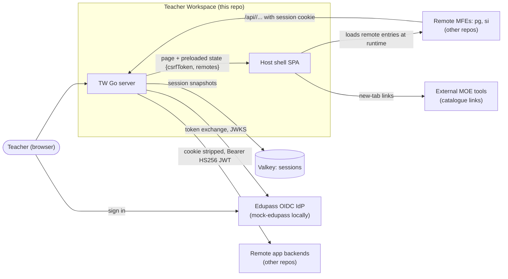

# 00 Project Overview

Revision: `main` @ `5ff58a7`. Written in Phase 0, rewritten after the batch 12 audit (2026-10-09). Every relationship below was verified in source unless marked otherwise.

## What it is

Teacher Workspace (TW) is a **Module Federation host shell** that consolidates teacher-facing MOE applications into one web workspace (`README.md`). The repository contains three deliverables:

1. **Host backend** (`server/`, Go): one binary that serves the shell and owns sign-in through Edupass (OIDC). It keeps server-side sessions in memory or Valkey, and reverse-proxies `/api/<app>/...` to partner backends with a short-lived signed JWT.
2. **Host shell** (`apps/host/`, React 19 + Rsbuild): navigation, a home page catalogue of 18 app cards (most link out to external MOE tools), a login page, and routes that load remote apps (micro-frontends owned by other teams) at runtime.
3. **mock-edupass** (`apps/mock-edupass/`, Node): a local OIDC provider with 8 fixture accounts for development and tests.

Two remote apps are wired in configuration:

- `pg`, Parents Gateway: exposes Posts and Groups, mounted at `/posts` and `/groups`.
- `si`, Student Insights: registered but not yet mounted; `/students` is a placeholder.

The project is pre-release: version `0.0.2`, released 2026-09-18 (`CHANGELOG.md`).

## Tech stack

| Area | Technology | Evidence |
| --- | --- | --- |
| Backend | Go 1.27.1, stdlib `net/http` with method patterns, `log/slog` JSON | `go.mod`, `main.go`, `handler.go:93-105` |
| Sign-in | `coreos/go-oidc/v3`, `golang.org/x/oauth2`; code flow, PKCE, `client_secret_post` or `private_key_jwt` | `handler.go:40-64`, `auth.go` |
| Tokens to backends | `golang-jwt/jwt/v5`, HS256 | `proxy.go:60-67` |
| Sessions | Valkey via `valkey-glide/go/v2` (cgo), or in-memory | `main.go:56-89`, `session/` |
| Frontend | React 19, react-router 8, Rsbuild 2, `@module-federation/enhanced` 2, Tailwind 4 (`tw:` prefix), shadcn on Base UI | `apps/host/package.json`, `rsbuild.config.ts`, `App.css` |
| Mock IdP | Node 24 (native TS), Express 5, `oidc-provider` 9 | `apps/mock-edupass/package.json` |
| Tooling | mise, pnpm workspace, oxlint, oxfmt, lefthook, golangci-lint | `mise.toml`, `pnpm-workspace.yaml`, `lefthook.yml`, `.golangci.yaml` |
| Tests | Go stdlib testing and testcontainers (Valkey); `node:test` for the mock; no frontend tests | `go.mod`, `apps/mock-edupass/package.json` |
| Delivery | 3-stage Dockerfile, `linux/arm64` only, AWS ECR via GitHub OIDC, release-PR model, GitLab deploy (outside repo) | `Dockerfile`, `.github/workflows/*`, ADR-0002 |

## System context (C4 level 1)

| Relationship | Evidence | Detail |
| --- | --- | --- |
| Server renders `index.html` with `{csrfToken, remotes}` | `index.go:24-56`, `apps/host/index.html:7-9` | `subsystems/page-render.md` |
| Shell registers remotes, loads `pg/Posts` and `pg/Groups` | `bootstrap.tsx:11`, `App.tsx:16-67` | `subsystems/host-shell.md` |
| Sign-in via Edupass with PKCE, state, nonce | `auth.go:38-253` | `workflows/edupass-sign-in.md` |
| Sessions in Valkey or memory, sliding idle TTL | `main.go:56-89`, `middleware/session.go` | `subsystems/sessions.md` |
| `/api/` proxy strips cookies and signs a JWT per app | `proxy.go:25-118` | `workflows/api-proxy.md` |
| Catalogue links to 16 external URLs | `HomeView.tsx:24-202` | `subsystems/host-shell.md` section 5 |

Containers, startup and configuration: `02-architecture.md`. Deployment topology beyond the image is outside the repo (`08-infrastructure-and-operations.md`, Q14).

## What a newcomer should know first

1. **Identity stops at the session.** The server knows the user's email after sign-in. But the SPA has no "signed in" flag, and partner backends receive a JWT with no user claim. `/api/` also accepts anonymous callers, and CSRF tokens are never checked. These are the top items in the risk register (`07-security-and-auth.md` R1-R3).
2. **No database.** The only server-side state is one JSON session per browser (`06-data-model.md`).
3. **Remotes are hard-coded per app.** Posts/`pg` and Student Insights/`si` identifiers appear in config, page render, proxy and `App.tsx` (`12-change-impact-guide.md` C1).
4. **Local dev needs three processes** (host dev server, Go server, mock-edupass). Two `CONTRIBUTING.md` commands are incomplete (`09-local-development-and-testing.md`, Q41, Q42).
5. **Conventions matter.** These include conventional commits with backticked scopes, squash-merge, no em-dashes, keyed Go struct literals, and strict Go test conventions (`CONTRIBUTING.md`, `docs/go-test-conventions.md`).
