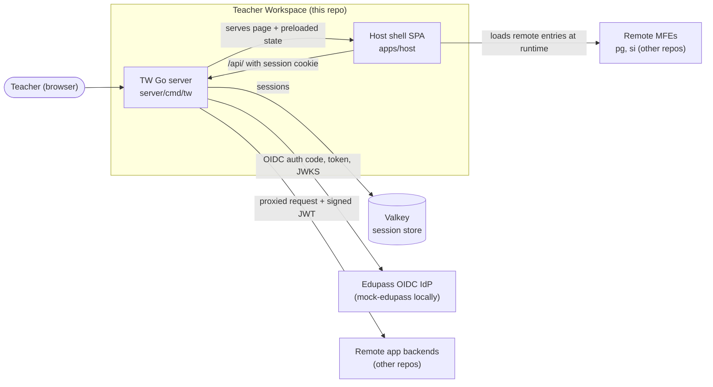
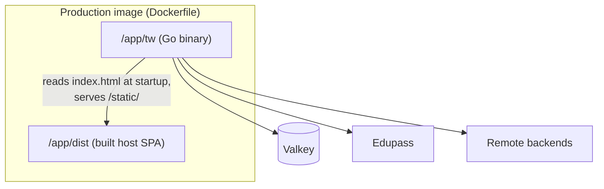

# 00 Project Overview (provisional)

Revision: `main` @ `5ff58a7`. Everything here is a Phase 0 sketch: relationships marked Inferred have not yet been traced in code.

## What it is

Teacher Workspace (TW) is a **Module Federation host shell** that consolidates teacher-facing MOE applications into one web workspace (`README.md`, `CONTRIBUTING.md`). It owns:

1. **Sign-in** through Edupass (MOE's OIDC identity provider) and a server-side **session** (cookie plus a store).
2. **The shell UI** (navigation, layout, routing) that mounts **remote apps** (micro-frontends, "MFEs") owned by other teams in other repos, loaded at runtime from their Module Federation manifests.
3. **A backend-for-frontend proxy** (`/api/`) that, per ADR-0001, terminates the session cookie and forwards requests to each remote app's own backend with a short-lived signed JWT scoped to that app.

Known remotes (from `CONTRIBUTING.md` and `.env.example`): `pg` (Parents Gateway, serves Posts and Groups) and `si` (Student Insights).

## Tech stack (Verified from manifests and config)

| Area | Technology | Evidence |
| --- | --- | --- |
| Backend | Go 1.27.1, stdlib `net/http` `ServeMux` (method-pattern routes), `log/slog` JSON logging | `go.mod`, `server/cmd/tw/main.go`, `server/internal/handler/handler.go:93-105` |
| Auth | `coreos/go-oidc/v3`, `golang.org/x/oauth2` (auth code flow, `openid` scope) | `handler.go:40-64` |
| Signed tokens | `golang-jwt/jwt/v5` (use not yet traced) | `go.mod` |
| Session store | Valkey via `valkey-glide/go/v2` (cgo) or in-memory | `main.go:56-89` |
| Frontend | React 19, react-router 8, Rsbuild 2, `@module-federation/enhanced` 2, Tailwind 4, shadcn/Base UI | `apps/host/package.json`, `apps/host/rsbuild.config.ts` |
| Mock IdP | Node 24 (native TS), Express 5, `oidc-provider` 9 | `apps/mock-edupass/package.json` |
| Tooling | mise (pins Go, Node, pnpm, golangci-lint), pnpm workspace `apps/*`, oxlint/oxfmt, lefthook pre-commit, golangci-lint (gofmt, goimports) | `mise.toml`, `pnpm-workspace.yaml`, `lefthook.yml`, `.golangci.yaml` |
| Go tests | stdlib testing, `testcontainers-go` (Valkey integration tests need Docker) | `go.mod`, `CONTRIBUTING.md` |
| Delivery | Multi-stage Dockerfile (host build, Go build, `debian:trixie-slim` runtime as non-root `zero`), `linux/arm64` only, pushed to AWS ECR `transform/teacher-workspace` via GitHub OIDC | `Dockerfile`, `.github/workflows/*.yml` |

## Provisional system context

Walkthrough: the browser only ever talks to the Go server's origin for the page and `/api/`. The server renders `index.html` with a JSON "preloaded state" (CSRF token and remote list), the shell registers the remotes and lazy-loads them per route, and remote API calls go back through the server's proxy.

| Relationship | Status | Evidence |
| --- | --- | --- |
| Server serves page with preloaded state (`csrfToken`, `remotes`) | Inferred (frontend side Verified) | `apps/host/index.html:7-9` (`{{.}}` Go template slot), `apps/host/src/stores/preloaded-state.ts:4-15`; server side in `handler/index.go` not yet read |
| Shell registers remotes at startup, loads `pg/Posts`, `pg/Groups` | Verified | `apps/host/src/bootstrap.tsx:11`, `apps/host/src/App.tsx:16-32` |
| Server to Edupass (authorize, token, JWKS) | Verified (config wiring only) | `handler.go:40-64`, routes `handler.go:95-96` |
| Server to Valkey | Verified (client construction) | `main.go:58-83` |
| `/api/` proxy adds signed JWT per remote | Inferred | ADR-0001, `.env.example` `TW_REMOTE_*_BACKEND_SIGNING_KEY`, `handler.go:36-37`; `proxy.go` not yet read |
| In dev, server proxies non-API requests to Rsbuild dev server | Verified | `handler.go:66-70,107-130` |

## Provisional container view

Note: `mock-edupass` and Valkey are not in the image (`Dockerfile` copies only `apps/host` and `server`). ADR-0001 describes an image that bundles a local OIDC provider and datastores for remote-app developers; see `11-open-questions-and-discrepancies.md` Q1.

Mermaid syntax in this file was parse-checked with mermaid 11.4.1 (2026-10-09); visual rendering not reviewed.
