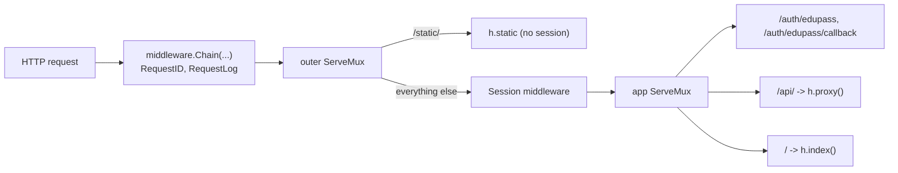

# 01 Repository Map

Revision: `main` @ `5ff58a7`. Module path `github.com/String-sg/teacher-workspace` (`go.mod`). The repo is a Go module at the root plus a pnpm workspace over `apps/*`.

## Layout

```text
.
├── server/                      Go backend (single binary "tw")
│   ├── cmd/tw/main.go           ENTRY POINT: process bootstrap, session store, HTTP server, graceful shutdown
│   ├── internal/
│   │   ├── config/              Config struct, defaults, validation (config.go ~22 KB)
│   │   ├── handler/             Routes + handlers: auth (Edupass), index (page), proxy (/api/), static
│   │   ├── middleware/          Chain, RequestID, RequestLog, Session
│   │   ├── session/             Session model, CSRF, Store interface
│   │   │   ├── memstore/        In-memory Store
│   │   │   └── valkeystore/     Valkey Store (integration tests via testcontainers)
│   │   ├── htmlutil/            index.html templating (file template in prod, URL template in dev)
│   │   └── httputil/            Response/error rendering helpers
│   └── pkg/                     Reusable packages
│       ├── dotenv/              .env + environment loading into config
│       ├── random/              Random string generation (base58/base62 per commit history)
│       └── require/             (purpose not yet read; no tests)
├── apps/
│   ├── host/                    React host shell (Module Federation host "teacher_workspace")
│   │   ├── index.html           Template with Go `{{.}}` preloaded-state slot
│   │   ├── rsbuild.config.ts    MF config (no static remotes; shared react/react-dom/react-router singletons), dev server :3001
│   │   └── src/
│   │       ├── index.ts         ENTRY POINT: dynamic import of bootstrap (MF async boundary)
│   │       ├── bootstrap.tsx    registerRemotes(preloadedState.remotes), mount <App/>
│   │       ├── App.tsx          Route table
│   │       ├── containers/      Route-level views (Login, RootLayout, Home, Students, NotFound, RemoteLoadFallback)
│   │       ├── components/      Sidebar, AppCard, AppSection, WelcomeModal, ErrorBoundary; ui/ = shadcn-generated
│   │       ├── stores/          preloaded-state.ts (reads server-embedded JSON)
│   │       ├── hooks/, helpers/ use-mobile, cn
│   │       └── assets/          logos, images, onboarding video
│   └── mock-edupass/            Local OIDC provider standing in for Edupass (dev and CI testing)
│       ├── src/index.ts         ENTRY POINT: loadConfig -> createProvider -> createApp -> listen
│       ├── src/{app,config,provider}.ts
│       └── test/                node:test suites (api, config)
├── docs/
│   ├── adr/0001-local-development-for-remote-apps.md   (Accepted)
│   ├── adr/0002-release-strategy.md                    (Accepted)
│   └── go-test-conventions.md
├── .github/workflows/ci.yml       PR CI: format, lint, go-lint, go-test -> build+push pr image to ECR
├── .github/workflows/release.yml  On push to main with "release: vX.Y.Z (#N)": build+push vX.Y.Z, git tag
├── Dockerfile                     3-stage build, arm64, non-root runtime
├── compose.yml                    Local Valkey 9.1 (loopback only, password-protected)
├── .env.example                   All TW_* and MOCK_EDUPASS_* settings (documented)
├── mise.toml / mise.lock          Toolchain pins
├── package.json                   Root scripts (dev/build/preview -> host; lint; format)
├── lefthook.yml                   Pre-commit oxfmt + oxlint on staged files
└── CONTRIBUTING.md, CLAUDE.md, CHANGELOG.md (0.0.2, 2026-09-18)
```

## Subsystems

| ID | Subsystem | Paths | Role (status) |
| --- | --- | --- | --- |
| S1 | Server bootstrap | `server/cmd/tw` | Logger, config load+validate, store selection, middleware chain, `http.Server` timeouts, SIGINT/SIGTERM shutdown with 30s timeout (Verified, `main.go:28-139`) |
| S2 | Configuration | `server/internal/config`, `server/pkg/dotenv` | Defaults, env/.env loading, validation, Edupass credential loading (Verified, see `02-architecture.md`) |
| S3 | HTTP handlers | `server/internal/handler` | Route table Verified (`handler.go:93-105`); auth/index/proxy bodies not read |
| S4 | Middleware | `server/internal/middleware` | RequestID, RequestLog, Session, `Chain` (not read) |
| S5 | Sessions and CSRF | `server/internal/session/**` | Store interface, memstore, valkeystore, CSRF token (not read) |
| S6 | Server utilities | `server/internal/htmlutil`, `server/internal/httputil`, `server/pkg/random`, `server/pkg/require` | Not read |
| S7 | Host frontend | `apps/host` | Bootstrap and routes Verified; components not read |
| S8 | mock-edupass | `apps/mock-edupass` | Entry and interaction router Verified; provider/config not read |
| S9 | Build, CI/CD, tooling | root configs, `.github/`, `Dockerfile`, `compose.yml` | Verified (read in full except `.oxlintrc.json`, `.oxfmtrc.json`) |

## Entry points

| Kind | Entry | Evidence |
| --- | --- | --- |
| Server binary | `server/cmd/tw/main.go` `main()` | Verified |
| HTTP routes | `GET /auth/edupass`, `GET /auth/edupass/callback`, `/api/` (any method), `/` (catch-all, page), `/static/` (outside session middleware) | Verified, `handler.go:95-101` |
| Frontend | `apps/host/src/index.ts` -> `bootstrap.tsx` -> `App.tsx` | Verified |
| Frontend routes | `/login`; under `RootLayout`: `/`, `/students/*` (local placeholder), `/posts/*` (remote `pg/Posts`), `/groups/*` (remote `pg/Groups`), `*` NotFound | Verified, `App.tsx:40-70` |
| Mock IdP | `apps/mock-edupass/src/index.ts`; routes `GET /health`, `GET /interaction/:uid`, plus `oidc-provider` endpoints | Verified, `app.ts:15-65` |
| CI | `.github/workflows/ci.yml` (on `pull_request`) | Verified |
| Release | `.github/workflows/release.yml` (on push to `main`) | Verified |
| Scheduled jobs, workers, queues, DB migrations | None found | Verified absent from file tree |

## Request pipeline (as wired in `main.go`)



| Edge | Status | Evidence |
| --- | --- | --- |
| RequestID and RequestLog wrap all routes; RequestID is outermost | Verified (`Chain` makes the first middleware outermost) | `main.go:107-111`, `middleware.go:10-18`, `middleware_test.go:11-45` |
| `/static/` bypasses session | Verified | `handler.go:100-102` |
| Session wraps auth, api, index | Verified | `handler.go:94-102` |

## External dependencies (runtime)

| Dependency | Used for | Config keys |
| --- | --- | --- |
| Edupass (OIDC) | Sign-in | `TW_EDUPASS_ISSUER_URL`, `_AUTH_URL`, `_TOKEN_URL`, `_JWKS_URL`, `_CLIENT_ID`, `_REDIRECT_URL`, `_CLIENT_AUTH_METHOD` (`client_secret_post` or `private_key_jwt`), secret/key/cert (+ `_FILE` variants) |
| Valkey | Session store (optional; default memory) | `TW_SESSION_STORE_PROVIDER`, `TW_SESSION_VALKEY_URL` (`?tls=true` enables TLS, `main.go:68`), `TW_SESSION_VALKEY_PREFIX` |
| Remote MFEs and their backends | UI modules and `/api/` targets | `TW_REMOTE_POSTS_*`, `TW_REMOTE_STUDENT_INSIGHTS_*` (`MANIFEST_URL`, `BACKEND_BASE_URL`, `BACKEND_SIGNING_KEY`), `TW_REMOTE_SIGNED_TOKEN_TTL` |
| Rsbuild dev server | Dev-only page/asset proxy target | `TW_DEV_SERVER_URL` |
| AWS ECR (CI), GitLab deploy pipeline (outside repo) | Image publishing and deployment | GitHub `vars.AWS_REGION`, `vars.AWS_ROLE_ARN` |
