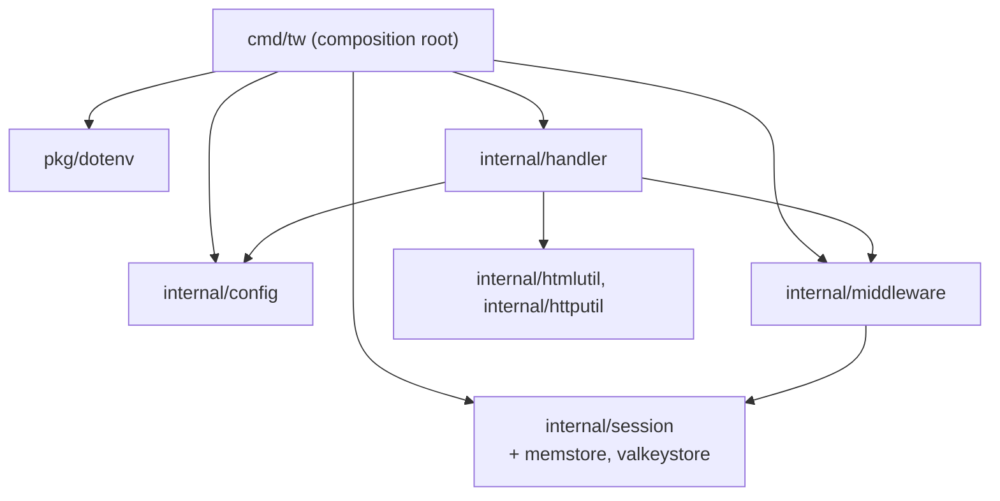
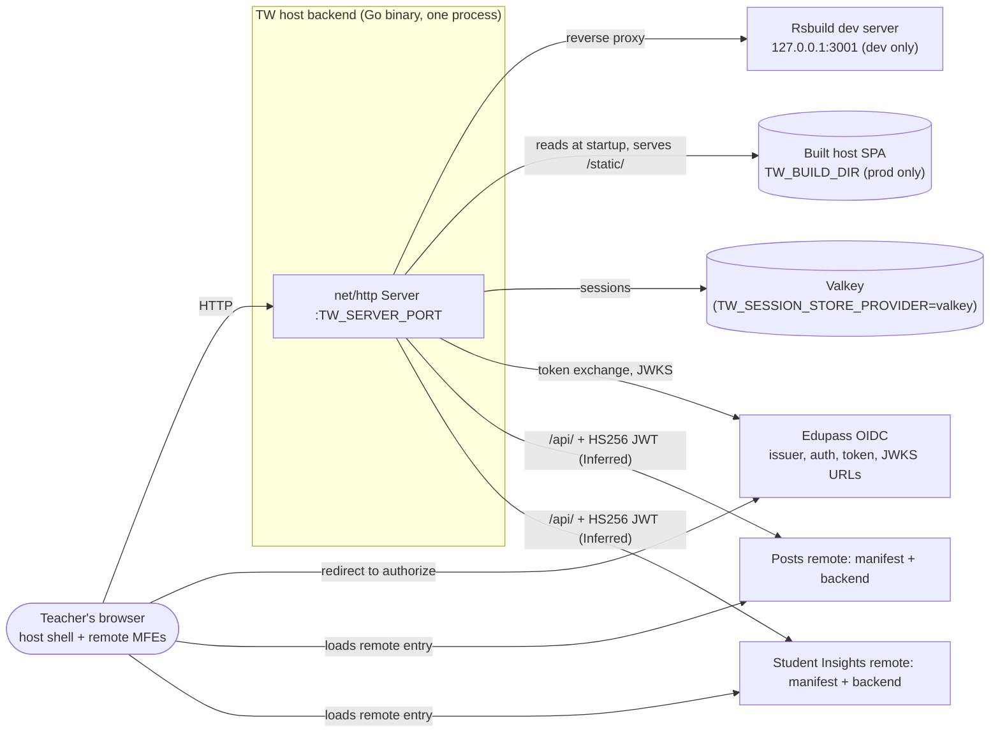
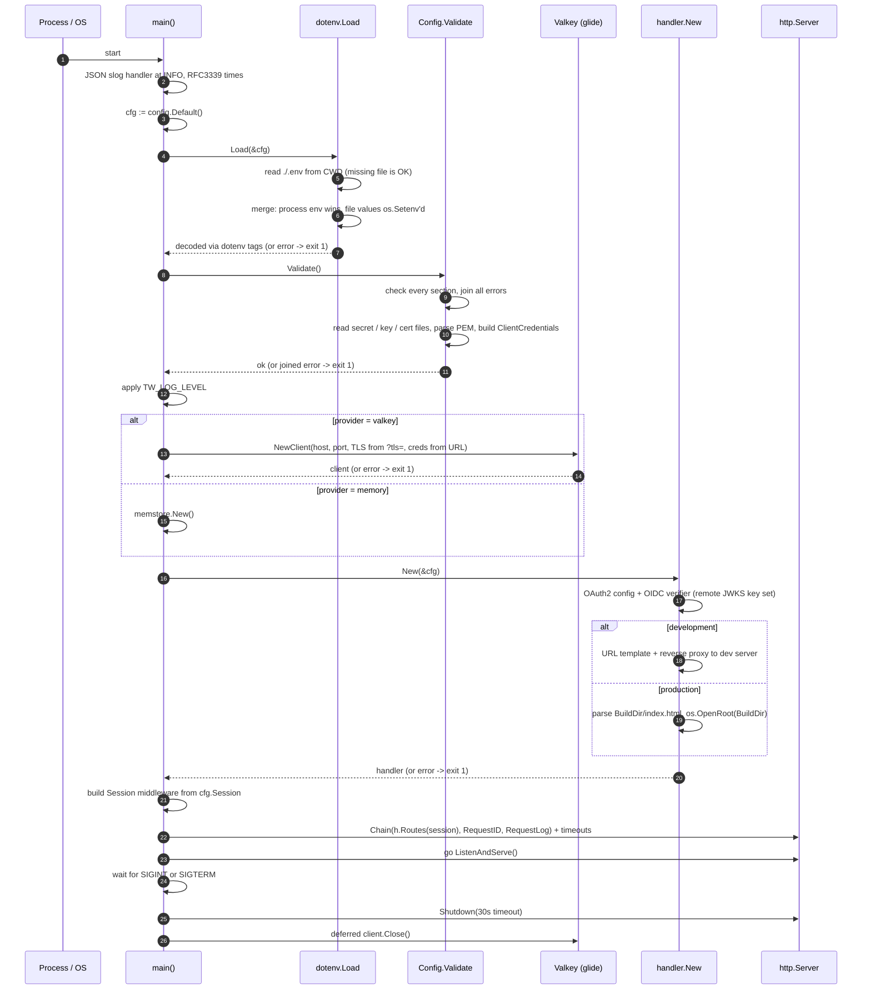
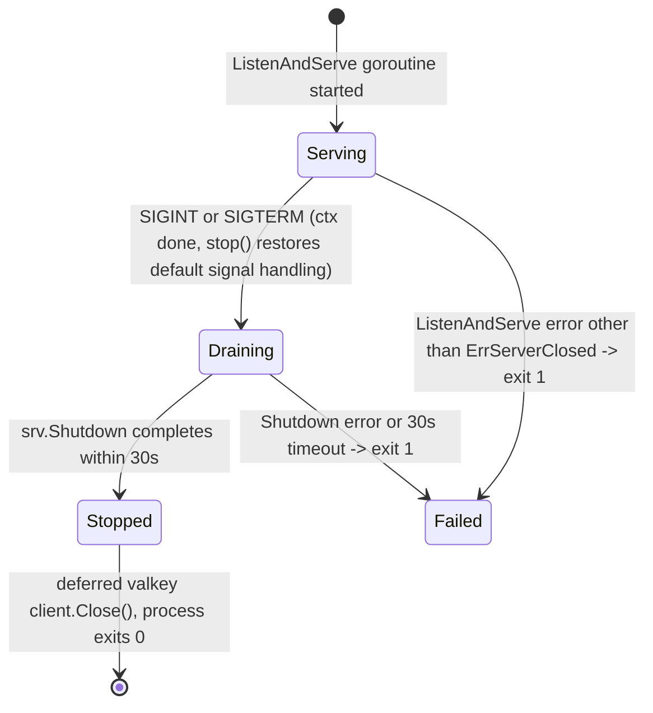
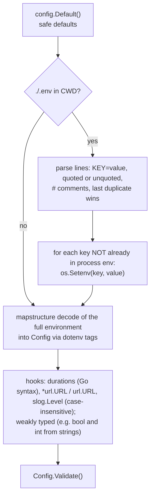
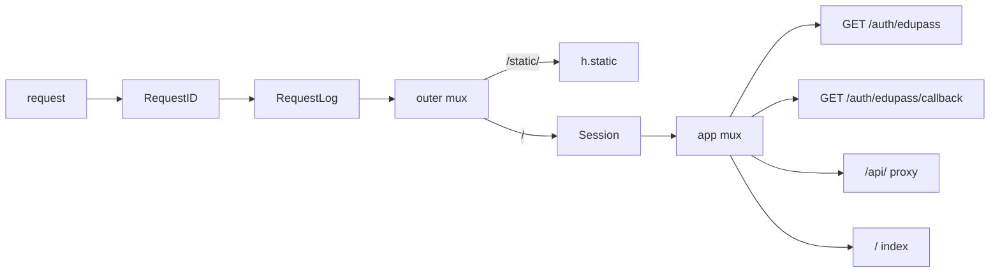

# 02 Architecture: Startup, Configuration and Request Pipeline

Revision: `main` @ `5ff58a7` (reviewed on branch `docs/engineering-onboarding`, which adds only these docs). Phase 1, batch 1.

Scope of this batch: process startup and shutdown (`server/cmd/tw/main.go`), configuration (`server/internal/config/config.go`, `server/pkg/dotenv/*`) and middleware composition (`server/internal/middleware/middleware.go`). Session, auth, index and proxy internals are out of scope here and covered in later batches.

## 1. Architecture style

A single Go process (the "host backend") acts as a **backend-for-frontend** in front of a React **Module Federation host shell**. There is no database of its own: the only server-side state is sessions (memory or Valkey). Layering inside the binary is shallow:

| Edge | Status | Evidence |
| --- | --- | --- |
| `main` imports config, handler, middleware, session, memstore, valkeystore, dotenv | Verified | `main.go:15-21` |
| `handler` imports config, htmlutil, httputil, middleware | Verified | `handler.go:15-18` |
| `middleware` depends on `session` | Inferred (from `middleware.Session(store, ...)` taking a `session.Store`, `main.go:97`); imports not yet read |  |
| `dotenv` is generic (decodes into any struct via `dotenv` tags); `config` does not import it | Verified | `dotenv.go:16-29`, `config.go:3-17` |

`main` is the only place that knows about concrete store implementations; handlers receive the session layer as an opaque `middleware.Middleware` (`handler.go:90-93`).

## 2. C4 level 2: containers (refined)

| Edge | Status | Evidence |
| --- | --- | --- |
| Dev proxy vs prod static, chosen by `TW_ENV` | Verified | `handler.go:66-85` |
| Valkey only when provider is `valkey`; no fallback | Verified | `main.go:57-89`, `config.go:188-195` |
| Exactly two remotes, Posts and Student Insights, each with manifest URL, backend base URL and signing key | Verified | `config.go:429-441` |
| Signing keys are sized for HS256 (at least 32 bytes) | Verified (validation); use in proxy Inferred | `config.go:480-483, 517-520` |
| Browser redirected to Edupass authorize endpoint | Inferred (standard OIDC; route exists at `handler.go:95`, body not read) |  |
| Browser loads remote entries directly from manifest URLs | Inferred | `bootstrap.tsx:11` registers whatever the server embeds; `index.go` not read |

## 3. Startup sequence

Walkthrough and notes:

- **Fail fast, report everything.** `Validate` collects every invalid field across all sections into one `errors.Join` error, so a misconfigured deploy shows all problems at once (`config.go:78-112`; test "reports multiple invalid fields in one error", `config_test.go:292`). The default config alone is invalid because Edupass has no defaults (`config_test.go:264` "rejects the default config").
- **`Validate` has side effects.** For `client_secret_post` it reads `TW_EDUPASS_CLIENT_SECRET_FILE` (trailing CR/LF trimmed); for `private_key_jwt` it reads the key and certificate, requires PKCS#8 RSA of at least 2048 bits, rejects an expired certificate, checks the certificate matches the key, and stores the key plus the base64url SHA-256 certificate thumbprint in `cfg.Edupass.ClientCredentials` (`config.go:321-420`). Nothing else populates `ClientCredentials` (it has tag `dotenv:"-"`, `config.go:260`).
- **Log level is applied late.** Logs before step 12 (config errors) are always at INFO and above (`main.go:29-54`).
- **Valkey must be reachable at startup.** Any `glide.NewClient` error exits the process (`main.go:76-80`). CONTRIBUTING states this is deliberate: no silent fallback to memory.
- **Production needs the built SPA at startup.** `Validate` checks `TW_BUILD_DIR` exists, then `handler.New` parses `index.html` once and opens the directory with `os.OpenRoot`, which confines file serving to that directory (`config.go:97-102`, `handler.go:71-82`).
- **Edupass is not contacted at startup.** `handler.New` only constructs clients; `oidc.NewRemoteKeySet` fetches keys lazily (Inferred from go-oidc library behaviour, not from repo code).
- **Exit paths skip cleanup.** Every `os.Exit(1)` (including a `ListenAndServe` failure inside the goroutine, `main.go:123-126`) bypasses the deferred `client.Close()`.

## 4. Shutdown

Evidence: `main.go:118-138`. Because `stop()` is called right after the first signal, a second Ctrl-C terminates immediately instead of waiting for the drain (standard `signal.NotifyContext` behaviour). The 30s drain equals the default `WriteTimeout`, so in-flight requests within their write deadline can finish. There is no readiness or health endpoint (Q11).

## 5. Configuration loading

| Rule | Status | Evidence |
| --- | --- | --- |
| `.env` is resolved against the **current working directory**, so run the binary from the repo root (relative defaults like `TW_BUILD_DIR=apps/host/dist` and `*_FILE` paths are CWD-relative too) | Verified | `dotenv.go:16-32`, `config.go:48`, `config.go:335,367,394` |
| Real environment variables override `.env` values; `.env` values are exported into the process environment | Verified | `dotenv.go:44-52`; test "single field overridden by process env" (`dotenv_test.go:252`) |
| Only keys with a matching `dotenv` tag are used; nested sections are flattened with `,squash` | Verified | `config.go:34-37,160` |
| **A variable that is set but empty still overrides the default.** E.g. `TW_SESSION_NAME=` yields `""` and fails validation; `TW_REMOTE_POSTS_MANIFEST_URL=` decodes to a non-nil empty URL, which counts as "partially registered" and fails | Verified for URLs (`dotenv_test.go:162` "empty string"; `config.go:450`); strings by mapstructure semantics (Inferred) |  |
| Durations without a unit (e.g. `30`) are rejected | Verified | `dotenv_test.go:121` |
| Unquoted values cannot contain `#` (treated as a comment); use quotes | Verified | `parser.go:8` regex |

Minor code note: `parser.go:16` replaces `"\n"` with `"\n"` (a no-op). It looks intended to normalise lone `\r` line endings; files with classic-Mac CR endings would not parse. Low impact (Q17).

## 6. Configuration reference

All variables are read by `config.Config` (`config.go:27-441`). "Required" means `Validate` fails without it.

### Application

| Variable | Default | Rules |
| --- | --- | --- |
| `TW_ENV` | `development` | `development` or `production` |
| `TW_LOG_LEVEL` | `info` | `debug`, `info`, `warn`, `error` (case-insensitive) |
| `TW_DEV_SERVER_URL` | `http://127.0.0.1:3001` | dev only: http/https with host |
| `TW_BUILD_DIR` | `apps/host/dist` (image sets `/app/dist`) | prod only: must exist |

### HTTP server

| Variable                        | Default | Rules           |
| ------------------------------- | ------- | --------------- |
| `TW_SERVER_PORT`                | `3000`  | 1 to 65535      |
| `TW_SERVER_READ_HEADER_TIMEOUT` | `2s`    | >= 0 (0 = none) |
| `TW_SERVER_READ_TIMEOUT`        | `15s`   | >= 0            |
| `TW_SERVER_WRITE_TIMEOUT`       | `30s`   | >= 0            |
| `TW_SERVER_IDLE_TIMEOUT`        | `60s`   | >= 0            |

### Session

| Variable | Default | Rules |
| --- | --- | --- |
| `TW_SESSION_NAME` | `tw_session` | valid RFC 6265 cookie name |
| `TW_SESSION_DEFAULT_TTL` | `3h` | >= 1s (sub-second would ship `Max-Age=0`, `config.go:179-180`) |
| `TW_SESSION_AUTHENTICATED_TTL` | `30m` | >= 1s |
| `TW_SESSION_SECURE` | `true` | bool; set `false` for plain-HTTP local dev |
| `TW_SESSION_STORE_PROVIDER` | `memory` | `memory` or `valkey` |
| `TW_SESSION_VALKEY_URL` | none | required for valkey: `valkey://[user:pass@]host:port[?tls=true or false]`; credentials are redacted in errors (`config_test.go:632`) |
| `TW_SESSION_VALKEY_PREFIX` | `session:` | required (non-empty) for valkey |

### Edupass (all required unless noted)

| Variable | Rules |
| --- | --- |
| `TW_EDUPASS_ISSUER_URL`, `_AUTH_URL`, `_TOKEN_URL`, `_JWKS_URL`, `_REDIRECT_URL` | http/https with host |
| `TW_EDUPASS_CLIENT_ID` | non-empty |
| `TW_EDUPASS_CLIENT_AUTH_METHOD` | default `client_secret_post`; or `private_key_jwt` |
| `TW_EDUPASS_CLIENT_SECRET` or `_SECRET_FILE` | exactly one, for `client_secret_post` |
| `TW_EDUPASS_CLIENT_PRIVATE_KEY` or `_PRIVATE_KEY_FILE` | exactly one, for `private_key_jwt`: PEM PKCS#8 RSA, >= 2048 bits |
| `TW_EDUPASS_CLIENT_CERTIFICATE` or `_CERTIFICATE_FILE` | exactly one, for `private_key_jwt`: PEM X.509, not expired, matches the key |

### Remote apps

| Variable | Default | Rules |
| --- | --- | --- |
| `TW_REMOTE_SIGNED_TOKEN_TTL` | `1m` | >= 1s |
| `TW_REMOTE_POSTS_MANIFEST_URL`, `_BACKEND_BASE_URL`, `_BACKEND_SIGNING_KEY` | unset (remote not registered) | all three or none; URLs http/https with host; base URL may have a path but no query or fragment; key >= 32 bytes |
| `TW_REMOTE_STUDENT_INSIGHTS_MANIFEST_URL`, `_BACKEND_BASE_URL`, `_BACKEND_SIGNING_KEY` | unset | same rules |

`IsPostsRegistered()` / `IsStudentInsightsRegistered()` report whether all three are set (`config.go:527-536`); their callers are not yet traced.

## 7. Request pipeline (middleware order now Verified)

`Chain(h, m...)` makes the **first middleware the outermost** (`middleware.go:10-18`, test `middleware_test.go:11-45`). So `Chain(h.Routes(session), RequestID, RequestLog)` (`main.go:107-111`) runs:

RequestID runs before RequestLog, so the access-log line carries the request ID (Verified in batch 6: `requestlog.go:39-43, 53`, `requestid_test.go:82`; see `subsystems/observability.md`). Session runs inside both, and never for `/static/` (`handler.go:100-102`).

## 8. Where to make common changes

| Change | Touch | Notes |
| --- | --- | --- |
| New server setting | `Config` field + `dotenv` tag + `Default()` + `validate()` + `config_test.go` + `.env.example` | Keyed struct literals per CONTRIBUTING |
| New remote app | `RemoteAppsConfig` (three fields, validation block, `Is...Registered`), plus index (embedding) and proxy routing | Remotes are hard-coded per app, not a list; blast radius spans config, handler and host routes (Q20) |
| New middleware for every request | `main.go:107-111` `Chain` arguments | Order = position |
| Middleware only for app routes (not static) | `Handler.Routes` (`handler.go:93-105`) |  |

## 9. Verification

- Re-read `config.go` validation branches against the listed `config_test.go` cases: defaults, every section's accept/reject tables, file-based secrets, key/cert failure modes and redaction tests exist (`config_test.go:24-1400`). Test bodies were sampled, not all read.
- Middleware order confirmed by `TestChain`.
- Mermaid blocks parse-checked with mermaid 11.4.1. Visual layout not reviewed.
