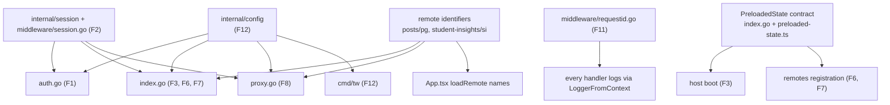

# 05 Feature-to-Code Map

Revision: `main` @ `5ff58a7`. Batch 11 (2026-10-09). Built from batches 1 to 10. Every path and symbol below was read in an earlier batch, and line references were spot-checked when this map was assembled. Change recipes are in `12-change-impact-guide.md`.

## 1. Features at a glance

| # | Feature | User entry point | Status |
| --- | --- | --- | --- |
| F1 | Sign in with Edupass | `/login` button, or any `/auth/edupass?return_to=...` link | Built (no role checks) |
| F2 | Sessions | every non-static request | Built (no logout) |
| F3 | Page shell and preloaded state | any page URL | Built |
| F4 | Home page app catalogue | `/` | Built (static list) |
| F5 | Layout and navigation | sidebar on every page except `/login` | Built |
| F6 | Posts and Groups (Parents Gateway remote) | `/posts/*`, `/groups/*` | Built in host; content lives in the `pg` repo |
| F7 | Student Insights | `/students/*` | Placeholder only; `si` remote configured but not mounted |
| F8 | API proxy to remote backends | `/api/posts/*`, `/api/student-insights/*` from remotes | Built (no auth check, no user claim) |
| F9 | Welcome modal | first visit in a browser | Built |
| F10 | Sign-in failure UX | `/login?error=oauth2_callback_failed` | Built |
| F11 | Request tracing and logs | `X-Request-ID` header, stdout logs | Built (no metrics or tracing) |
| F12 | Configuration and startup | process start | Built |
| F13 | Static assets and dev proxy | `/static/*` | Built |
| F14 | Build, PR images and releases | PRs, merges to `main` | Built |
| F15 | Local identity provider (mock-edupass) | `:9000` in dev and tests | Built (dev only) |

## 2. Traceability

| # | UI / client | Server route or trigger | Handlers and core symbols | Data | External deps | Tests | Docs and diagrams |
| --- | --- | --- | --- | --- | --- | --- | --- |
| F1 | `LoginView.tsx:8-35` | `GET /auth/edupass`, `GET /auth/edupass/callback` (`handler.go:95-96`) | `authEdupass`, `authEdupassCallback`, `safeReturnTo`, `loginFailedURL` (`auth.go`); `edupassOAuth2Config`, `edupassIDTokenVerifier` (`handler.go:40-64`); `config.EdupassConfig` incl. credential loading (`config.go:243-427`) | pending-login keys in session `data`; `session.User{Email}` | Edupass authorize, token, JWKS | `auth_test.go`, `config_test.go` Edupass cases | `workflows/edupass-sign-in.md` (sequence and failure flow) |
| F2 | cookie `tw_session` | Session middleware on all non-static routes (`handler.go:102`) | `middleware.Session`, `sessionResponseWriter` (`middleware/session.go`); `session.New/Load/Save`, `SetUser`, CSRF (`session.go`, `csrf.go`); `memstore`, `valkeystore`; `random.Base58` | session snapshot | Valkey | `middleware/session_test.go`, `session/*_test.go`, store tests (Docker) | `subsystems/sessions.md` (lifecycle, state machine) |
| F3 | `index.ts`, `bootstrap.tsx`, `stores/preloaded-state.ts` | `/` catch-all (`handler.go:98`) | `Handler.index`, `PreloadedState`, `Remote` (`index.go:14-57`); `htmlutil.URLTemplate` / `FileTemplate`; `httputil.RenderHTML` | preloaded state (`csrfToken`, `remotes`) | Rsbuild dev server (dev only) | `index_test.go`, `template_test.go`, `httputil_test.go` | `subsystems/page-render.md`, `subsystems/host-shell.md` section 2 |
| F4 | `HomeView.tsx` (`APP_SECTIONS`), `AppSection.tsx`, `AppCard.tsx` | served by F3 | none server-side | static array in code; logos in `src/assets/logos` | 16 external MOE and government URLs | none | `subsystems/host-shell.md` section 5 |
| F5 | `RootLayout.tsx`, `Sidebar.tsx`, `components/ui/sidebar.tsx`, `hooks/use-mobile.ts` | served by F3 | none | none | Help link to `go.gov.sg/teacherworkspace-feedback` | none | `subsystems/host-shell.md` sections 3-4 |
| F6 | `App.tsx:16-67` (`loadRemote('pg/Posts')`, `'pg/Groups'`), `ErrorBoundary`, `RemoteLoadFallbackView` | remote registered via F3 when `TW_REMOTE_POSTS_*` set (`index.go:27-29`) | `IsPostsRegistered` (`config.go:527-530`) | `remotes[]` entry `pg` | `pg` remote bundle (other repo) | none in this repo | `subsystems/host-shell.md`, `subsystems/page-render.md` section 4 |
| F7 | `StudentsView.tsx`, sidebar and catalogue links to `/students` | `si` remote registered when `TW_REMOTE_STUDENT_INSIGHTS_*` set (`index.go:30-31`) | `IsStudentInsightsRegistered` (`config.go:532-536`) | `remotes[]` entry `si` | `si` remote (other repo) | `index_test.go` remote cases | `subsystems/host-shell.md` section 3 (Q10) |
| F8 | remotes' own fetch calls (host makes none) | `/api/` (`handler.go:97`) | `Handler.proxy`, `newRemoteBackendProxy` (`proxy.go`); `RemoteAppsConfig` (`config.go:429-536`) | per-request HS256 JWT | Posts and Student Insights backends | `proxy_test.go` | `workflows/api-proxy.md` (sequence, contract) |
| F9 | `WelcomeModal.tsx` in `RootLayout` | none | none | `localStorage["tw_welcome_modal_seen"]` | none | none | `subsystems/host-shell.md` section 6 |
| F10 | `LoginView.tsx` toast | redirect from callback (`auth.go:287-294`) | `loginFailedURL` | query `error`, `return_to` | none | `auth_test.go` (redirect targets) | `workflows/edupass-sign-in.md` section 5 |
| F11 | `X-Request-ID` response header | all requests (`main.go:107-111`) | `RequestID`, `RequestLog`, `LoggerFromContext` (`middleware/requestid.go`, `requestlog.go`) | JSON logs | log platform (Unknown) | `requestid_test.go`, `requestlog_test.go` | `subsystems/observability.md` |
| F12 | none | process start | `main` (`cmd/tw/main.go`), `config.Default/Validate`, `dotenv.Load` | `config.Config` | Valkey (connect at start) | `config_test.go`, `dotenv_test.go`, `parser_test.go` | `02-architecture.md` (startup, config reference) |
| F13 | Rsbuild `assetPrefix: '/static'` (`rsbuild.config.ts:37-45`) | `/static/` (`handler.go:101`) | `Handler.static` (`index.go:59-77`), `newDevServerProxy` (`handler.go:107-130`) | built files in `TW_BUILD_DIR` | Rsbuild dev server (dev) | `index_test.go:274-372` | `subsystems/page-render.md` section 2 |
| F14 | none | PRs, push to `main` | `Dockerfile`, `ci.yml`, `release.yml` | image tags in ECR | AWS ECR, GitLab (outside repo) | CI itself | `08-infrastructure-and-operations.md` (build, CI, release diagrams) |
| F15 | browser redirect to `:9000` in dev | mock routes (`app.ts`, `oidc-provider`) | `createProvider`, `accounts`, `loadConfig` (`provider.ts`, `config.ts`) | 8 fixture accounts | none | `test/api.test.ts`, `test/config.test.ts` (not run in CI) | `workflows/edupass-sign-in.md` section 8, `09-local-development-and-testing.md` |

## 3. Shared dependencies and blast radius

| Shared piece | Used by | Why changes are risky |
| --- | --- | --- |
| `internal/config` | every server feature | validation runs at startup, so a mistake stops the process; config is also the source of remote names and keys |
| Session middleware and `session` package | F1, F2, F3, F8 | wraps every non-static route; a save failure turns any response into a 500 |
| `PreloadedState` shape | server `index.go`, host `preloaded-state.ts`, potentially remotes via the DOM | the host throws on boot if the shape is wrong, so server and host must ship together (they do, in one image) |
| Remote identifiers (`posts` / `pg`, `student-insights` / `si`) | config, `index.go`, `proxy.go`, `App.tsx`, partner repos | hard-coded in four places plus partner builds (Q20, Q33) |
| JWT claim set | `proxy.go`, `proxy_test.go`, partner backends | the partner contract, and ADR-0002's major-version boundary |
| Shared MF singletons (`react`, `react-dom`, `react-router`) | host and every remote | version drift breaks remote rendering (dev/prod builds must also match) |
| `httputil` renderers | all handlers | header defaults (`nosniff`) and error body shapes |

## 4. Gaps visible from the map

- No feature has frontend tests (F3 to F7, F9, F10).
- F6 and F7 have no server-side behaviour beyond registration: everything else lives in other repos.
- F8 has no client in this repo; its only consumers are partner remotes.
- Identity from F1 is not consumed by F3, F6, F7 or F8 (see `06-data-model.md` section 4).
