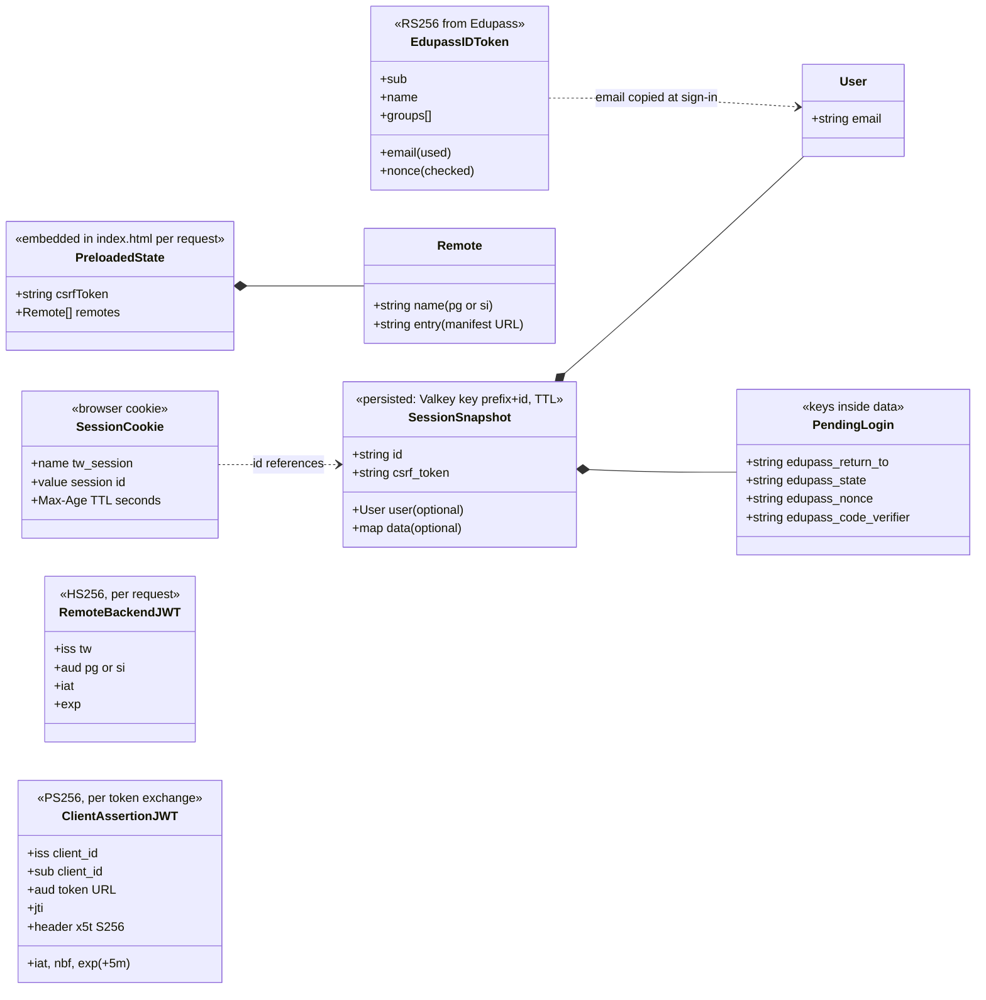
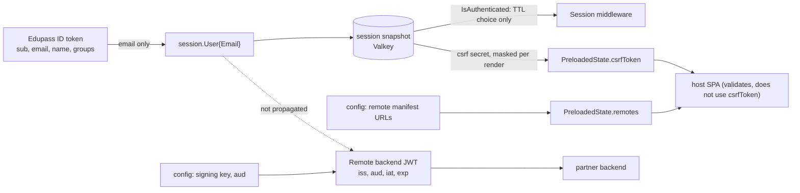

# 06 Data Model

Revision: `main` @ `5ff58a7`. Batch 10 (2026-10-09). Structures spot-checked in this batch: `session.go:43-61`, `index.go:14-22`, `auth.go:22-27, 155-164, 235-237`, `proxy.go:61-66`, `provider.ts:7-62`.

## 1. Summary

Teacher Workspace has **no database, no ORM and no migrations**. The only persisted server-side data is the **session**: a JSON document per browser, stored in Valkey (or in process memory) with an idle TTL. Everything else is either configuration loaded at startup, or data **in transit**: the page's preloaded state, JWTs to partner backends and Edupass, and the Edupass ID token. Business data (posts, groups, student insights) lives in the remote apps' own backends, outside this repo.

## 2. Structures



| Structure | Where it lives | Writer | Reader | Lifetime | Evidence |
| --- | --- | --- | --- | --- | --- |
| Session snapshot | Valkey `TW_SESSION_VALKEY_PREFIX` (default `session:`) + ID, or memstore map | Session middleware (`session.Save`) on every session-backed response | Session middleware (`session.Load`) on every session-backed request | idle TTL: 3h anonymous, 30m signed in | `session.go:50-56, 104-122`, `valkeystore.go:45-101`, `middleware/session.go:88-111` |
| `User` | inside snapshot | `authEdupassCallback` via `SetUser` | nothing yet reads it for decisions (`IsAuthenticated` only picks the TTL) | with the session | `session.go:58-61`, `auth.go:249`, `middleware/session.go:90` |
| Pending login | snapshot `data` | `authEdupass` | `authEdupassCallback` (`GetAndDelete`) | until callback or expiry | `auth.go:22-27, 52-55, 100-107` |
| Session cookie | browser | Session middleware | browser sends it back; TW strips it before proxying | `Max-Age` = current TTL | `middleware/session.go:103-111`, `proxy.go:86` |
| Preloaded state | `<script id="preloaded-state">` in the HTML | `Handler.index` | host `stores/preloaded-state.ts` (and potentially remotes via the DOM) | one page load | `index.go:14-46`, `preloaded-state.ts` |
| Remote backend JWT | `Authorization` header to backend | `Handler.proxy` | partner backend | `TW_REMOTE_SIGNED_TOKEN_TTL` (1m) | `proxy.go:60-67, 88` |
| Client assertion JWT | token request body to Edupass | `authEdupassCallback` (`private_key_jwt` only) | Edupass | 5 minutes | `auth.go:153-176` |
| Edupass ID token | callback memory only | Edupass | `authEdupassCallback` (verify, nonce, email) | discarded after the callback | `auth.go:215-249` |
| Configuration | process memory (`config.Config`) | `config.Default`, `dotenv.Load`, `Validate` (adds `ClientCredentials`) | handlers, middleware, `main` | process lifetime | `config.go:27-441`, `02-architecture.md` |
| Welcome-modal flag | browser `localStorage["tw_welcome_modal_seen"]` | `WelcomeModal` on close | `WelcomeModal` on mount | until storage is cleared | `WelcomeModal.tsx:13-31` |
| Access and error logs | stdout (JSON) | `RequestLog`, handlers | log platform (Unknown) | Unknown retention | `subsystems/observability.md` |

## 3. Session snapshot in detail

Stored JSON (field names from the struct tags; values illustrative):

```json
{
  "id": "<32 base58 chars>",
  "csrf_token": "<32 base58 chars, the unmasked secret>",
  "user": { "email": "john.smith@example.com" },
  "data": {
    "edupass_state": "...",
    "edupass_nonce": "...",
    "edupass_code_verifier": "...",
    "edupass_return_to": "/posts"
  }
}
```

`user` and `data` are omitted when empty (`omitempty`). After a successful sign-in, `data` is cleared and the ID and `csrf_token` are regenerated (`session.go:194-199`).

Invariants enforced on load (`session.go:76-102`). A stored entry that breaks any of these is treated as undecodable, logged at WARN, and replaced by a fresh session (`middleware/session.go:72-74`):

| Invariant                                   | Check                  |
| ------------------------------------------- | ---------------------- |
| Valid JSON                                  | `json.Unmarshal`       |
| Stored `id` equals the key it was read from | `snap.ID != id`        |
| CSRF secret present                         | `snap.CSRFToken == ""` |

Type caveat: after a round trip through JSON, numbers in `data` come back as `float64` and structs as `map[string]any` (`session.go:160-162`). Store simple strings or read back with those types.

Compatibility: adding optional fields to `User` or new `data` keys is backward compatible, because old entries decode with zero values. Renaming or removing `id` or `csrf_token` would invalidate every live session. That is acceptable, since sessions are short-lived, but it would sign everyone out on deploy.

Lifecycle and state machine: see `subsystems/sessions.md` section 5.

## 4. Data flow and transformations



The dashed edge is the main data-model gap. User identity stops at the session: it reaches neither the SPA (no signed-in flag) nor partner backends (no user claim) (Q21, Q30).

## 5. Identity data available from Edupass but not stored

Per the mock provider (`provider.ts:7-62`, `151-152`) and its README:

| Claim | Shape | Example | Used by TW |
| --- | --- | --- | --- |
| `sub` | string | `staff-1` | no |
| `email` | string, may be absent in principle | `john.smith@example.com` | yes (required) |
| `name` | string, optional | `John Smith` | no |
| `groups` | string array, always present, may be empty | `["0001_TW_ROLE_TEACHER", "0001_TW_ATTR_PG_ADMIN"]` | no |

Group string grammar (from fixtures; see `10-business-glossary.md`): `<location>_<appCode>_<ROLE or ATTR>_<NAME>`, where location is a school code such as `0001` or `X` for global, and app code is `TW` (production) or `TWSTG` (pre-production). A future `User` model would likely be `{sub, email, name, roles: [{location, role}], attributes: [{location, attr}]}` (Inferred design suggestion, not in code).

## 6. Where to change things

| Change | Touch |
| --- | --- |
| Store more about the user | `session.User` (`session.go:58-61`), claims struct `auth.go:235-237`, `SetUser` call `auth.go:249`; additive JSON, so no migration needed |
| Expose sign-in state to the SPA | `PreloadedState` (`index.go:14-17`) and host `preloaded-state.ts` validator, changed together |
| Carry identity to backends | JWT claims `proxy.go:61-66`, `proxy_test.go:254-262`, and the partner contract (`workflows/api-proxy.md` section 4) |
| New session data key | constant beside `auth.go:22-27` style keys; remember `SetUser` clears `data` |
| Change session storage layout | `valkeystore` prefix/key scheme and `CONTRIBUTING.md` valkey-cli instructions |
