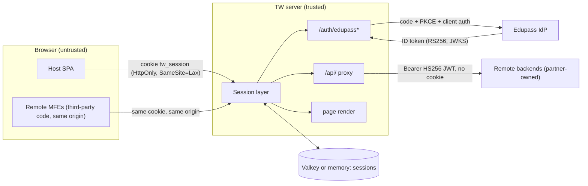
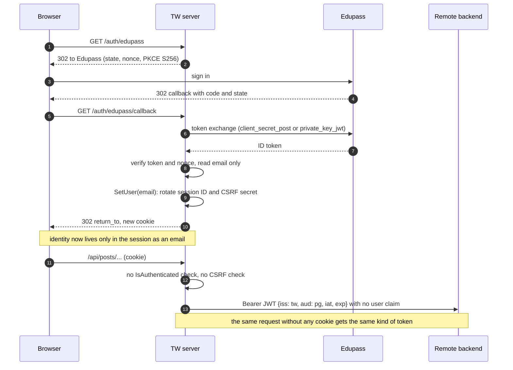

# 07 Security and Authentication

Revision: `main` @ `5ff58a7`. Batch 9 (2026-10-09).

This document consolidates security-relevant findings from batches 2 to 8. Load-bearing claims were re-checked against source in this batch: `proxy.go:48-89`, `middleware/session.go:89-111`, `session.go:194-199`, `auth.go:235-249`, `httputil.go:45-48`, and a search confirming `VerifyCSRFToken` has no non-test caller. Detail lives in the linked documents. Severity ratings in section 6 are this analysis's assessment, not a project decision.

**Context:** the codebase is pre-release (`0.0.x`, CHANGELOG), and several gaps look like "not built yet" rather than mistakes. They matter before partner backends hold real data or real teachers use it.

## 1. Trust boundaries

| Boundary | What crosses it | Control in place | Gap |
| --- | --- | --- | --- |
| Browser to TW | session cookie, query params, request bodies | opaque random ID; HttpOnly; SameSite=Lax; Secure configurable; `return_to` sanitised | no CSRF verification (R2); no auth on `/api/` (R1); no security headers (R4) |
| Remote MFE code to the host page | runs in the same document and origin as the shell | none (by design of Module Federation) | a compromised or careless remote has full same-origin access, including reading `#preloaded-state` and calling `/api/` for any app (Inferred, same-origin semantics) |
| TW to Edupass | auth code, PKCE verifier, client secret or PS256 assertion | TLS (Inferred via URLs); 10s timeout; ID token verified (go-oidc) plus nonce | `email_verified` not checked (R9) |
| TW to session store | session JSON | key prefix; Valkey password and optional TLS from URL; credentials redacted in config errors | store growth from anonymous sessions (R6) |
| TW to remote backends | proxied request plus JWT | Cookie removed, backend `Set-Cookie` removed, per-app HS256 key, 1m TTL, `aud` per app | token proves only "came via TW", not who the user is (R1); spoofable `X-Request-ID` passthrough (R7) |

## 2. Authentication and identity flow

Detail: `workflows/edupass-sign-in.md`, `workflows/api-proxy.md`.

## 3. Controls that are in place (Verified)

| Control | Evidence |
| --- | --- |
| OIDC authorization code flow with PKCE (S256), `state` and `nonce`, single-use pending login | `auth.go:48-61, 100-127, 229-233` |
| Confidential client auth: `client_secret_post` or `private_key_jwt` (PS256, `x5t#S256`, 5-minute assertion with unique `jti`); key must be RSA >= 2048 bits, PKCS#8, cert unexpired and matching | `auth.go:152-182`, `config.go:346-420` |
| Open-redirect protection on `return_to` (protocol-relative, backslash, dot segments, control characters, CRLF, length; heavily tested) | `auth.go:255-285`, `auth_test.go:1396-1560` |
| Session fixation defence: new session ID, new CSRF secret, data cleared on sign-in; old entry dropped | `session.go:189-199`, `middleware/session.go:113-119` |
| Session IDs and CSRF secrets: 32 chars of base58 from `crypto/rand` with unbiased sampling (about 187 bits) | `session.go:33-35`, `random.go:18-83` |
| Cookie: HttpOnly, SameSite=Lax, host-only, Path=/, Secure on by default, Max-Age tied to the store TTL | `middleware/session.go:103-111`, `config.go:61` |
| Idle timeouts: 3h anonymous, 30m signed in, enforced by the store's TTL | `middleware/session.go:89-92` |
| `Cache-Control: no-store` on every session-backed response | `middleware/session.go:102` |
| CSRF token design: masked per render (BREACH-resistant), constant-time verify, rotated on sign-in (not enforced, see R2) | `csrf.go`, `session.go:130-143` |
| Proxy strips `Cookie` outbound and `Set-Cookie` inbound; replaces client `Authorization` | `proxy.go:86-94` |
| Per-app signing keys, at least 32 bytes (HS256 minimum), short TTL | `config.go:477-483`, `proxy.go:60-67` |
| Production static files confined to the build dir with `os.OpenRoot` (symlink escape tested) | `handler.go:78-82`, `index_test.go:335` |
| `X-Content-Type-Options: nosniff` on all rendered responses | `httputil.go:31-77` |
| Secrets: `*_FILE` variants for mounted secrets; Valkey credentials redacted in errors; client secret, assertion, query strings and emails kept out of logs; `.env*` git- and docker-ignored | `config.go:253-258, 214-217`, `auth_test.go:652, 727, 1025`, `proxy.go:102-112`, `.gitignore`, `.dockerignore` |
| Container runs as a non-root system user; Actions pinned by SHA with least-privilege tokens; pnpm release-age and build-script guards | `Dockerfile:71-75`, `ci.yml`, `pnpm-workspace.yaml` |

## 4. Authorisation

There is **none** at this revision:

- Sign-in accepts any Edupass user whose ID token has an email; `groups`, `sub` and `name` are discarded (`auth.go:235-249`).
- No route checks `IsAuthenticated()`, including the page (`index.go`) and the API proxy (`proxy.go`).
- The JWT sent to backends carries no user, so backends cannot authorise either.

The mock-edupass fixtures (location-scoped roles such as `0001_TW_ROLE_TEACHER`, attributes such as `X_TW_ATTR_PG_ADMIN`, a role-conflict user, a non-TW-role user, a pre-prod `TWSTG` app code) show the intended model is role and location based from Edupass `groups` (Inferred from `provider.ts:14-62` and the mock README). Q26.

## 5. Sensitive data inventory

| Data | Where it lives | Lifetime | Notes |
| --- | --- | --- | --- |
| Teacher email | session snapshot in Valkey or memory | up to 30m idle after last request | only PII TW stores; not logged |
| Edupass tokens (access, ID) | process memory during the callback only | discarded | no refresh token kept |
| Pending login (state, nonce, PKCE verifier, return_to) | session data | until callback or 3h idle | single use |
| CSRF secret | session snapshot | until sign-in or expiry | masked in the page |
| Edupass client secret or private key, remote signing keys | env or mounted files, process memory | process lifetime | loaded at startup |
| Request paths | access logs | log retention (Unknown) | may contain IDs from partner APIs |

## 6. Risk register (prioritised)

Severity = impact x likelihood as assessed here, given a production deployment with real partner backends.

| ID | Risk | Evidence | Severity | Suggested fix | Q |
| --- | --- | --- | --- | --- | --- |
| R1 | `/api/` proxy forwards unauthenticated callers with a valid signed token and no user identity; backends cannot tell users apart or reject anonymous calls | `proxy.go:48-78` (no session use), `proxy_test.go:254-262` | **High** (critical once a backend serves real data) | In `proxy()`: require `SessionFromContext(...).IsAuthenticated()`, return 401 JSON otherwise; add `sub` (and email or a stable Edupass ID) to the JWT; update `proxy_test.go` | Q21 |
| R2 | CSRF tokens never verified; protection relies on SameSite=Lax, which treats sibling subdomains of the same registrable domain as same-site, so a compromised or malicious page on another subdomain could forge requests (Inferred, browser semantics) | `VerifyCSRFToken` unused; `middleware/session.go:110` | **Medium** (High after R1 makes cookies carry authority) | Middleware on unsafe methods for `/api/` (and any future form posts) checking a header such as `X-CSRF-Token` against `sess.VerifyCSRFToken`; define how host and remotes obtain the token | Q8, Q38 |
| R3 | No authorisation: any Edupass account with an email can sign in and use every remote | `auth.go:235-249` | **Medium/High** (depends on who Edupass admits for this client) | Parse `groups` at sign-in, reject users without a TW role (staff-7 fixture), store roles and location in `session.User`, pass them in the JWT | Q26 |
| R4 | No CSP, `frame-ancestors` / `X-Frame-Options`, HSTS or `Referrer-Policy`, so clickjacking is possible and there is no XSS containment, unless added at the edge | `httputil.go:45-54` | **Medium** (infra check: nothing at the edge adds them; the app sits behind an ALB with no header rules and no CloudFront, `infra/04-infra-edge-and-network.md`) | Add headers in `RenderHTML` or a middleware; CSP must allow the remotes' origins (manifest hosts) | Q29 |
| R5 | No logout and no absolute session lifetime; on shared classroom or staffroom computers a session survives until 30m of inactivity (shared-device use is an Inferred domain risk) | `handler.go:93-105`, `middleware/session.go` | **Medium** | Add `POST /auth/logout` (CSRF-protected) that drops the session, plus an absolute lifetime field in the snapshot; consider Edupass RP-initiated logout (needs the ID token) | Q22, Q27 |
| R6 | Every cookieless request creates a stored session for 3h (bots, probes, unknown paths); memstore never sweeps | `middleware/session.go:65`, `index.go` catch-all | **Low/Medium** (availability, Valkey memory; the deployed ALB health check alone keeps at least about 4,300 probe sessions per environment, `infra/04` 2.2) | Create sessions lazily (only save when data changes or on `/auth/*`), shorter anonymous TTL, health route outside the session layer | Q23 |
| R7 | Client-supplied `X-Request-ID` reaches backends unchanged; TW's own ID and client IP are not forwarded | `proxy.go:83-90`, `requestid.go:22` | **Low** (log integrity) | In `Rewrite`: set `X-Request-ID` from `RequestIDFromContext`, call `pr.SetXForwarded()` | Q31 |
| R8 | Shared-secret HS256 to partners: each backend holds a key that can mint tokens accepted by itself; rotating requires coordinated restarts | `proxy.go:61-67`, `config.go:432-441` | **Low/Medium** | Consider asymmetric signing (RS256 or ES256) with a TW JWKS so backends hold only public keys; add `kid` for rotation | Q20 |
| R9 | `email_verified` not checked | `auth.go:235-247` | **Low** (depends on Edupass guarantees) | Check it, or confirm Edupass only issues verified emails | Q28 |
| R10 | Supply chain: Dockerfile pnpm tarball not checksum-verified; base images by tag | `Dockerfile:6, 17-19, 37, 55` | **Low/Medium** | Verify the tarball's SHA-256; pin base images by digest | Q39 |
| R11 | Remote MFEs run with full same-origin privileges | MF architecture; `rsbuild.config.ts` | **Accepted by design** (document it) | Partner code review and supply-chain controls; CSP `script-src` limited to known remote hosts | Q29 |
| R12 | mock-edupass has a hard-coded cookie key and auto-login; harmless locally, dangerous if deployed reachable (ADR-0001 plans to ship it in a developer image). **It is deployed in dev** at `https://dev-mock-edupass.edutech.works`, behind the shared dev WAF (default allow), so anyone who can reach it can sign in to dev TW as a fixture user | `provider.ts:132-136`, `app.ts:15-56`; `infra/02-infra-runtime.md` 3.3, `infra/04` 2.1 | **Low** (dev only, no real data) | Keep it out of production images; refuse to start when `NODE_ENV=production` or bind to localhost by default | Q1 |
| R13 | Key and certificate expiry only checked at startup; rotation needs a restart | `config.go:408-410` | **Low** (availability) | Monitor cert expiry; document rotation by redeploy | Q19, infra IQ30 |
| R14 | Panics bypass JSON logging and request IDs, which hampers incident detection | `main.go:105-116` | **Low** | Recovery middleware inside `RequestLog`; set `http.Server.ErrorLog` to a slog adapter | Q34 |

### 6.1 Deployment-side risks (from the infra track)

These come from the organisation's infra repo at `b345a06` (`infra/` docs). They affect TW but are fixed outside the app code, except R15.

| ID | Risk | Evidence | Severity | Suggested fix | IQ |
| --- | --- | --- | --- | --- | --- |
| R15 | The shared WAF injects a secret header (`x-amzn-waf-alb-expecting-this-header`) into every request, and the `/api/` proxy forwards all non-hop-by-hop headers, so the secret would reach partner backends once remotes are configured | `proxy.go:81-90`; `infra/04` 3.3 | **Medium** (once remotes are live) | Strip `x-amzn-waf-*` in `Rewrite`, or forward an allowlist of headers | IQ21 |
| R16 | The task security group accepts port 3000 from `0.0.0.0/0`, so in-network sources can bypass the ALB and WAF | `infra/02` 4.2 | **Low/Medium** | Reference the ALB security group | IQ18 |
| R17 | Any repo in the `transformteamsg` GitHub org can push or overwrite any image tag in mgmt ECR, and TW tags are mutable | `infra/07` 3, 7 | **Medium** (supply chain) | Scope the push role per repository; immutable `v*` tags | IQ35 |
| R18 | The shared WAF's Common Rule Set blocks request bodies over 8 KB and HTML-like bodies, which would break large or rich-text `/api/posts/*` requests | `infra/04` 3.4 | **Medium** (availability of the posts remote) | Host- or path-scoped overrides for TW's `/api/` | IQ25 |

## 7. Suggested order of fixes

1. R1 then R2 together: require sign-in on `/api/`, add user claims, enforce CSRF, and agree how remotes get the token (one design, since cookie authority without CSRF checks would be worse).
2. R3: role parsing at sign-in, using the existing mock fixtures as test cases.
3. R5: logout and absolute lifetime.
4. R4: security headers (coordinate with the platform team in case the edge already sets them).
5. R6, R7, R10, R14: hardening and hygiene.
6. R15 to R18: deployment-side items, coordinated with the platform team (`infra/11-infra-open-questions.md`).

Each of R1 to R3 changes the contract with partner teams (ADR-0002 treats the proxy interface as the major-version boundary), so they warrant an ADR and a version bump plan.

## 8. Test coverage of security behaviour

| Behaviour | Tested? |
| --- | --- |
| `return_to` sanitisation, PKCE and state/nonce generation, client assertion shape, secret redaction in logs | yes (`auth_test.go`) |
| Session rotation on sign-in, cookie attributes, TTL selection, CSRF token mint/verify | yes (`session_test.go`, `middleware/session_test.go`) |
| Callback rejection paths (state mismatch, nonce mismatch, bad ID token, missing email, no pending login, provider error) | **no named tests** (Q25) |
| Cookie and Set-Cookie stripping in the proxy | yes (`proxy_test.go:326, 345`) |
| Proxy rejects anonymous callers | not implemented |
| CSRF enforcement | not implemented |
| Static file confinement | yes (`index_test.go:335`) |
