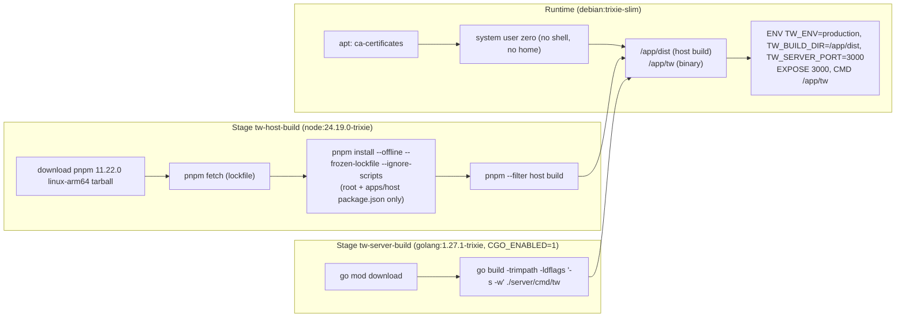
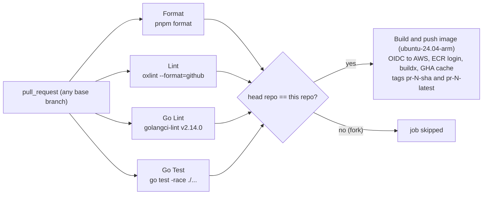
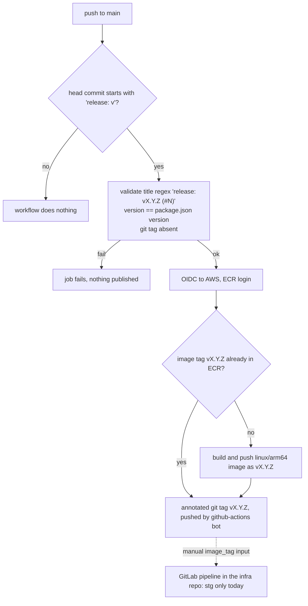
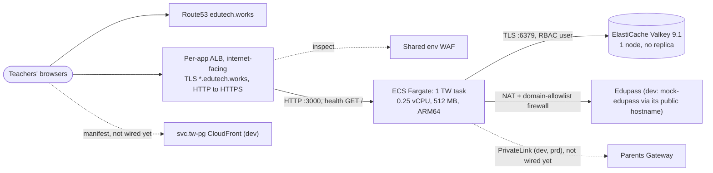

# 08 Infrastructure, Delivery and Operations

Revision: `main` @ `5ff58a7`. Batch 8 (2026-10-09); deployment facts folded in from the infra track (2026-10-10).

Files in scope (read in full): `Dockerfile`, `.dockerignore`, `compose.yml`, `.github/workflows/ci.yml`, `.github/workflows/release.yml`, `.github/PULL_REQUEST_TEMPLATE.md`, `package.json`, `pnpm-workspace.yaml`, `mise.toml`, `lefthook.yml`, `.oxlintrc.json`, `.oxfmtrc.json`, `.golangci.yaml`, `docs/adr/0002-release-strategy.md`, `CHANGELOG.md`.

**Evidence boundary:** this repository ends at a container image in AWS ECR. The deploy pipeline, environments, load balancer, TLS termination, Valkey hosting and secrets management live in the organisation's infra repo (`dxd-transform-infrastructure`).

That side is documented in [`infra/`](infra/README.md) (infra revision `b345a06`, completed 2026-10-10). Sections 3 to 5 below now carry the verified deployment facts and link to the detail. What is deployed (running image tags, secret values) is still not visible from code (infra IQ16).

## 1. Deployable artefact

One OCI image, `linux/arm64` only, containing the Go binary and the built host SPA. mock-edupass and Valkey are **not** in it.

| Fact | Status | Evidence |
| --- | --- | --- |
| Three stages, runtime runs as non-root `zero` | Verified | `Dockerfile:1-81` |
| cgo build, because the Valkey client (`valkey-glide`) ships native libraries; hence a glibc Debian runtime rather than a static or Alpine image | Verified (cgo), Inferred (reason for Debian) | `Dockerfile:39`, `CONTRIBUTING.md` (cgo note) |
| `ca-certificates` installed so the binary can open TLS connections (Valkey, Edupass); fixed in 0.0.2 | Verified | `Dockerfile:64-66`, `CHANGELOG.md` (#153) |
| pnpm is downloaded as an arm64 tarball with `wget`, **without checksum verification**, so the build only works on arm64 builders | Verified | `Dockerfile:17-19` (Q13, Q39) |
| `.env*`, `node_modules`, `dist`, `.git`, `.github` are excluded from the build context | Verified | `.dockerignore` |
| No `HEALTHCHECK` in the image, and no health route in the server | Verified | `Dockerfile`, `handler.go:93-105` (Q11) |
| Base images referenced by tag, not digest | Verified | `Dockerfile:6, 37, 55` |

**Deployed today:** the dev and stg task definitions use older variable names that this revision ignores (infra IQ2; `infra/02-infra-runtime.md` section 3).

Runtime configuration that the deploy environment must supply (the image sets only `TW_ENV`, `TW_BUILD_DIR`, `TW_SERVER_PORT`): every `TW_EDUPASS_*` value (no defaults), `TW_SESSION_STORE_PROVIDER=valkey` plus `TW_SESSION_VALKEY_URL` for any multi-instance deployment, the `TW_REMOTE_*` triples for each remote, and optionally timeouts, TTLs and log level. Full reference: `02-architecture.md` section 6. Secret values may be passed as `*_FILE` paths (Edupass secret, key, certificate), which suits mounted secrets (`config.go:253-258`).

## 2. CI on pull requests

| Fact | Status | Evidence |
| --- | --- | --- |
| Triggers on every PR; a newer push cancels the running workflow for that ref | Verified | `ci.yml:3-9` |
| Workflow token is `contents: read`; only the image job gets `id-token: write` | Verified | `ci.yml:11-12, 102-104` |
| All actions pinned to commit SHAs | Verified | `ci.yml` (every `uses:`) |
| Go tests run with the race detector; Valkey tests need Docker (provided by `ubuntu-latest`) | Verified (command), Inferred (Docker availability) | `ci.yml:92-93`, `valkeystore_test.go` |
| Image pushed to `<registry>/transform/teacher-workspace` with the PR head SHA, not the merge commit | Verified | `ci.yml:122-133` |
| **Not run in CI:** host typecheck (`tsc`), a standalone host build, mock-edupass tests and typecheck, any frontend tests (none exist). The host is compiled only inside the image job, and that job is skipped for forks | Verified | `ci.yml` (Q12) |
| **The Format job may not fail on unformatted code.** It runs `pnpm format`, which is `oxfmt "<globs>"`, a command that rewrites files in place (CONTRIBUTING: "rewrites files in place"). There is no `--check` flag | Verified (command); Inferred (exit code is 0 after rewriting, depends on oxfmt behaviour) | `package.json` `format` script, `ci.yml:36-37` (Q40) |
| No release-title check job for `release/**` PRs, although ADR-0002 describes one | Verified | `ci.yml` (Q2) |

## 3. Release

Release-PR model from ADR-0002: a `release/vX.Y.Z` branch bumps root `package.json` and adds a `CHANGELOG.md` section, titled `release: vX.Y.Z`. Squash-merging it publishes.

| Fact | Status | Evidence |
| --- | --- | --- |
| Runs on push to `main`, gated on the commit message | Verified | `release.yml:3-19` |
| Validates title shape, matches `package.json` version, rejects an existing git tag | Verified | `release.yml:30-56` |
| Re-run safe: an existing ECR image is reused, then tagging continues | Verified | `release.yml:68-85` |
| Image pushed **before** the git tag, so a failed build leaves no tag | Verified | `release.yml:100-121` |
| Tests are not re-run at release (relies on PR CI) | Verified | `release.yml` (no test step); ADR-0002 notes `main` has no required checks |
| Concurrency does not cancel an in-flight release | Verified | `release.yml:10-12` |
| Versions so far: `0.0.1` (2026-09-09), `0.0.2` (2026-09-18) | Verified | `CHANGELOG.md`, `package.json` |
| Deployment happens in GitLab with the image tag as input: a web pipeline in the infra repo runs Terragrunt plan and apply of the ECS service. Only stg has jobs; dev has no pipeline; prd has no app | Verified in the infra repo (job templates inaccessible) | `docs/adr/0002-release-strategy.md`; `infra/07-infra-delivery.md` section 4 |

**Rollback:** the ECS deployment circuit breaker rolls back failed deployments automatically (Verified config, `infra/02`). Manually, redeploy a previous `vX.Y.Z` tag through the GitLab pipeline (Inferred). The release workflow never overwrites an existing `v*` image, but ADR-0002 notes the ECR repository itself allows overwrites. There are no database migrations to roll back; the only state is sessions, and the JSON session format is additive (`subsystems/sessions.md`).

## 4. Runtime topology (dev and stg, from the infra repo)

| Fact | Status | Evidence |
| --- | --- | --- |
| One task per environment, no autoscaling beyond 1; no container health check; ECS Exec on | Verified (config) | `infra/02-infra-runtime.md` section 1 |
| Load balancer: per-app ALB with TLS termination, shared environment WAF, health check `GET /` every 5 s (creates a session per probe, Q23) | Verified (config) | `infra/04-infra-edge-and-network.md` section 2 |
| Valkey: one `cache.t3.micro` node, TLS required, password auth via a named user | Verified (config) | `infra/05-infra-data-and-secrets.md` section 2 |
| Secrets: Secrets Manager `init` (Valkey URL, signing keys) injected as env vars; real Edupass credential not yet wired | Verified (config) | `infra/05` section 3 |
| Remotes: not configured in any environment | Verified (config) | `infra/02` section 5.3; `infra/06` section 3 |
| prd: no app; only a marketing site, the Edupass credential secret and a Parents Gateway endpoint | Verified (config) | `infra/00-infra-overview.md` |

The CONTRIBUTING note about "a horizontally scaled deployment" describes intent. Today each environment runs a single task (infra IQ14 asks what prd will look like).

## 5. Operational characteristics

| Concern | Behaviour | Evidence |
| --- | --- | --- |
| Startup dependencies | fails fast on invalid config, unreachable Valkey, missing `index.html`; Edupass is not contacted at startup | `02-architecture.md` section 3 |
| Shutdown | SIGINT/SIGTERM, 30s graceful drain | `main.go:118-138` |
| Statelessness | all state in the session store; any instance can serve any request when Valkey is used | `subsystems/sessions.md` |
| Logs | JSON on stdout, one access line per request with `request_id` | `subsystems/observability.md` |
| Metrics, tracing, health | none in the app | `subsystems/observability.md` section 5 |
| Signing-key rotation (remote JWT keys, Edupass client key and cert) | read once at startup, so rotation means a restart; certificate expiry checked only at startup | `config.go`, Q19 |
| Valkey memory | every cookieless request creates a 3h entry; the ALB health check alone keeps at least about 4,300 entries per environment | Q23; `infra/04` 2.2 |
| Health probe | ALB target group `GET /` every 5 s, success `200,300-399`; no container health check | `infra/04` 2.2 (Q11) |
| Timeouts at the edge | ALB idle timeout 300 s vs app keep-alive 60 s, which can cause sporadic 502s | `infra/04` 2.3 (infra IQ23) |

## 6. Supply chain and tooling guards

| Guard | Evidence |
| --- | --- |
| Exact Node and pnpm versions enforced (`engines` plus `engineStrict: true`) | `package.json`, `pnpm-workspace.yaml` |
| New npm package versions must be at least 7 days old (`minimumReleaseAge: 10080` minutes) | `pnpm-workspace.yaml` |
| Install scripts only allowed for `core-js` (`allowBuilds`) | `pnpm-workspace.yaml` |
| Local tools pinned and checksum-verified by `mise.lock` (lockfile platform: `macos-arm64` only, so other platforms are not covered) | `mise.toml` |
| GitHub Actions pinned by SHA | `ci.yml`, `release.yml` |
| Gap: pnpm tarball in the Dockerfile is not checksum-verified; base images not pinned by digest | `Dockerfile:6, 17-19, 37, 55` (Q39) |

## 7. Where to change things

| Change | Where |
| --- | --- |
| Add an amd64 image | `Dockerfile:17-19` (pnpm architecture), `platforms` in both workflows, an amd64 or emulated runner (cgo) |
| Add a CI check (host typecheck, mock tests, format check) | new job in `ci.yml`, add it to `needs` of the image job |
| Add a container health check | a health route outside the session layer (`handler.go:100-102`), then point the ALB target group health check at it (infra `svc.teacher-workspace/alb/target-groups.hcl`) |
| Cut a release | follow ADR-0002: branch `release/vX.Y.Z`, bump `package.json`, add `CHANGELOG.md` section, PR titled `release: vX.Y.Z` |
