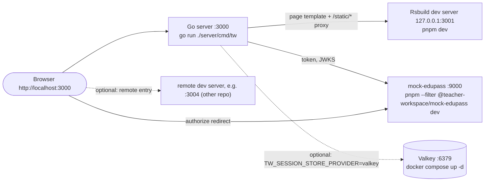

# 09 Local Development and Testing

Revision: `main` @ `5ff58a7`. Batch 8 (2026-10-09).

Sources: `CONTRIBUTING.md`, `README.md`, `.env.example`, `mise.toml`, `package.json`, `pnpm-workspace.yaml`, `lefthook.yml`, `compose.yml`, `apps/*/package.json`, `apps/mock-edupass/README.md`, `docs/go-test-conventions.md`, plus code read in earlier batches. Commands below are what the repo documents or what the code implies; none were run during this analysis.

## 1. Toolchain

| Tool | Version | Managed by |
| --- | --- | --- |
| mise | >= 2026.3.5 (`min_version`) | Homebrew (`brew install mise`) |
| Go | 1.27.1 | mise |
| Node.js | 24.19.0 (enforced via `engines`) | mise |
| pnpm | 11.22.0 (enforced) | mise |
| golangci-lint | 2.14.0 | mise (GitHub release; authenticate `gh` or set `MISE_GITHUB_TOKEN` to avoid rate limits) |
| Docker | any recent | for local Valkey and the Valkey store tests |

Windows is not supported (cgo Valkey client). VS Code recommendations: `oxc.oxc-vscode`, `golang.go`, `hverlin.mise-vscode` (`.vscode/extensions.json`).

## 2. First-time setup

From `CONTRIBUTING.md`:

```bash
mise trust
mise install
cp .env.example .env
pnpm install      # also installs the lefthook pre-commit hook via "prepare"
```

`.env.example` is already wired for local development against mock-edupass: `TW_ENV=development`, `TW_SESSION_SECURE=false`, Edupass URLs at `http://localhost:9000`, client ID `teacher-workspace`, redirect `http://localhost:3000/auth/edupass/callback`, `client_secret_post`, and matching `MOCK_EDUPASS_*` values.

## 3. Running locally



Run from the **repo root** (the server reads `./.env` from the working directory, and `TW_BUILD_DIR` defaults to a relative path):

| Terminal | Command | Needed for |
| --- | --- | --- |
| 1 | `pnpm dev` | host dev server on `127.0.0.1:3001` |
| 2 | `go run ./server/cmd/tw` | the app on `http://localhost:3000` |
| 3 | `pnpm --filter @teacher-workspace/mock-edupass dev` | signing in (reads `../../.env`, watches files) |
| optional | `docker compose up -d` then `TW_SESSION_STORE_PROVIDER=valkey TW_SESSION_VALKEY_URL=valkey://default:<password>@127.0.0.1:6379 go run ./server/cmd/tw` | shared or persistent sessions (password is in `compose.yml`) |

`README.md` and `CONTRIBUTING.md` "Running locally" list only terminals 1 and 2. The server starts without mock-edupass, because Edupass is not contacted at startup, but "Sign in with Edupass" then fails. The mock is documented only in its own README (Q41).

### Running against a local remote

```bash
TW_REMOTE_POSTS_MANIFEST_URL=http://127.0.0.1:3004/mf-manifest.json go run ./server/cmd/tw
```

As written in `CONTRIBUTING.md`, this sets only the manifest URL. Config validation requires all three Posts values (manifest URL, backend base URL, signing key of at least 32 bytes) or none, so the server should refuse to start with that command alone (`config.go:450-485`; Q42). Set all three:

```bash
TW_REMOTE_POSTS_MANIFEST_URL=http://127.0.0.1:3004/mf-manifest.json \
TW_REMOTE_POSTS_BACKEND_BASE_URL=http://127.0.0.1:<backend-port> \
TW_REMOTE_POSTS_BACKEND_SIGNING_KEY=<at least 32 bytes, shared with the backend> \
  go run ./server/cmd/tw
```

Host and remote must both be development builds or both production builds (one shared React instance).

### Signing in

- Default fixture is `staff-1` (John Smith). To use another fixture (`staff-2` to `staff-8`, see `apps/mock-edupass/README.md`), add `&account=staff-N` to the mock's `/authorize` URL in the address bar after TW redirects you there.
- To test `private_key_jwt`: generate `.certs/client.key` and `.certs/client.crt` with the `openssl` command in `CONTRIBUTING.md`. Set the server side (`TW_EDUPASS_CLIENT_AUTH_METHOD=private_key_jwt`, `TW_EDUPASS_CLIENT_PRIVATE_KEY_FILE`, `TW_EDUPASS_CLIENT_CERTIFICATE_FILE`). CONTRIBUTING shows only those; the mock also needs `MOCK_EDUPASS_TW_AUTH_METHOD=private_key_jwt` and `MOCK_EDUPASS_TW_CERTIFICATE_FILE=.certs/client.crt`, and must not also have the secret set for that method (`config.ts:40-136`).

### Production build locally

```bash
pnpm build
TW_ENV=production go run ./server/cmd/tw
```

The server parses `apps/host/dist/index.html` once at startup, so rebuild and restart together.

### Inspecting sessions in Valkey

```bash
docker compose exec -e VALKEYCLI_AUTH=<password> valkey valkey-cli --scan --pattern 'session:*'
```

Then `GET session:<id>` shows the JSON snapshot, `TTL session:<id>` shows the remaining idle time.

## 4. Testing

| Suite | Command | Notes |
| --- | --- | --- |
| Go, as CI runs it | `go test -race ./...` | Valkey store tests start a container via testcontainers: Docker must be running |
| Go, one package / one test | `go test ./server/internal/config`, `go test -run TestName ./server/...` |  |
| mock-edupass | `pnpm --filter @teacher-workspace/mock-edupass test` | `node --test`; not run in CI (Q12) |
| mock-edupass typecheck | `pnpm --filter @teacher-workspace/mock-edupass typecheck` | not run in CI |
| Host | none | no tests or test conventions exist yet |

Go test conventions (`docs/go-test-conventions.md`, which `CLAUDE.md` also imports), in short:

- one parent `Test<Func>` / `Test<Type>_<Method>` with one subtest per behaviour, named as a sentence
- table-driven only when cases differ purely in inputs
- test through public contracts, not internals
- `t.Setenv` / `t.TempDir` / `t.Chdir` for setup
- `want`/`got` failure messages with fixed templates
- logs checked only in log-named subtests, using a `slog.JSONHandler` buffer
- helpers and test doubles at the bottom of the file, named for what they do

## 5. Formatting, linting and hooks

| Area | Format | Lint | Hook |
| --- | --- | --- | --- |
| Go | `mise run fmt` (golangci-lint fmt: gofmt with `interface{}` rewritten to `any`, goimports) | `mise run lint` | **none** (lefthook only covers JS/TS/MD/HTML/CSS/JSON/YAML/TOML) |
| JS/TS and others | `pnpm format` (oxfmt; 100 cols, single quotes, trailing commas, sorted imports, Tailwind class sorting in `apps/host`, Markdown `proseWrap: never`) | `pnpm lint` (oxlint: correctness rules plus a ported ESLint set; `no-explicit-any`, `react/jsx-no-target-blank`, `rules-of-hooks`; `no-console` warns) | lefthook pre-commit runs oxfmt `--write` and oxlint `--fix` on staged files and re-stages them |

Run `mise run fmt` before committing Go, since no hook does it.

## 6. Conventions that affect every change

- Branches: `<type>/<short-description>`, types `feat`, `fix`, `docs`, `refactor`, `test`, `chore`, `release`.
- Commits and PR titles: conventional commits, scope in backticks (``feat(`server/auth`): ...``). Squash-merge is enforced, so the PR title becomes the commit. In a shell, use single quotes for `-m` so the backticks are not executed.
- PR body: Summary, Changes, Test Plan (delete Test Plan for docs-only PRs).
- No em-dashes anywhere; Markdown not hard-wrapped; Go keyed struct literals; Go doc comments describe the caller-visible contract (`CONTRIBUTING.md`).
- `components/ui/*` is shadcn-generated: regenerate rather than hand-edit.

## 7. Troubleshooting

| Symptom | Likely cause | Evidence |
| --- | --- | --- |
| Sign-in always returns to `/login?error=oauth2_callback_failed`, logs show `no pending login in session` | session cookie not stored: `TW_SESSION_SECURE=true` over plain HTTP, or a different host name between steps (`localhost` vs `127.0.0.1`) | `middleware/session.go:103-111`, `auth.go:109-118` |
| "Sign in with Edupass" fails to connect | mock-edupass not running on `:9000` | `.env.example` Edupass URLs |
| Server exits with a list of `TW_*` errors | config validation (all errors joined); check `.env` is in the directory you ran from | `config.go:78-112`, `dotenv.go:16-32` |
| Server exits right after starting with Valkey | Valkey not reachable or wrong password; no fallback to memory | `main.go:76-80` |
| Blank page or 500 on `/` in dev | Rsbuild dev server not running on `TW_DEV_SERVER_URL` | `template.go:49-82` |
| `/posts` shows "This section didn't load" | Posts remote not registered (all three `TW_REMOTE_POSTS_*` needed) or a dev/prod build mismatch | `App.tsx:45-67`, `CONTRIBUTING.md` |
| Production run exits on startup | `apps/host/dist` missing: run `pnpm build` | `config.go:97-102`, `handler.go:71-76` |
| `mise install` fails with 403/429 | GitHub rate limit on tool downloads | `CONTRIBUTING.md` |
