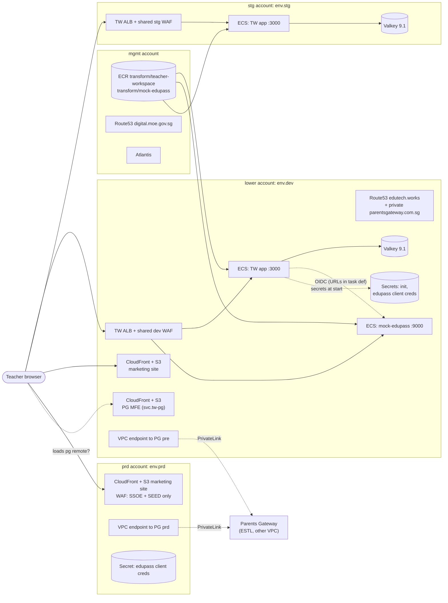

# 00 Infra Overview (provisional)

Infra revision: `main` @ `b345a06`. Phase 0 (2026-10-10). Every row cites the file that shows it. Paths are relative to `infra/states/provider.aws/` unless they start with `.gitlab/` or `docs/`. This is an inventory-level map: Phase 1 batches will trace each piece in depth.

## 1. What runs where

The platform model from `ARCHITECTURE.md` is: one AWS account per stage (`lower` = dev, `stg`, `prd`) plus `mgmt` for shared services. Each workload account has one VPC with web/app/DB/firewall subnet tiers, one ECS Fargate cluster per environment, images in mgmt ECR, secrets in Secrets Manager, DNS in Route53 and infra changes applied through Atlantis. TW follows that model, but each environment is at a different stage:

| Component | dev (`acct.lower/env.dev`) | stg (`acct.stg/env.stg`) | prd (`acct.prd/env.prd`) |
| --- | --- | --- | --- |
| TW app on ECS Fargate (`ecs-services/main`) | yes | yes | **no** |
| mock-edupass on ECS (`ecs-services/mock-edupass`) | yes | no | no |
| Per-app ALB (`alb/`) | yes, 2 host rules (app, mock-edupass) | yes, 1 host rule (app) | no |
| Valkey session cache (`elasticache/cache`, `user-group`) | yes | yes | no |
| Secret `transform/<env>/teacher-workspace/init` | yes | yes | no |
| Secret `.../edupass/oidc-client-credentials` | yes | yes | yes |
| Marketing site, CloudFront + S3 (`cloudfront/`, `s3/`) | yes | no | yes |
| VPC endpoint to Parents Gateway (`pg-connect/vpc-ep-pg`) | yes | no | yes |
| GitLab deploy job (`.gitlab/teacher-workspace/trunk-pipeline.yml`) | none found | yes (`ecs-services/main`) | none |

Evidence: directory listings of `acct.lower/env.dev/svc.teacher-workspace`, `acct.stg/env.stg/svc.teacher-workspace`, `acct.prd/env.prd/svc.teacher-workspace` (Verified).

So in short (Verified from config, not from live AWS):

- **dev** runs the app, a mock Edupass, Valkey, a marketing site and a Parents Gateway endpoint.
- **stg** runs the app and Valkey, with Edupass settings still placeholders.
- **prd** has only the marketing site, the Edupass client credential secret and a Parents Gateway endpoint. The TW app itself is not provisioned in prd.

## 2. Hostnames

| Hostname | Points to | Evidence |
| --- | --- | --- |
| `dev-teacher-workspace.edutech.works` | dev TW ALB (host rule priority 101 to app target group :3000) | `acct.lower/route53/edutech.works/terragrunt.hcl:303-311`, `.../svc.teacher-workspace/alb/https-listener-rules.hcl:1-19` |
| `dev-mock-edupass.edutech.works` | same dev TW ALB (rule 102 to mock-edupass :9000) | `edutech.works/terragrunt.hcl:313-321`, `https-listener-rules.hcl:21-38` |
| `stg-teacher-workspace.edutech.works` | stg TW ALB (record lives in the **lower** account's zone) | `edutech.works/terragrunt.hcl:333-341`, `.gitlab/teacher-workspace/trunk-pipeline.yml:21` |
| `dev-tw.edutech.works` | dev marketing site CloudFront | `edutech.works/terragrunt.hcl:35-39`, `acct.lower/.../svc.teacher-workspace/cloudfront/terragrunt.hcl:24-27` |
| `tw.digital.moe.gov.sg` | prd marketing site CloudFront | `acct.mgmt/route53/digital.moe.gov.sg/terragrunt.hcl:161-169`, `acct.prd/.../cloudfront/terragrunt.hcl` (aliases) |
| `stable-tw.pre.parentsgateway.com.sg` (private zone, lower VPC) | dev VPC endpoint to Parents Gateway "pre" | `acct.lower/route53/parentsgateway.com.sg/terragrunt.hcl:15-24` |
| `prod-tw.prd.parentsgateway.com.sg` (private zone, prd VPC) | prd VPC endpoint to Parents Gateway | `acct.prd/route53/parentsgateway.com.sg/terragrunt.hcl:15-24` |
| `teacher.digital.moe.gov.sg` | **SDT** prd ALB, not TW | `digital.moe.gov.sg/terragrunt.hcl:151-159` (naming trap; out of scope) |

## 3. Provisional deployment map

| Edge | Status | Evidence |
| --- | --- | --- |
| ALB to TW app on port 3000, health check `GET /` | Verified (config) | `acct.lower/.../svc.teacher-workspace/alb/target-groups.hcl:5-24` |
| ALB to mock-edupass on 9000, health `GET /health` | Verified (config) | `target-groups.hcl:26-44` |
| TW app to Valkey (TLS required, SG from the app's SG) | Verified (config) | `elasticache/cache/terragrunt.hcl:38-66` |
| TW app gets `TW_SESSION_VALKEY_URL` and a signing key from the `init` secret | Verified (config) | `ecs-services/main/terragrunt.hcl:164-181` |
| TW app to mock-edupass for OIDC | Inferred: the task sets `https://dev-mock-edupass...` URLs, but under the names `TW_OIDC_*` that app code at `5ff58a7` does not read (IQ2) | `ecs-services/main/terragrunt.hcl:133-158` |
| Images pulled from mgmt ECR | Verified (config) | `ecs-services/main/terragrunt.hcl:107`, `acct.mgmt/ecr/terragrunt.hcl:516-563` |
| Browser loads the `pg` remote from `svc.tw-pg` CloudFront | Inferred from the distribution comment "MFE for PG Staff Portal @ Teacher Workspace"; no TW config in the infra repo sets `TW_REMOTE_POSTS_MANIFEST_URL` (IQ3) | `acct.lower/env.dev/svc.tw-pg/cloudfront/terragrunt.hcl:25` |
| TW to Parents Gateway over PrivateLink | Verified (endpoint and private DNS exist); whether the TW app calls it is Unknown, because the app only proxies to `TW_REMOTE_*_BACKEND_BASE_URL`, which nothing in the infra repo sets (IQ3) | `pg-connect/vpc-ep-pg/terragrunt.hcl`, `parentsgateway.com.sg/terragrunt.hcl`, infra `docs/adr/0001-*` |
| prd marketing site only reachable from SSOE and SEED IPs | Verified (config) | `acct.prd/env.prd/wafv2/us-east-1/terragrunt.hcl:38-58` |

Mermaid syntax: see the validation note in `13-infra-session-handoff.md`.

## 4. First-look findings (to be confirmed in Phase 1)

1. **Env var names in the task definitions do not match the app at `5ff58a7`.** dev and stg set `TW_OIDC_ISSUER_URL`, `TW_OIDC_AUTH_URL`, `TW_OIDC_TOKEN_URL`, `TW_OIDC_JWKS_URI`, `TW_OIDC_REDIRECT_URL`, `TW_OIDC_CLIENT_ID`, `TW_OIDC_CLIENT_SECRET` and `TW_API_PROXY_*_SIGNING_KEY`. The app reads `TW_EDUPASS_*` (with `TW_EDUPASS_JWKS_URL`, not `_URI`) and `TW_REMOTE_*`, and requires the Edupass settings. If the deployed image matches `5ff58a7`, it should fail config validation at startup. Which image is actually deployed is Unknown (IQ2). Traced in batch 1: `02-infra-runtime.md` sections 3 and 5. Evidence: `acct.lower/.../ecs-services/main/terragrunt.hcl:119-181`; app `config.go:243-258, 429-441`.
2. **Remote apps are not configured.** No task sets the manifest URL or backend base URL for Posts or Student Insights. Only signing keys are set: Posts in dev; Posts and Student Insights in stg (IQ3).
3. **prd has no TW app.** `ARCHITECTURE.md:48` says TW "is currently served as a static site from S3 and CloudFront". That matches prd, which serves only a marketing site, but not dev or stg, which run the app on ECS (IQ4).
4. **The Parents Gateway hostname differs from the ADR.** Infra ADR-0001 names `pg-internal.parentsgateway.com`; the repo creates `stable-tw.pre.parentsgateway.com.sg` and `prod-tw.prd.parentsgateway.com.sg` (IQ5).
5. **The dev task definition carries a plaintext client secret** for the mock IdP. It is the mock's own shared value, the same as the app's `.env.example`, not a real credential. Value not reproduced here (IQ6).
6. **The ALB health check is `GET /` every 5 seconds.** In the app, `/` passes through the session middleware, so each probe creates a stored session. This matches app risk R6 / Q23 (IQ7).
