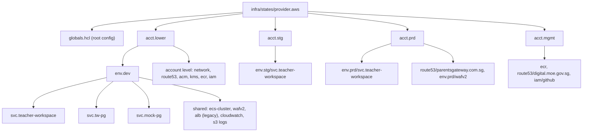

# 01 Infra Repository Map (TW slice)

Infra revision: `main` @ `b345a06`. Phase 0 (2026-10-10).

## 1. Repo identity and tooling

| Item | Value | Evidence |
| --- | --- | --- |
| Title | "MOE DIVA Infra" | `README.md:1` |
| IaC | Terraform + Terragrunt, versions pinned by `infra/.terraform-version` and `infra/.terragrunt-version`, installed with `tenv` | `README.md:15-41` |
| Providers | AWS (primary); Azure, GCP, Elastic, Grafana stacks also exist (out of scope) | `infra/states/` listing, `ARCHITECTURE.md` "Multi-provider" |
| Apply path | Atlantis: an MR triggers `atlantis plan`, a reviewer comments `atlantis apply`, then merge | `ARCHITECTURE.md:245-260` |
| App deploy path | GitLab pipelines under `.gitlab/<project>/`, selected by a `project` input in `.gitlab-ci.yml`, with `image_tag` and `target_env` inputs; shared job templates come from `wog/moe/dxdtransform/dxd-transform/cicd-templates@v2.3.1` (not accessible here) | `.gitlab-ci.yml:1-36` |
| MR checks | Terraform lock validation, KICS IaC SAST, Atlantis screening (all MR-only) | `.gitlab-ci.yml:38-119` |
| Commit and branch conventions | Angular-style types `chore`, `fix`, `ci`, `docs`, `refactor`, `test` (no `feat`); scope = account, env or product; branch named after the change | `CONTRIBUTING.md` |
| Review rules | Changes under `acct.stg`, `acct.prd`, `acct.mgmt`, `shared` and `infra/modules` need the devops team | `CODEOWNERS` |
| Agent guidance | `AGENTS.md` (plan vs apply rules, RDS and IAM exceptions, Route53 zone ownership) | `AGENTS.md` headings |

## 2. How the tree maps to infrastructure

Path pattern: `infra/states/provider.aws/acct.<account>/env.<env>/svc.<service>/<resource>/terragrunt.hcl`. Each leaf directory is one Terraform state; the root config `globals.hcl` derives names (for example `transform-dev-teacher-workspace`), tags and state keys from the path (`ARCHITECTURE.md:294-357`).

## 3. TW footprint inventory

### 3.1 `svc.teacher-workspace` stacks

| Stack | dev | stg | prd | Module source | Notes |
| --- | --- | --- | --- | --- | --- |
| `ecs-services/main` | yes | yes | - | `terraform-aws-modules/ecs/aws//modules/service` 6.7.0 | ARM64 Fargate, 0.25 vCPU / 512 MB, port 3000, `TW_ENV=production`, circuit breaker with rollback, ECS Exec on, `IMAGE_TAG` from env at apply time |
| `ecs-services/mock-edupass` | yes | - | - | same module | port 9000, Service Connect name `mock-edupass` in namespace `transform-dev`, image `transform/mock-edupass` |
| `ecs-services/dev-console` | cache only | - | - | n/a | only a `.terragrunt-cache` with a saved `tfplan`; no `terragrunt.hcl` (IQ8) |
| `alb` (+ `target-groups.hcl`, `https-listener-rules.hcl`) | yes | yes | - | `terraform-aws-modules/alb/aws` 9.4.0 | per-app ALB (current pattern), HTTP to HTTPS redirect, default 404 "Error code: 1", shared env WAF ACL, idle timeout 300s, access logs to env logs bucket |
| `elasticache/cache` | yes | yes | - | `terraform-aws-modules/elasticache/aws` 1.6.0 | Valkey 9.1, `cache.t3.micro`, 1 node, TLS required, KMS `transform-DBKey`, DB subnets, slow log to CloudWatch |
| `elasticache/user-group` | yes | yes | - | same, `//modules/user-group` | password from `VALKEY_PASSWORD`; `get_env("LOCAL")` deliberately makes Atlantis fail, so it is applied by hand |
| `secrets` | yes | yes | yes | local `infra/modules/aws/secrets` | `.../init` (dev, stg); `.../edupass/oidc-client-credentials` (all three; values uploaded out of band) |
| `cloudfront` + `s3` | yes | - | yes | `cloudfront/aws` 6.0.2, `s3-bucket/aws` 3.15.1 | "Marketing site for Teacher Workspace"; OAC, SG geo-restriction, TLS 1.2 |
| `pg-connect/vpc-ep-pg` | yes | - | yes | local `infra/modules/aws/network/vpc-endpoints` | interface endpoint to the Parents Gateway endpoint service, app subnets |

Evidence: the `terragrunt.hcl` files in each listed directory (Verified; stg and prd differences found by diff against dev).

### 3.2 Connected services

| Service | What it is | Relation to TW | Status |
| --- | --- | --- | --- |
| `env.dev/svc.tw-pg` | S3 + CloudFront, comment "MFE for PG Staff Portal @ Teacher Workspace"; the bucket allows the lower `transform-gitlab` role to write | hosts the `pg` remote bundle (Inferred) | in scope |
| `env.dev/svc.mock-pg` | internal ALB returning a fixed "mock PG" response, behind an NLB and VPC endpoint service `tw-inc-tunnel` | same-account PrivateLink pre-flight for TW to Parents Gateway (infra ADR-0001 "Validation") | in scope |
| `env.dev/svc.tw-ci` | AI service: Bedrock knowledge base, Postgres, migration task, Service Connect only, image `transform/tw-ci` | **Unknown.** Name suggests TW, but no TW code references it | identified only (IQ1) |

### 3.3 Shared stacks that name TW

| File | TW content |
| --- | --- |
| `acct.lower/route53/edutech.works/terragrunt.hcl` | records `dev-teacher-workspace`, `dev-mock-edupass`, `stg-teacher-workspace` (ALB aliases), `dev-tw` (CloudFront) |
| `acct.mgmt/route53/digital.moe.gov.sg/terragrunt.hcl` | record `tw` to the prd marketing CloudFront |
| `acct.lower/route53/parentsgateway.com.sg/terragrunt.hcl`, `acct.prd/...` | private zones associated with the account VPC; CNAMEs to the TW VPC endpoints |
| `acct.mgmt/ecr/terragrunt.hcl` | repositories `transform/teacher-workspace`, `transform/mock-edupass` (and `transform/tw-ci`), pull by lower, stg and prd; tags mutable |
| `acct.mgmt/iam/github/terragrunt.hcl` | GitHub OIDC trust includes `repo:String-dxd/teacher-workspace:*` and `repo:transformteamsg/*` |
| `acct.prd/env.prd/wafv2/us-east-1/terragrunt.hcl` | CloudFront WAF for TW: default block, allow SSOE and SEED IP sets |

### 3.4 Shared platform TW depends on (described, not yet inspected)

| Dependency | Where | Used by |
| --- | --- | --- |
| ECS cluster `transform-<env>-cluster` | `env.*/ecs-cluster` | app and mock-edupass services |
| Env WAF ACL `transform-<env>` (regional; dev also has a us-east-1 one) | `env.*/wafv2` | TW ALB (ARN hard-coded), dev marketing CloudFront |
| Env logs bucket | `env.*/s3/ap-southeast-1/logs` | ALB access logs, CloudFront and S3 logs |
| KMS `transform-ServicesSecretsKey`, `transform-DBKey` | `acct.*/kms` | secrets, Valkey |
| VPC and subnets (web, app, DB) | `acct.*/network`, `acct-vars.hcl` | everything |
| Network Firewall domain allowlist | `acct.*/network` (module) | outbound calls to Edupass, Parents Gateway, remote backends |
| Wildcard ACM certs `*.edutech.works`, `*.digital.moe.gov.sg` | `acct.*/acm` | ALB and CloudFront TLS |
| Service Connect namespace `transform-dev` | `env.dev/private-namespace` | mock-edupass |

## 4. Entry points

| Kind | Entry | Evidence |
| --- | --- | --- |
| Infra change | MR, then Atlantis plan/apply per leaf directory | `ARCHITECTURE.md:245-260` |
| App deploy, stg | GitLab web pipeline with `project=teacher-workspace`, `target_env=stg`, `image_tag=<tag>`: `plan` then `deploy` of `acct.stg/.../ecs-services/main` on `transform-stg-cluster` / `transform-stg-teacher-workspace-main` | `.gitlab/teacher-workspace/trunk-pipeline.yml` |
| App deploy, dev | **none found** in `.gitlab/` | (IQ9) |
| mock-edupass deploy | none found | (IQ9) |
| Manual applies | Valkey user group (`LOCAL`, `VALKEY_PASSWORD`); secret values via `aws secretsmanager put-secret-value` | `elasticache/user-group/terragrunt.hcl:17-26`, `secrets/terragrunt.hcl:20-22` |

## 5. Relevant docs in the infra repo

| Doc | Relevance | Status |
| --- | --- | --- |
| `README.md` | setup and tooling only; points to `ARCHITECTURE.md` for hosting | inspected |
| `ARCHITECTURE.md` | platform model; one TW sentence (line 48) and one Parents Gateway DNS note (line 164) | sections 1-11 inspected |
| `docs/adr/0001-use-vpc-endpoint-service-for-teacher-workspace-parents-gateway-connectivity.md` | TW to Parents Gateway decision (PrivateLink) | inspected |
| `docs/github-to-gitlab-mirroring.md` | generic mirroring how-to; may explain how the TW GitHub repo reaches GitLab | headings only |
| `AGENTS.md`, `CONVENTIONS.md`, `CONTRIBUTING.md`, `CODEOWNERS` | working conventions | inspected (AGENTS: headings and zone table) |
