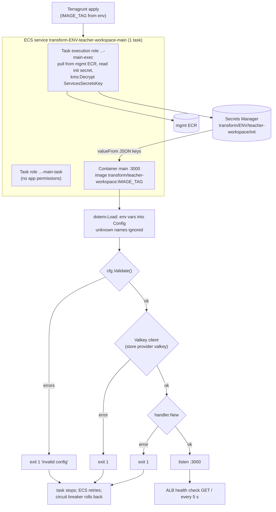

# 02 Infra Runtime: ECS Services and Task Configuration

Infra revision: `main` @ `b345a06`; app revision `5ff58a7`. Phase 1 batch 1 (2026-10-10). Paths are relative to `infra/states/provider.aws/` unless they start with an app path (`server/`, `apps/`, `Dockerfile`). Labels: **Verified** (read in code), **Inferred** (follows from code plus module or AWS defaults not read here), **Unknown**, **Conflicts**.

Short version:

- Each environment runs **one** Fargate task of the TW app (dev and stg), plus one mock-edupass task in dev.
- The task definitions pass Edupass and remote-app settings under names the app at `5ff58a7` does not read. An image built from `5ff58a7` would therefore exit at config validation in both environments (section 5, IQ2).
- Fixing only the names would still fail: a remote signing key without its manifest and backend URLs is also a validation error (section 5.3).

## 1. Services at a glance

|  | dev `main` | stg `main` | dev `mock-edupass` |
| --- | --- | --- | --- |
| File | `acct.lower/env.dev/svc.teacher-workspace/ecs-services/main/terragrunt.hcl` | `acct.stg/env.stg/svc.teacher-workspace/ecs-services/main/terragrunt.hcl` | `acct.lower/env.dev/svc.teacher-workspace/ecs-services/mock-edupass/terragrunt.hcl` |
| Module | `terraform-aws-modules/ecs/aws//modules/service` 6.7.0 (L7) | same (L7) | same (L7) |
| ECS service name | `transform-dev-teacher-workspace-main` | `transform-stg-teacher-workspace-main` | `transform-dev-teacher-workspace-mock-edupass` |
| Cluster | `transform-dev-cluster` | `transform-stg-cluster` | `transform-dev-cluster` |
| Image | `787257787447.dkr.ecr.ap-southeast-1.amazonaws.com/transform/teacher-workspace:${IMAGE_TAG}` (L107) | same (L107) | `.../transform/mock-edupass:${IMAGE_TAG}` (L80) |
| CPU / memory | 256 / 512 (L66-67) | same | 256 / 512 (L48-49) |
| Platform | Fargate `LATEST`, `ARM64` Linux (L69-75) | same | same (L52-58) |
| Container port | 3000 (L109-117) | 3000 | 9000 (L36, L82-90) |
| Task count | not set; `autoscaling_max_capacity = 1` (L77) | same | `desired_count = 1`, max 1 (L50, L60) |
| Health check grace | 120 s (L76) | 120 s | 120 s (L59) |
| Circuit breaker | enabled, rollback (L79-82) | same | same (L64-67) |
| `deployment_minimum_healthy_percent` | module default | module default | 100 (L61) |
| `wait_for_steady_state` | not set | not set | `true` (L62) |
| `force_new_deployment` | `true` (L217) | `true` (L225) | `true` (L165) |
| ECS Exec | enabled (L74) | enabled | enabled (L57) |
| `readonlyRootFilesystem` | `false` (L183) | `false` (L191) | `false` (L119) |
| Log retention | 400 days (L184) | 400 days (L192) | 400 days (L120) |
| Load balancer | target group `main` of the TW ALB, container `main`:3000 (L188-194) | same | target group `mock-edupass`:9000 (L124-130) |
| Service Connect | none | none | namespace `transform-dev`, name and alias `mock-edupass`:9000 (L152-162) |
| Secrets from Secrets Manager | 2 (section 3) | 3 | none |

All rows Verified from the cited lines. stg differs from dev main only in the secret key path, the Edupass values (lines 134-158) and one extra secret (L181-188); `diff` of the two files shows nothing else.

### 1.1 How the names resolve (Verified)

Every leaf includes `root.hcl` (L1-4), a symlink in each account directory that points at the shared root config. Assumption: the target is `globals.hcl` (Inferred; the symlink target was not read).

| Step | Source | Result for dev `main` |
| --- | --- | --- |
| `project_name` | `acct.lower/acct-vars.hcl:4` | `transform` |
| `env`, `svc` | regex on the leaf path (`globals.hcl:6-7`) | `dev`, `teacher-workspace` |
| `name_prefixes.default` | `globals.hcl:35` | `transform-dev-teacher-workspace` |
| `name` | leaf `locals.name` = prefix + directory basename (`main/terragrunt.hcl:48`) | `transform-dev-teacher-workspace-main` |
| IAM roles | L84-89 | `transform-dev-teacher-workspace-main` (service), `...-main-exec`, `...-main-task` |
| Security group | L63-64, name prefix | `transform-dev-teacher-workspace-main...` |
| Cluster | `env.dev/ecs-cluster/terragrunt.hcl:20`, no `svc` in path | `transform-dev-cluster` |
| Service Connect namespace | `env.dev/private-namespace/terragrunt.hcl:17` | `transform-dev` (matches mock-edupass L153) |
| Tags | `globals.hcl:22-31` | `Project-Code = transform/teacher-workspace`, `Service = teacher-workspace` |

The stg names match what the stg GitLab deploy job targets (`.gitlab/teacher-workspace/trunk-pipeline.yml`), so the job and the stack agree (Verified).

### 1.2 Shared cluster and namespace

- `env.dev/ecs-cluster` and `env.stg/ecs-cluster` are identical. They use the root ECS module 6.7.0, ECS Exec logging `OVERRIDE` and 400-day log retention (`ecs-cluster/terragrunt.hcl:7-28`). No capacity providers are configured in the leaf, so the module defaults apply (Inferred).
- `env.dev/private-namespace` uses a local module and is named after the env prefix (`private-namespace/terragrunt.hcl:7, 17`). Only mock-edupass registers in it. stg has no namespace stack under `env.stg` in the listing.

### 1.3 Network placement (Verified)

- Both services run in the account's `transform` app subnets (`main/terragrunt.hcl:50-51, 196-197`; `acct.lower/acct-vars.hcl:28-36`, `acct.stg/acct-vars.hcl:28-34`). These are two subnets across `ap-southeast-1a` and `-1b`.
- There is no `assign_public_ip` input, so tasks get private IPs only (module default false; Inferred).

## 2. Task composition and startup



| Step | Status | Evidence |
| --- | --- | --- |
| Terragrunt reads `IMAGE_TAG` from the shell environment, with no default | Verified | `main/terragrunt.hcl:55`; `mock-edupass/terragrunt.hcl:37` |
| `get_env` without a default fails when the variable is unset, so a plan or apply without `IMAGE_TAG` errors | Inferred (Terragrunt behaviour) | same |
| Every apply forces a new deployment, even with an unchanged tag | Verified | `force_new_deployment = true` |
| Secrets are injected at task start by the execution role, one JSON key per variable (`<arn>:<key>::`) | Verified | `main/terragrunt.hcl:99-101, 164-181` |
| The app reads only process env plus an optional `.env` in its working directory. None ships in the image, and a missing file is not an error | Verified | `server/pkg/dotenv/dotenv.go:19-31`; `Dockerfile:57-80` |
| Variables with names the app does not know are ignored silently | Verified (decoder has no unused-key check) | `dotenv.go:54-70` |
| `Validate` reports every invalid field at once, logs `invalid config` and exits 1 | Verified | `server/cmd/tw/main.go:44-52`; `config.go:78-112` |
| Valkey client creation, then `handler.New`, are the next exit points | Verified | `main.go:56-95` |
| Graceful shutdown waits up to 30 s on SIGTERM | Verified | `main.go:26, 118-139` |
| ECS sends SIGKILL 30 s after SIGTERM, so in-flight requests get the full window but no more | Inferred (Fargate `stopTimeout` default; not set in the task) |  |
| No container health check is defined, so the ALB target health check is the only liveness probe | Verified (no `healthCheck` key) | `main/terragrunt.hcl:103-186` |

## 3. Environment variable and secret mapping

The app's settings come from `server/internal/config/config.go` (full reference: app doc `02-architecture.md` section 6). This table lists every app setting and what each environment supplies. "Image" means the `Dockerfile` `ENV` (`Dockerfile:57-59`); "default" means `config.Default()` (`config.go:40-74`).

### 3.1 Settings the app reads

| App variable (`config.go` line) | Required? | dev `main` supplies | stg `main` supplies | Effective value | Status |
| --- | --- | --- | --- | --- | --- |
| `TW_ENV` (28) | yes | `production` (L121-122) | same | `production` | OK |
| `TW_LOG_LEVEL` (29) | no, default info | `info` (L125-126) | same | info | OK |
| `TW_DEV_SERVER_URL` (31) | only in development | - | - | unused in production | OK |
| `TW_BUILD_DIR` (32) | in production | image `/app/dist` | image | `/app/dist` | OK |
| `TW_SERVER_PORT` (116) | no, default 3000 | image 3000 | image | 3000, matches port mapping | OK |
| `TW_SERVER_*_TIMEOUT` (117-120) | no | - | - | defaults 2 s / 15 s / 30 s / 60 s | OK |
| `TW_SESSION_NAME` (154) | no | - | - | `tw_session` | OK |
| `TW_SESSION_DEFAULT_TTL`, `_AUTHENTICATED_TTL` (155-156) | no | - | - | 3 h / 30 min | OK |
| `TW_SESSION_SECURE` (157) | no | - | - | `true` (the ALB terminates HTTPS, batch 2) | OK |
| `TW_SESSION_STORE_PROVIDER` (158) | no | `valkey` (L129-130) | same | `valkey` | OK |
| `TW_SESSION_VALKEY_URL` (164) | yes when valkey | secret key `TW_SESSION_VALKEY_URL` (L166-171) | same | value Unknown. It must be `valkey://host:port`, with `?tls=true` because the cache requires TLS (batch 3) | Unknown (IQ16) |
| `TW_SESSION_VALKEY_PREFIX` (165) | yes when valkey | - | - | `session:` | OK |
| `TW_EDUPASS_ISSUER_URL` (244) | **yes** | **not set** (sets `TW_OIDC_ISSUER_URL`, L133-134) | **not set** (`TW_OIDC_ISSUER_URL` = `https://edupass.invalid`) | missing | **Conflict (IQ2)** |
| `TW_EDUPASS_AUTH_URL` (245) | **yes** | not set (`TW_OIDC_AUTH_URL`, L137-138) | not set | missing | **Conflict** |
| `TW_EDUPASS_TOKEN_URL` (246) | **yes** | not set (`TW_OIDC_TOKEN_URL`, L141-142) | not set | missing | **Conflict** |
| `TW_EDUPASS_JWKS_URL` (247) | **yes** | not set (`TW_OIDC_JWKS_URI`, L145-146: different prefix **and** suffix) | not set | missing | **Conflict** |
| `TW_EDUPASS_CLIENT_ID` (249) | **yes** | not set (`TW_OIDC_CLIENT_ID`, L153-154) | not set (placeholder) | missing | **Conflict** |
| `TW_EDUPASS_REDIRECT_URL` (250) | **yes** | not set (`TW_OIDC_REDIRECT_URL`, L149-150) | not set | missing | **Conflict** |
| `TW_EDUPASS_CLIENT_AUTH_METHOD` (252) | no | - | - | `client_secret_post` (default). Matches the mock's `MOCK_EDUPASS_TW_AUTH_METHOD` | OK |
| `TW_EDUPASS_CLIENT_SECRET` / `_FILE` (253-254) | **yes** for `client_secret_post` | not set (`TW_OIDC_CLIENT_SECRET`, L157-158, plaintext mock value, IQ6) | not set (placeholder) | missing | **Conflict** |
| `TW_EDUPASS_CLIENT_PRIVATE_KEY*`, `_CERTIFICATE*` (255-258) | only for `private_key_jwt` | - | - | unused | OK |
| `TW_REMOTE_SIGNED_TOKEN_TTL` (432) | no | - | - | 1 min | OK |
| `TW_REMOTE_POSTS_MANIFEST_URL`, `_BACKEND_BASE_URL` (434-435) | all three or none | - | - | unset | see 5.3 (IQ3) |
| `TW_REMOTE_POSTS_BACKEND_SIGNING_KEY` (436) | all three or none | not set (secret key `TW_API_PROXY_POSTS_SIGNING_KEY`, L174-179) | same name | missing | **Conflict (IQ2)** |
| `TW_REMOTE_STUDENT_INSIGHTS_*` (438-440) | all three or none | - | not set (secret key `TW_API_PROXY_STUDENT_INSIGHTS_SIGNING_KEY`, stg L182-187) | missing | **Conflict (IQ2)** |

### 3.2 Variables the task sets that the app ignores

`TW_OIDC_ISSUER_URL`, `TW_OIDC_AUTH_URL`, `TW_OIDC_TOKEN_URL`, `TW_OIDC_JWKS_URI`, `TW_OIDC_REDIRECT_URL`, `TW_OIDC_CLIENT_ID`, `TW_OIDC_CLIENT_SECRET`, `TW_API_PROXY_POSTS_SIGNING_KEY` and, in stg, `TW_API_PROXY_STUDENT_INSIGHTS_SIGNING_KEY`. No `dotenv` tag with these names exists in `config.go` (Verified by search). The same stale `TW_OIDC_*` names appear in `apps/mock-edupass/README.md` (app Q3). This suggests an earlier app version used them.

### 3.3 mock-edupass (dev)

| Variable (mock `apps/mock-edupass/src/config.ts` line) | Task sets (mock-edupass `terragrunt.hcl` line) | Matches TW side? |
| --- | --- | --- |
| `MOCK_EDUPASS_PORT` (28, default 9000) | `9000` (L94-95) | yes, port mapping and target group :9000 |
| `MOCK_EDUPASS_URL` (30-31, required) | `https://dev-mock-edupass.edutech.works` (L98-99) | equals the TW task's issuer value (L134) |
| `MOCK_EDUPASS_TW_ID` (33-34, required) | `teacher-workspace` (L102-103) | equals the TW task's client ID value (L154) |
| `MOCK_EDUPASS_TW_REDIRECT_URI` (36-37, required) | `https://dev-teacher-workspace.edutech.works/auth/edupass/callback` (L106-107) | equals the TW task's redirect value (L150) and the app's callback route |
| `MOCK_EDUPASS_TW_AUTH_METHOD` (40) | `client_secret_post` (L110-111) | equals the app default |
| `MOCK_EDUPASS_TW_SECRET` (48, required for `client_secret_post`) | plaintext value (L114-115, not reproduced; IQ6) | same value as the TW task's `TW_OIDC_CLIENT_SECRET` (L157-158) |

All mock names match its code (Verified). The values on both sides agree, so the dev pair would work as soon as the TW side uses the `TW_EDUPASS_*` names (Inferred).

## 4. IAM, security groups and service discovery

### 4.1 IAM (Verified unless marked)

| Role | Name | Permissions given in the leaf | Notes |
| --- | --- | --- | --- |
| Task execution (main) | `...-main-exec` | `kms:Decrypt` on `transform-ServicesSecretsKey` (L91-97); read of the `init` secret ARN via `task_exec_secret_arns` (L99-101) | ECR pull and CloudWatch Logs write come from the module's default policy (Inferred). Cross-account pull from mgmt ECR is granted on the repository side (`acct.mgmt/ecr/terragrunt.hcl:516-563`) |
| Task (main) | `...-main-task` | none | correct for the app: the server makes no AWS API calls (app track, server inspected in full). ECS Exec's SSM channel permissions are added by the module when `enable_execute_command` is true (Inferred) |
| Service (main) | `...-main` | module default (ELB registration) | Inferred |
| mock-edupass roles | `...-mock-edupass`, `-exec`, `-task` | none beyond module defaults (L69-74) | no secrets, no KMS |

The `edupass/oidc-client-credentials` secret (all environments) is **not** referenced by any task definition. Only `init` is. That leaves the real Edupass client secret unused in dev and stg as of this revision (Verified for dev and stg; batch 3 covers the secret stacks).

### 4.2 Security groups (Verified)

| Service | Ingress | Egress | Comment |
| --- | --- | --- | --- |
| TW `main` (dev, stg) | TCP 3000 from `0.0.0.0/0`, described as "Ingress to app" (dev L199-207, stg L207-215) | all, `0.0.0.0/0` (dev L209-214) | the rule key is `alb_to_app`, but the source is any address, not the ALB security group. Tasks are in private subnets, so anything routable inside the VPC (and anything attached through the account's transit gateway, if routes allow) can reach port 3000 directly, bypassing the ALB and WAF (Inferred; IQ18) |
| mock-edupass (dev) | TCP 9000 from `172.16.0.0/16`, "from the ALB and Service Connect clients in the Transform VPC" (L135-143) | all (L145-150) | that CIDR is taken to be the Transform VPC (comment; the CIDR is not in `acct-vars.hcl`, so this is Inferred) |
| Valkey (cache stack) | 6379 from the TW `main` security group |  | defined in `elasticache/cache`, which depends on this service. The leaf comment at L162-163 explains why `main` reads the Valkey URL from Secrets Manager instead of depending on the cache stack |

### 4.3 Service Connect

mock-edupass registers as `mock-edupass:9000` in `transform-dev` (L152-162). The TW `main` service has **no** `service_connect_configuration`, so it is not a Service Connect client and cannot resolve that alias (Verified that the block is absent; client behaviour Inferred). The TW task's OIDC URLs point at the public hostname `https://dev-mock-edupass.edutech.works` (L134-146) instead. The app's server-side token and JWKS calls would therefore leave through the VPC egress path and come back in through the ALB (traced in batch 2).

## 5. Startup outcome with the current config

### 5.1 If the running image is built from `5ff58a7` or later (Inferred)

`Validate` (`config.go:78-112`) collects these errors in dev and stg and the process exits 1 (`main.go:49-52`):

1. Edupass block (`config.go:264-330`): `TW_EDUPASS_ISSUER_URL is required`, `..._AUTH_URL`, `..._TOKEN_URL`, `..._JWKS_URL`, `..._CLIENT_ID`, `..._REDIRECT_URL`, then `TW_EDUPASS_CLIENT_SECRET or TW_EDUPASS_CLIENT_SECRET_FILE is required for client_secret_post`.
2. No remote-app errors, because none of the `TW_REMOTE_*` names are set.
3. Session block passes only if the `TW_SESSION_VALKEY_URL` secret value is well formed (Unknown).

What ECS then does (Inferred from ECS behaviour; nothing in the infra repo shows deployed state, IQ16):

- The task stops shortly after start.
- ECS keeps launching replacements.
- The deployment circuit breaker marks the deployment failed and rolls back to the previous task definition, if one ran successfully. On a first deployment there is nothing to roll back to.
- With at most one task and no healthy target, the ALB serves 503 for `dev-teacher-workspace` / `stg-teacher-workspace`.
- `main` does not set `wait_for_steady_state` (unlike mock-edupass, L62), so `terragrunt apply`, and therefore the stg GitLab deploy job, can report success before the rollout fails.

### 5.2 If the running image predates the rename (Unknown)

If the deployed tag comes from an app version that read `TW_OIDC_*` and `TW_API_PROXY_*`, the services start. They then break on the first deploy of a current image. Either way, the two repos are out of step at the revisions read. Which tag runs is Unknown (IQ16). The commands in section 7 settle it.

### 5.3 Renaming alone is not enough (Verified)

The app treats each remote as all or nothing: setting any of manifest URL, backend base URL or signing key requires all three (`config.go:430-431`; Posts L450-485, Student Insights L487-522). The infra supplies only signing keys. Renaming `TW_API_PROXY_POSTS_SIGNING_KEY` to `TW_REMOTE_POSTS_BACKEND_SIGNING_KEY` without adding `TW_REMOTE_POSTS_MANIFEST_URL` and `TW_REMOTE_POSTS_BACKEND_BASE_URL` turns a silent ignore into a startup failure:

- `TW_REMOTE_POSTS_MANIFEST_URL is required to register the posts remote`, and the same for the base URL.

A safe fix, in either order of the two steps:

1. Rename the seven Edupass variables (including `JWKS_URI` to `JWKS_URL`).
2. Either drop the two signing-key secrets until the remotes are ready, or add the two URLs per remote. The URL values are open (IQ3).

### 5.4 stg Edupass placeholders (Verified values; outcome Inferred)

After a rename, stg would pass validation: `https://edupass.invalid` is a well-formed http(s) URL with a host, and the placeholder client ID and secret are non-empty. The service would start and serve pages. Sign-in would fail because `.invalid` never resolves (RFC 6761). IQ13 (is stg meant to be sign-in-capable yet?) stays open.

## 6. Operational notes

| # | Observation | Status | Evidence | Follow-up |
| --- | --- | --- | --- | --- |
| R1 | Single task per environment (max capacity 1): no redundancy across the two AZs, and every deploy or task replacement has a gap or overlap depending on module deployment defaults | Verified config; effect Inferred | `main/terragrunt.hcl:77` | expected for dev/stg; record before prd (IQ14) |
| R2 | `main` lacks `wait_for_steady_state`; mock-edupass has it. Applies can succeed while the rollout fails | Verified | `main` vs `mock-edupass/terragrunt.hcl:62` | batch 5 (deploy job) |
| R3 | Task security group allows 3000 from `0.0.0.0/0` instead of the ALB security group | Verified | dev L199-207 | IQ18 |
| R4 | ECS Exec is on for the app and the mock; exec sessions are logged by the cluster (`OVERRIDE`) | Verified | L74; `ecs-cluster/terragrunt.hcl:22-26` | where exec logs go is set by module defaults (Inferred) |
| R5 | `readonlyRootFilesystem = false`. The app writes nothing to disk at runtime (it serves `/app/dist` read-only and keeps sessions in Valkey), so `true` looks safe | Verified config; app behaviour from the app track | L183 | suggestion only |
| R6 | Logs: the app writes JSON to stdout (`main.go:32-42`). The module's default log group per container receives it, with 400-day retention | log format Verified; log group name and driver Inferred (module default `awslogs`) | L184 | batch 5 or console |
| R7 | `IMAGE_TAG` has no default, and ECR tags are mutable (`acct.mgmt/ecr`), so the same tag can point at different images over time | Verified config | L55; ECR L516-563 | batch 5 |
| R8 | The real Edupass client credential secret is not wired into any task | Verified | section 4.1 | batch 3 |

## 7. Commands to settle the open points (user to run)

Run these yourself and paste the output back. Nothing here changes state.

In the teacher-workspace repo, to find when the app moved from `TW_OIDC_*` and `TW_API_PROXY_*` to the current names:

```
git log -S 'TW_OIDC_' --oneline -- server/
git log -S 'TW_API_PROXY_' --oneline -- server/
git log -S 'TW_EDUPASS_JWKS_URL' --oneline -- server/
```

With read-only AWS access to the lower and stg accounts, to see which image tag is actually running and whether the service is healthy:

```
aws ecs describe-services --cluster transform-dev-cluster --services transform-dev-teacher-workspace-main --query 'services[0].{td:taskDefinition,running:runningCount,events:events[:5].message}'
aws ecs describe-task-definition --task-definition <td from above> --query 'taskDefinition.containerDefinitions[0].image'
```

Repeat with `transform-stg-cluster` and `transform-stg-teacher-workspace-main` for stg.

## 8. Questions raised or sharpened

- **IQ2**: sharpened (sections 3 and 5). It now includes the `JWKS_URI` vs `JWKS_URL` suffix difference and the all-or-nothing trap.
- **IQ3**: sharpened (section 5.3).
- **IQ13**: sharpened (section 5.4).
- **IQ18** (new): task security group ingress from `0.0.0.0/0`.
- **IQ19** (new): `main` has no `wait_for_steady_state`.
- **IQ20** (new): the Edupass credentials secret is unused by any task.

All are listed in `11-infra-open-questions.md`.
