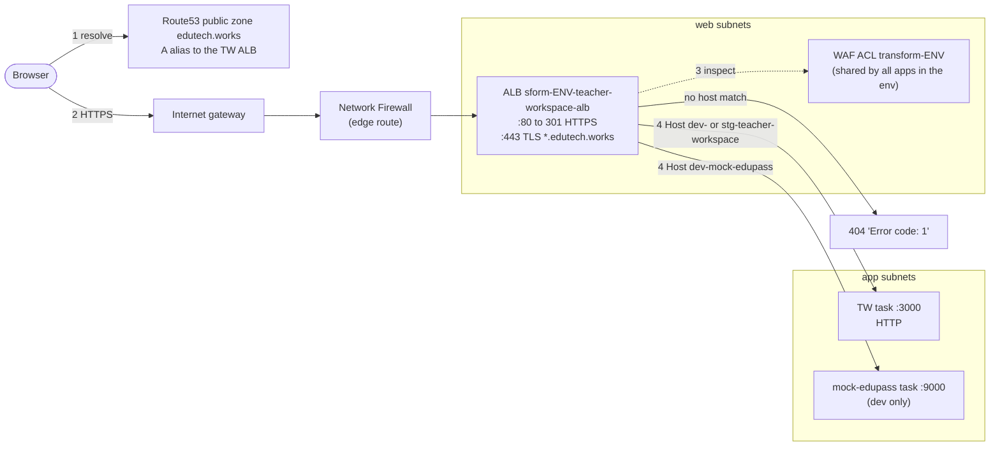
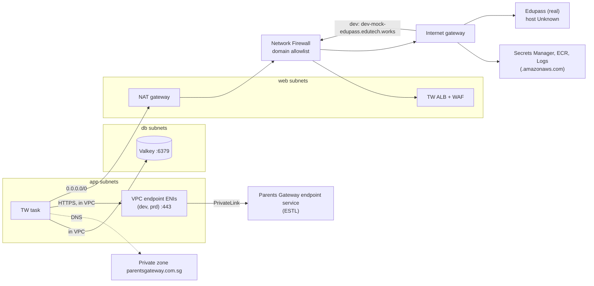

# 04 Infra Edge and Network

Infra revision: `main` @ `b345a06`; app revision `5ff58a7`. Phase 1 batch 2 (2026-10-10). Paths are relative to `infra/states/provider.aws/` unless they start with `infra/modules/` or an app path (`server/`). Labels: **Verified**, **Inferred**, **Unknown**, **Conflicts** (see `README.md`).

Short version:

- A browser reaches the TW app through an internet-facing per-app ALB. The ALB terminates TLS with a wildcard `*.edutech.works` certificate, passes the shared environment WAF, and forwards plain HTTP to the single task on port 3000.
- Outbound traffic from the task leaves through a NAT gateway and an AWS Network Firewall with a domain allowlist. The allowlist includes `.edutech.works` and `.gov.sg`.
- Parents Gateway is reached privately over a VPC endpoint in dev and prd, but not in stg.
- Four things matter most:
  - In dev the TW server calls mock-edupass through the public internet and back through the same WAF (section 4.2).
  - The WAF injects a shared secret header that the TW proxy forwards to remote backends (section 3.3).
  - The ALB idle timeout is longer than the app's keep-alive timeout (section 2.3).
  - The health check is `GET /` every 5 seconds, which creates a session on every probe (section 2.2).

## 1. Network layout (Verified)

| Item | dev (`acct.lower`) | stg (`acct.stg`) | Evidence |
| --- | --- | --- | --- |
| VPC CIDR | `172.16.0.0/16` | `172.17.0.0/16` | `acct.{lower,stg}/network/terragrunt.hcl:16`; also `svc.teacher-workspace/alb/terragrunt.hcl:19` |
| web (public) subnets, ALB and NAT | `172.16.0.0/19`, `172.16.32.0/19` | `172.17.0.0/19`, `172.17.32.0/19` | `network/terragrunt.hcl:110-113` |
| app (private) subnets, ECS tasks and PG endpoint | `172.16.64.0/19`, `172.16.96.0/19` | `172.17.64.0/19`, `172.17.96.0/19` | `network/terragrunt.hcl:115-118` |
| db subnets, Valkey | `172.16.128.0/21`, `172.16.136.0/21` | `172.17.128.0/21`, `172.17.136.0/21` | `network/terragrunt.hcl:127-130` |
| firewall subnets | `172.16.144.0/21`, `172.16.152.0/21` | `172.17.144.0/21`, `172.17.152.0/21` | `network/terragrunt.hcl:133-137` |
| NAT | one per AZ | one per AZ | `network/terragrunt.hcl:27-28` |
| Extra private route | `172.30.0.0/16` via the shared-services transit gateway | same | `network/terragrunt.hcl:120-125` |
| Default network ACL | TCP 80, 443, 444 and 1024-65535 in and out, from and to anywhere | same | `network/terragrunt.hcl:34-102` |
| Flow logs | on, CloudWatch, 60 s aggregation | same | `network/terragrunt.hcl:215-219` |

Routing (Verified in the local VPC module):

- Private (app) subnets send `0.0.0.0/0` to the NAT gateway in their AZ (`infra/modules/aws/network/terraform-aws-vpc/main.tf:755-760`).
- Public (web) subnets send `0.0.0.0/0` to the firewall endpoint (`main.tf:199-209`).
- The firewall subnets route to the internet gateway (`network-firewall.tf:64-70`).
- The internet gateway's edge route table sends traffic for the public subnets back through the firewall (`network-firewall.tf:89-95`).
- So every packet between the internet and the web tier crosses the Network Firewall in both directions. Traffic that stays inside the VPC (ALB to task, task to Valkey, task to the PG endpoint) does not.

## 2. Inbound: browser to TW app



### 2.1 Hostnames, records and listeners

| Hostname | Record | ALB rule | Target | Evidence |
| --- | --- | --- | --- | --- |
| `dev-teacher-workspace.edutech.works` | A alias, lower account public zone | priority 101, host header | TG `main`, HTTP :3000 | `acct.lower/route53/edutech.works/terragrunt.hcl:21, 303-311`; `acct.lower/env.dev/svc.teacher-workspace/alb/https-listener-rules.hcl:2-19` |
| `dev-mock-edupass.edutech.works` | A alias to the **same** ALB | priority 102 | TG `mock-edupass`, HTTP :9000 | `edutech.works/terragrunt.hcl:313-321`; `https-listener-rules.hcl:21-38` |
| `stg-teacher-workspace.edutech.works` | A alias in the **lower** account's zone, pointing at the stg account's ALB | priority 101 | TG `main` :3000 | `edutech.works/terragrunt.hcl:25, 333-341`; `acct.stg/.../alb/https-listener-rules.hcl` |

- The zone is public: no VPC association (`edutech.works/terragrunt.hcl:510`).
- The ALB DNS names are **hard-coded** strings (`edutech.works/terragrunt.hcl:21, 25`), not dependencies. If an ALB is ever replaced, these records must be edited by hand (Verified; IQ24).
- The names begin `sform-...` because the ALB name keeps the last 31 characters of `transform-<env>-teacher-workspace-alb` (`alb/terragrunt.hcl:15`). Target group `main` is cut the same way, to `form-<env>-teacher-workspace-main` (`target-groups.hcl:7`). These look like typos but are expected.
- The ALB DNS names have no `internal-` prefix, so both ALBs are internet-facing (Verified from the name; the module input `internal` is not set).

| Listener | Behaviour | Evidence |
| --- | --- | --- |
| :80 HTTP | 301 to HTTPS :443 | `alb/terragrunt.hcl:74-83` |
| :443 HTTPS | certificate `https_cert_arn.ap-southeast-1` from `acct-vars.hcl`; default action 404 `text/plain` "Error code: 1"; host rules from `https-listener-rules.hcl` | `alb/terragrunt.hcl:84-96`; `acct.lower/acct-vars.hcl:14-16` |
| TLS policy | not set, so the module 9.4.0 default applies | Inferred |
| Certificate | the account's `*.edutech.works` ACM certificate (DNS-validated) | `acct.{lower,stg}/acm/ap-southeast-1/terragrunt.hcl`; which ACM entry the ARN maps to is Inferred |
| ALB security group | in: 80 and 443 from `0.0.0.0/0`; out: everything to the VPC CIDR, and 443 to anywhere | `alb/terragrunt.hcl:41-71` |
| Idle timeout | 300 s | `alb/terragrunt.hcl:101` |
| Access logs | env logs bucket, prefix `alb/<alb name>/access-logs` | `alb/terragrunt.hcl:25-30, 103-106` |

TLS ends at the ALB. The ALB to task hop is plain HTTP inside the VPC (`target-groups.hcl:8`). The app still sets `Secure` session cookies (default `TW_SESSION_SECURE=true`), which is correct because the browser sees HTTPS.

### 2.2 Health checks (Verified config; app behaviour from the app track)

| Target group | Path | Interval / timeout | Healthy / unhealthy after | Success codes | Evidence |
| --- | --- | --- | --- | --- | --- |
| `main` (dev, stg) | `GET /` | 5 s / 4 s | 2 / 3 checks | `200,300-399` | `target-groups.hcl:13-23` |
| `mock-edupass` (dev) | `GET /health` | 5 s / 4 s | 2 / 3 | `200` | `target-groups.hcl:33-43` |

The TW server has no health route (app `04-api-catalog.md`). `/` goes through the session middleware, so each probe without a cookie creates and saves a new 3-hour session in Valkey (app R6, Q23).

- Each ALB node probes on its own, and there are at least two nodes (one per AZ). That is at least 2 x 720 probes an hour, or at least about 4,300 live session keys per environment at any time, purely from health checks (Inferred arithmetic).
- The probe also tests Valkey: if Valkey fails, `/` returns 500 and the target turns unhealthy. With one target, the ALB then fails open and keeps sending traffic to it (Inferred, ALB behaviour), so a Valkey outage shows up as 500s rather than 503s.
- A dedicated route on the outer mux (app `12-change-impact-guide.md` C6), with the health-check path pointed at it, would remove both effects. IQ7 tracks this.

### 2.3 Timeouts along the path

| Hop | Setting | Value | Evidence |
| --- | --- | --- | --- |
| Client to ALB, ALB to target idle | `idle_timeout` | 300 s | `alb/terragrunt.hcl:101` |
| App keep-alive idle | `TW_SERVER_IDLE_TIMEOUT` (not set in the task) | 60 s default | `config.go:55` |
| App write deadline | `TW_SERVER_WRITE_TIMEOUT` | 30 s default | `config.go:54` |
| App read deadline | `TW_SERVER_READ_TIMEOUT` | 15 s default | `config.go:53` |

- The app closes idle keep-alive connections after 60 s, but the ALB may hold its side for up to 300 s. AWS guidance is that the target's keep-alive should be **longer** than the ALB idle timeout. Otherwise the ALB can reuse a connection the app just closed, and the client gets a sporadic 502 (Inferred; IQ23). The fix is either to raise `TW_SERVER_IDLE_TIMEOUT` above 300 s or to lower the ALB idle timeout below 60 s.
- Any request or proxied backend call taking more than 30 s is cut by the app, whatever the ALB allows.

## 3. WAF (regional ACL in front of the TW ALB)

The TW ALB associates the environment's shared regional ACL by a hard-coded ARN (`alb/terragrunt.hcl:22, 38-39`): `transform-dev` in dev, `transform-stg` in stg. The ACL is built by the local module `infra/modules/aws/wafv2` from `shared/common-waf-config.hcl`, plus per-environment additions (`env.{dev,stg}/wafv2/ap-southeast-1/terragrunt.hcl`). **Every app on every ALB in the environment shares these rules**, so a change made for another product changes TW's protection too.

### 3.1 Rules in evaluation order (Verified)

| Priority | Rule | Action | Applies to TW? | Evidence |
| --- | --- | --- | --- | --- |
| 1 | `Common-BlockByRateLimit`: 500,000 requests per IP per 60 s | block | yes; at this limit it is effectively off | `common-waf-config.hcl:26-32` |
| 10-40 (dev only) | `BlockSus` IP set; allow `WOGAA` and two penetration-test IP sets | block / allow | yes. Allowed IPs skip every later rule, including all managed rules | `env.dev/wafv2/ap-southeast-1/terragrunt.hcl:41-66` |
| 50 | `SusCountries`: CN, DE | block | yes | `common-waf-config.hcl:207-213` |
| 60 | `Common-BlockGITSIRIPs` IP set | block | yes | `common-waf-config.hcl:215-222` |
| 100-190 | per-app URI allow rules (SDT, Glow, LLMProxy, Grafana, Platform, Covaa, MySEC, SUMS, DevSecOpsDashboard, Reliefcher) | allow | yes, see 3.2 | `common-waf-config.hcl:34-205` |
| 1000-1050 | AWS managed: IP reputation, known bad inputs, SQLi, Linux, Unix, anonymous IP | block on match | yes | `common-waf-config.hcl:227-269` |
| 1060 | AWS managed: Bot Control | count only | yes | `common-waf-config.hcl:270-276` |
| 1065 | `Superset` allow (`/api/v1*`, `/superset*`) | allow | yes, see 3.2 | `common-waf-config.hcl:149-162` |
| 1070 | AWS managed: Common Rule Set (`SizeRestrictions_Cookie_HEADER` set to count) | block on match | yes, see 3.4 | `common-waf-config.hcl:277-289` |
| default | allow, inserting a header from secret `transform/waf` | allow + header | yes, see 3.3 | `common-waf-config.hcl:14-24` |

WAF logs go to a CloudWatch log group (`env.dev/wafv2/ap-southeast-1/terragrunt.hcl:21-23, 77-80`).

### 3.2 Other apps' allow rules also match TW paths (Verified)

The URI rules match only on the path, with no host condition (`infra/modules/aws/wafv2/main.tf:406-457`). On the TW hostname:

- Requests to `/main`, `/chat/completions`, `/v1/embeddings`, `/embeddings`, `/api/telegram/webhook`, `/api/import-timetable`, `/api/scan-file` or `/api/auth/callback/mims` are allowed before any managed rule runs.
- So are paths starting with `/admin/unit/`, `/api/dashboards`, `/api/webhook/github`, `/api/webhook/gitlab`, `/api/uploads`, `/api/internal/transcription-proxy`, `/api/studies`, `/u/`, and (at 1065, before the Common Rule Set) `/api/v1` and `/superset`.

TW serves all of these with its catch-all shell (`/`) or the `/api/` proxy (404 for unknown remotes), so the exposure today is small. It does mean the managed rules are skipped for those paths on TW. If a future remote is mounted at one of them, for example `/api/uploads`, it would silently lose WAF inspection (Inferred impact; IQ25).

### 3.3 The WAF secret header is forwarded to remote backends (Inferred)

The default action inserts a header named `alb-expecting-this-header`. WAF prefixes it `x-amzn-waf-`, and its value comes from Secrets Manager `transform/waf` (`common-waf-config.hcl:14-24`; module `main.tf:51-63`). The name suggests some ALB listener requires it as proof that traffic passed the WAF. No TW listener rule checks it (`https-listener-rules.hcl`), and which listener does is Unknown: not found in the files read.

The TW proxy (`server/internal/handler/proxy.go:81-90`) uses Go's `ReverseProxy.Rewrite`. That removes only hop-by-hop and `X-Forwarded-*` headers, then TW deletes `Cookie` and replaces `Authorization`. Every other inbound header, including `x-amzn-waf-alb-expecting-this-header`, is passed on. Once a remote backend is configured (IQ3), every `/api/posts/*` request would deliver the shared WAF secret to the Parents Gateway service, which another team runs (IQ21).

To find where the header is checked, run in the infra repo:

```
git grep -n 'alb-expecting-this-header'
```

### 3.4 The Common Rule Set and the `/api/` proxy (Inferred)

The AWS Common Rule Set blocks, among other things:

- request bodies over 8 KB (`SizeRestrictions_BODY`), and
- bodies that look like cross-site scripting (`CrossSiteScripting_BODY`).

Only the cookie-size rule is set to count (`common-waf-config.hcl:282-288`). Any Posts or Student Insights request through `/api/` with a large JSON body, or rich-text HTML content, would get a WAF 403 before reaching TW. This matters for the `pg` remote, whose purpose is composing posts (IQ25).

## 4. Outbound: TW task to its dependencies



### 4.1 Egress allowlist (Verified)

The lower and stg firewalls use one stateful domain-list rule group, `WHITELIST-OUTBOUND-DOMAINS-AND-DROP-OTHERS`, in `ALLOWLIST` mode on `HTTP_HOST` and `TLS_SNI` (`acct.lower/network/terragrunt.hcl:148-201`). A comment notes that only `0.0.0.0/0` routes pass through the firewall (L143-144).

| TW destination | Domain | Allowed in dev | Allowed in stg | Notes |
| --- | --- | --- | --- | --- |
| mock-edupass (dev) | `dev-mock-edupass.edutech.works` | yes (`.edutech.works`, L162) | n/a | goes out and back in, see 4.2 |
| Real Edupass | Unknown hostname | only if under `.gov.sg` (L155) or another listed suffix | same | stg uses `edupass.invalid` today (IQ13); confirm the real issuer, token and JWKS hosts when known (IQ11) |
| AWS APIs (Secrets Manager, ECR, CloudWatch Logs) | `.amazonaws.com` | yes (L156) | yes | used by the ECS agent at task start. No interface endpoints for these were found in TW's stacks (account-level `vpc-endpoints` not read) |
| Parents Gateway | private zone, VPC endpoint | n/a (stays in the VPC) | **no endpoint in stg** | section 5 |
| Remote backends other than PG | Unknown | only if allowlisted; `.cloudfront.net` is **not** (only one specific distribution, L181) | same | relevant once `TW_REMOTE_*_BACKEND_BASE_URL` is set (IQ3) |

The stg list is a subset of dev's (`diff` of the two files): it drops `.github.com`, some Google and HashiCorp entries, and the Bedrock entry. None of the dropped entries matter to TW.

### 4.2 In dev, the TW server reaches mock-edupass through the internet (Inferred)

The TW task's OIDC settings use the public hostname (batch 1, `02-infra-runtime.md` 4.3). Since TW is not a Service Connect client, the server's token request and JWKS fetch take this path:

1. task, to NAT, to Network Firewall (SNI `dev-mock-edupass.edutech.works` allowed), to internet gateway, out to the ALB's public IP;
2. back in through the internet gateway and firewall, to the same ALB, through the **WAF**, and on to the mock task.

The WAF sees the request coming from the NAT gateway's public IP, which belongs to AWS. The managed `AnonymousIpList` group (priority 1050, not overridden) includes a hosting-provider IP list that matches cloud-provider addresses. If AWS NAT addresses match it, the token exchange is blocked with 403, and sign-in fails with `/login?error=oauth2_callback_failed` (app `workflows/edupass-sign-in.md`). Not confirmed: check the dev WAF logs for blocked `POST /token` requests to `dev-mock-edupass.edutech.works` (IQ26).

Two ways around this:

- give TW `main` a Service Connect client configuration and point the server-side URLs (token, JWKS) at `http://mock-edupass:9000`; or
- add an allow rule for the NAT addresses.

With the first, keep the issuer and authorize URLs public, because the browser uses the authorize URL and ID-token issuer checks normally compare against the issuer URL. Only the server-side token and JWKS URLs would move (Inferred; check against app `workflows/edupass-sign-in.md` before changing).

### 4.3 Valkey

The task reaches Valkey inside the VPC (app subnets to db subnets). The cache security group allows 6379 from the TW task's security group (batch 3 traces TLS and auth). The default network ACL allows TCP 1024-65535 both ways, which covers 6379 and the ephemeral return ports (Verified, `network/terragrunt.hcl:60-67, 94-101`).

## 5. Parents Gateway over PrivateLink

| Item | dev | prd | stg | Evidence |
| --- | --- | --- | --- | --- |
| VPC endpoint | interface endpoint tagged `transform-dev-teacher-workspace-vpc-ep-pg-api-ep` to `vpce-svc-0a77c81eb13a20526` | to `vpce-svc-01f580e2a3b3573d0` | **none** | `acct.lower/.../pg-connect/vpc-ep-pg/terragrunt.hcl:15, 33-39`; prd same file L15 |
| Placement | subnets tagged `*app*` in the VPC tagged `transform` | same |  | `vpc-ep-pg/terragrunt.hcl:22-32` |
| Endpoint security group | TCP 443 from the **whole VPC CIDR** | same |  | `infra/modules/aws/network/vpc-endpoints/sgrp.tf:14-49` |
| Private DNS name | `stable-tw.pre.parentsgateway.com.sg`, a CNAME to the endpoint's DNS name (hard-coded) | `prod-tw.prd.parentsgateway.com.sg` |  | `acct.lower/route53/parentsgateway.com.sg/terragrunt.hcl:15-24`; `acct.prd/...:15-24` |
| Zone | private `parentsgateway.com.sg`, associated with the account VPC | same |  | `parentsgateway.com.sg/terragrunt.hcl:34-42` |
| Firewall | not on path (VPC-local route) |  |  | section 1 |
| Used by the TW app | **not yet**: no `TW_REMOTE_*_BACKEND_BASE_URL` is set anywhere (IQ3). The expected value is `https://stable-tw.pre.parentsgateway.com.sg` in dev (Inferred) |  |  |  |

Notes:

- **IQ5 resolved.** The ADR names `pg-internal.parentsgateway.com` only as an example ("e.g.", infra `docs/adr/0001-*.md:57`). The real private names are the two above.
- **Endpoint acceptance.** The module accepts an `auto_accept` field (`vpc-ep-pg/terragrunt.hcl:37`) but never passes it to the resource (`vpc-endpoints/main.tf:31-44`). Acceptance is controlled on ESTL's side, which the ADR says requires acceptance and allowlists specific roles (`0001-*.md:58`). Verified that the field is unused; ESTL's settings are Unknown.
- **Blast radius.** The endpoint accepts 443 from the whole shared VPC, so any workload in the lower or prd VPC, not just TW, can call Parents Gateway through it. The ADR's narrow exposure is per VPC, not per app (IQ22).
- **Split horizon.** The private zone answers for all of `parentsgateway.com.sg` inside the VPC. Any workload there that needs a public `*.parentsgateway.com.sg` name gets no answer (Inferred from Route53 private-zone behaviour; `ARCHITECTURE.md:164` discusses this zone).
- **No stg endpoint (IQ15).** stg cannot reach Parents Gateway privately, so the `pg` remote's backend cannot work in stg as configured.

### 5.1 The `svc.mock-pg` test rig (dev, Verified)

| Piece | Config | Evidence |
| --- | --- | --- |
| Internal ALB | app subnets; listener **443 with protocol HTTP** (no TLS) returning a fixed 200 "Hello, this is the mock PG service!" | `acct.lower/env.dev/svc.mock-pg/alb/terragrunt.hcl:14-21, 44-55` |
| Endpoint service `tw-inc-tunnel` | NLB TCP 443 in `*private*` subnets, targeting the ALB; allowed principal is the lower account root; acceptance not required | `svc.mock-pg/tw-inc-tunnel/vpc-ep-svc/terragrunt.hcl:16-18, 39-77` |
| NLB security group | 443 from `172.16.64.0/18` (local named `sdt_app_subnets`, which is actually the app tier) and from the VPC | same file L20, L79-94 |

The rig tested TCP reachability only: no TLS, so no hostname or certificate check. The ADR says it is "not representative of the final posture" (`0001-*.md:45`). Which endpoint service `vpce-svc-0a77c81eb13a20526` (the dev TW endpoint target) belongs to, the mock rig or ESTL's pre-production service, cannot be told from code (IQ27).

## 6. Questions raised or sharpened

| IQ | Change | Section |
| --- | --- | --- |
| IQ5 | resolved: the ADR hostname was illustrative | 5 |
| IQ7 | sharpened: probe volume, and Valkey coupling of the health check | 2.2 |
| IQ11 | sharpened: the real Edupass hosts must be under an allowlisted suffix | 4.1 |
| IQ15 | sharpened: the `pg` remote cannot work in stg | 5 |
| IQ18 | sharpened: the ALB's egress already covers the VPC, so the task rule could reference the ALB security group | 2.1 |
| IQ21 (new) | WAF secret header forwarded by the TW proxy | 3.3 |
| IQ22 (new) | PG endpoint open to the whole VPC | 5 |
| IQ23 (new) | ALB idle timeout 300 s vs app keep-alive 60 s | 2.3 |
| IQ24 (new) | hard-coded ALB DNS names and WAF ARN | 2.1, 3 |
| IQ25 (new) | shared WAF rules: cross-app allow paths, and Common Rule Set body limits on `/api/` | 3.2, 3.4 |
| IQ26 (new) | WAF may block the server-to-mock-edupass hairpin | 4.2 |
| IQ27 (new) | which endpoint service the dev PG endpoint targets | 5.1 |
