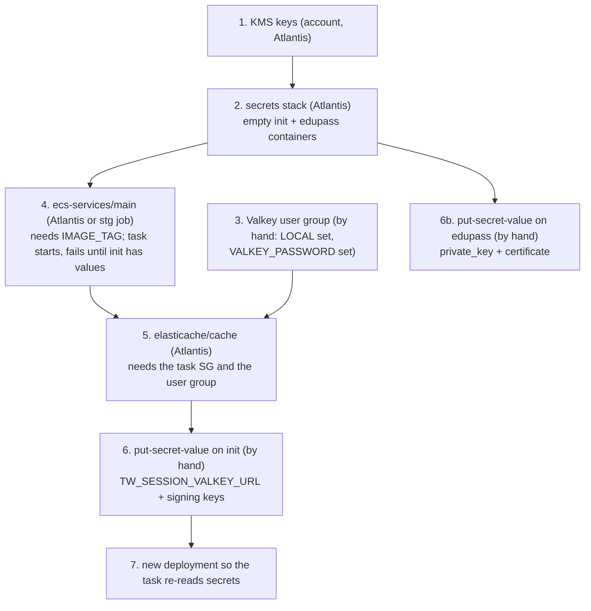

# 05 Infra Data and Secrets

Infra revision: `main` @ `b345a06`; app revision `5ff58a7`. Phase 1 batch 3 (2026-10-10). Paths are relative to `infra/states/provider.aws/` unless they start with `infra/modules/` or an app path (`server/`, `Dockerfile`). Labels: **Verified**, **Inferred**, **Unknown**, **Conflicts** (see `README.md`). No secret values appear in this document.

Short version:

- TW keeps one kind of data in AWS: sessions, in a single-node Valkey 9.1 per environment, with TLS required and password authentication through a named (not `default`) user.
- The app can connect to it only if the `TW_SESSION_VALKEY_URL` secret is shaped exactly right (section 2.3).
- Secrets live in two Secrets Manager containers per environment, both created empty and filled by hand. Neither the key list of `init` nor the bootstrap order is written down anywhere in the repo (sections 3 and 4).
- The real Edupass credential is designed for `private_key_jwt` (a key and certificate), not a client secret, and is not wired into any task yet (section 3.3).

## 1. Inventory

| Resource | dev | stg | prd | Evidence |
| --- | --- | --- | --- | --- |
| Valkey replication group `transform-<env>-teacher-workspace-valkey` | yes | yes (identical config) | no | `acct.lower/env.dev/svc.teacher-workspace/elasticache/cache/terragrunt.hcl`; stg file differs in nothing (`diff`) |
| Valkey user group and user | yes | yes (identical) | no | `.../elasticache/user-group/terragrunt.hcl` |
| Secret `transform/<env>/teacher-workspace/init` | yes | yes | no | `.../secrets/terragrunt.hcl:33-38` |
| Secret `transform/<env>/teacher-workspace/edupass/oidc-client-credentials` | yes | yes | yes | `.../secrets/terragrunt.hcl:24-32`; prd L24-32 |
| KMS `transform-ServicesSecretsKey` (secrets), `transform-DBKey` (Valkey at rest) | account level | account level | account level | `acct.{lower,stg}/kms/ap-southeast-1/terragrunt.hcl:39-78` |

The secret names come from `name_prefixes.default_with_forward_slash` (`secrets/terragrunt.hcl:15`; `globals.hcl:36`): `transform/dev/teacher-workspace/...` (Verified, and matches the names the task reads in `ecs-services/main/terragrunt.hcl:53`).

## 2. Valkey session store

### 2.1 Cache configuration (Verified)

| Setting | Value | Line (`elasticache/cache/terragrunt.hcl`) |
| --- | --- | --- |
| Module | `terraform-aws-modules/elasticache/aws` 1.6.0 | 7 |
| Replication group ID | `transform-<env>-teacher-workspace-valkey` | 35 |
| Engine | `valkey` 9.1, parameter group `default.valkey9` | 38-39, 68 |
| Size | `cache.t3.micro`, `num_cache_clusters = 1` (one primary, no replica) | 40-41 |
| Failover | disabled | 43 |
| In-transit encryption | enabled, mode `required` (plaintext connections refused) | 45-46 |
| Auth | user group `user_group_id` (RBAC) | 27, 48 |
| At-rest key | `transform-DBKey` | 50 |
| Changes | `apply_immediately = true` | 52 |
| Placement | db subnets of the `transform` VPC | 29-31, 54-55 |
| Security group | ingress 6379 from the TW `main` task security group only | 57-66 |
| Logs | slow log to CloudWatch, JSON, 400 days | 70-76 |
| Snapshots | not set, so module default (Inferred: none) |  |

Two dependency notes:

- The cache depends on `ecs-services/main` for the task security group ID (L14-20). That is why the task takes the Valkey URL from Secrets Manager rather than from a cache output (`ecs-services/main/terragrunt.hcl:162-163`; batch 1).
- The cache names the user group by a computed string (L27, L48) and has **no** `dependency` on the `user-group` stack. If the user group does not exist yet, the cache apply fails (Inferred).

### 2.2 User group and user (Verified)

| Setting | Value | Line (`elasticache/user-group/terragrunt.hcl`) |
| --- | --- | --- |
| Module | `terraform-aws-modules/elasticache/aws//modules/user-group` 1.6.0 | 7 |
| User ID and **user name** | `substr("<prefix>-valkey-default", -32)`, which is `teacher-workspace-valkey-default` in both dev and stg (the env part is cut off) | 14, 21-23 |
| User group ID | `substr("<prefix>-valkey-users", -32)`: `v-teacher-workspace-valkey-users` (dev), `g-teacher-workspace-valkey-users` (stg) | 15, 30 |
| Password | from the shell variable `VALKEY_PASSWORD` at apply time | 25 |
| Permissions | `on ~* +@all` (all keys, all commands) | 26 |
| Apply path | `get_env("LOCAL")` with no default, with the comment "this will cause Atlantis to fail, we do not want Atlantis to deploy this": applied by hand from a laptop | 17 |

Consequences:

- **The user is not named `default`.** A client that connects without credentials is not authenticated as this user, so the app must send a username and password (Inferred from Valkey ACL behaviour; ElastiCache's rules on a `default` user for Valkey user groups were not checked).
- **The password is in Terraform state.** It is passed as a module input to an `aws_elasticache_user` resource, so it is stored in the state file in the account's state bucket, unlike the Secrets Manager values, which are kept out of state on purpose (Inferred from Terraform behaviour; IQ28).
- The `passwords` list accepts more than one entry, which allows rotation with overlap. No rotation process is written down.

### 2.3 What `TW_SESSION_VALKEY_URL` must look like

The app reads the URL only from the `init` secret, key `TW_SESSION_VALKEY_URL` (`ecs-services/main/terragrunt.hcl:164-172`). It validates it (`config.go:200-226`), then builds the client from it (`server/cmd/tw/main.go:56-83`).

| URL part | App rule | What the infra requires | Result if wrong |
| --- | --- | --- | --- |
| scheme | must be `valkey` (`config.go:210-212`) | n/a | exit 1 at `Validate` |
| userinfo | optional; if present, username and password are sent (`main.go:70-74`) | **required**: user `teacher-workspace-valkey-default` and the `VALKEY_PASSWORD` value, percent-encoded if it contains reserved characters such as `@ : / ? # %` | no credentials: commands are refused once the app runs (Inferred) |
| host | required (`config.go:213-215`) | the replication group's primary endpoint (from AWS, not in code) | exit 1 at `Validate` |
| port | required (`config.go:216-218`) | `6379` (the security group port) | exit 1 at `Validate` |
| `?tls=` | `true` or `false`; TLS is used only if it is exactly `true` (`config.go:219-223`; `main.go:68`) | **`tls=true`**, because transit encryption is `required` | client creation fails, exit 1 at `main.go:76-79` (Inferred: the client connects when created) |

So the expected shape, with no real values:

```
valkey://teacher-workspace-valkey-default:<percent-encoded password>@<primary endpoint>:6379?tls=true
```

The image includes the system CA bundle (`Dockerfile:64-66`), so the client can verify the ElastiCache certificate (Inferred: the client verifies by default). `TW_SESSION_VALKEY_PREFIX` keeps its default `session:`.

### 2.4 Availability and capacity (Inferred)

- One node and no replica: a node failure, replacement or engine maintenance loses every stored session, so all users must sign in again. With `apply_immediately = true`, a config change that needs a reboot happens during the apply, not in the maintenance window. Acceptable for sessions only if this is understood (IQ29).
- `cache.t3.micro` has about 0.5 GiB of memory. At the batch 2 estimate of about 4,300 health-check sessions plus real sessions, small session records fit easily. Eviction follows the default parameter group's policy (not read).

## 3. Secrets Manager

### 3.1 How the containers are made (Verified)

| Property | Value | Evidence |
| --- | --- | --- |
| Module | local `infra/modules/aws/secrets` | `secrets/terragrunt.hcl:7` |
| Values | **none**: the module creates only the secret container, and the leaf comment says values are uploaded out of band with `aws secretsmanager put-secret-value` and never stored in Terraform | `infra/modules/aws/secrets/main.tf:9-21`; `secrets/terragrunt.hcl:20-22` |
| Encryption | `transform-ServicesSecretsKey`, looked up by alias | `secrets/terragrunt.hcl:25, 34`; module `data.tf:3-6` |
| Deletion | `prevent_destroy = true`; 30-day recovery window | module `main.tf:15, 18-20`; leaf L31, L37 |
| Resource policies | none set for TW secrets (the module supports them) | module `main.tf:4-6, 54-58`; leaf has no `resource_policy_statements` |
| Rotation | none configured | module has no rotation resource |
| Key documentation | `Property-Description:<key>` tags on the Edupass secret; none on `init` (module TODO: "Add validation to secret tags") | leaf L27-30; module `variables.tf:25` |

### 3.2 `init` secret: keys the tasks expect

The repo has no list of `init` keys apart from the task definitions. This table is that list (Verified from `ecs-services/main/terragrunt.hcl:164-181`, stg L164-189):

| JSON key | dev | stg | Read by the app at `5ff58a7`? | Correct key for the app |
| --- | --- | --- | --- | --- |
| `TW_SESSION_VALKEY_URL` | yes | yes | yes | same; shape in 2.3 |
| `TW_API_PROXY_POSTS_SIGNING_KEY` | yes | yes | no (IQ2) | inject as `TW_REMOTE_POSTS_BACKEND_SIGNING_KEY`; at least 32 bytes (`config.go:480-483`); only together with the two Posts URLs (IQ3) |
| `TW_API_PROXY_STUDENT_INSIGHTS_SIGNING_KEY` | no | yes | no (IQ2) | `TW_REMOTE_STUDENT_INSIGHTS_BACKEND_SIGNING_KEY`; at least 32 bytes (`config.go:517-520`) |

- The JSON key name and the environment variable name are set separately in `valueFrom` (`<arn>:<json key>::`). The rename in IQ2 can therefore keep the stored JSON keys and change only the `name` field in the task.
- A signing key shorter than 32 bytes would fail validation once the variable is renamed. Whether the stored values meet that is Unknown.
- The signing key is shared with the remote backend, which verifies the HS256 token. Who holds the other copy (for Posts, the Parents Gateway team) is Unknown (IQ3).

### 3.3 Edupass credential secret: built for `private_key_jwt`

The secret description and tags say it holds an **eduPass OIDC client certificate credential** with two JSON keys (`secrets/terragrunt.hcl:26-30`):

- `private_key`: "PEM-encoded RSA private key for the eduPass client certificate credential"
- `certificate`: "PEM-encoded public X.509 certificate submitted to eduPass"

That matches the app's `private_key_jwt` mode, not the `client_secret_post` mode that dev (mock) and stg (placeholder) use today. No task definition reads this secret (batch 1, IQ20). Wiring it would take these task changes (Inferred from the app's config rules):

| Task change | Value | App rule |
| --- | --- | --- |
| env `TW_EDUPASS_CLIENT_AUTH_METHOD` | `private_key_jwt` | `config.go:346` |
| secret `TW_EDUPASS_CLIENT_PRIVATE_KEY` | `valueFrom` `<edupass secret arn>:private_key::` | must be PEM, **PKCS#8** (`BEGIN PRIVATE KEY`, not `BEGIN RSA PRIVATE KEY`), RSA, at least 2048 bits (`config.go:372-388`) |
| secret `TW_EDUPASS_CLIENT_CERTIFICATE` | `<edupass secret arn>:certificate::` | PEM X.509, not expired, public key must match the private key (`config.go:390-413`) |
| remove | `TW_EDUPASS_CLIENT_SECRET` (`TW_OIDC_CLIENT_SECRET` today) | setting a secret is ignored in this mode |
| exec role | add the Edupass secret ARN to `task_exec_secret_arns` | today only `init` is listed (`ecs-services/main/terragrunt.hcl:99-101`) |

Other notes:

- PEM values stored as JSON strings with `\n` escapes come out as real newlines when ECS resolves the key (Inferred, ECS behaviour), which the app's PEM parser needs.
- The certificate's expiry is checked **only at startup** (`config.go:408-410`). An expired certificate does not stop a running task, but the next deploy or task replacement fails validation and the circuit breaker rolls back. Nothing in the infra alerts on expiry (IQ30).
- In prd, this secret is the only resource for the TW app itself; prd otherwise has only the marketing site and the PG endpoint (Phase 0).

### 3.4 The mock client secret in dev (IQ6)

The dev task definitions hold the mock IdP's shared client secret as a plain environment value in both services (`ecs-services/main/terragrunt.hcl:157-158`; `mock-edupass/terragrunt.hcl:114-115`). That puts it in git, the task definition and the console. It only works against the mock, which signs in anyone anyway, so the practical risk is low. Moving it into `init` (key read by both tasks) would remove the one exception to "no secret values in the repo". IQ6 stays open as a hygiene choice.

## 4. Keys and access

### 4.1 KMS (Verified config; policy rendering in the module not read)

| Key | Key users (decrypt) | Admins | Used by TW for | Evidence |
| --- | --- | --- | --- | --- |
| `transform-ServicesSecretsKey` | dev roles, `transform-group-sc` (lower only), **every role matching `*-exec` and `*-task`**, `*-lambda`, `*-atlantis`, and in lower `*-platform` | admin roles | both TW secrets; the TW exec role also has an explicit `kms:Decrypt` (batch 1) | `acct.lower/kms/ap-southeast-1/terragrunt.hcl:14-60` |
| `transform-DBKey` | `*-atlantis` | admin roles; in lower also the dev roles | Valkey encryption at rest | same file L62-78 |
| `transform-DefaultKey` | wide; CloudWatch Logs as a service | admins | not referenced by TW stacks | L80-100 |

Who can read TW secrets is therefore decided by IAM `secretsmanager:GetSecretValue` permissions, not by the key. Any ECS exec or task role in the account (any product) and the dev group roles pass the KMS check. Only roles whose IAM policy allows `GetSecretValue` on the TW secret ARNs can read them. The TW exec role is limited to the `init` ARN (batch 1). What the dev group's and other products' roles allow was not read (`shared/group-dev-policy.tftpl`; IQ31).

### 4.2 Bootstrap and change order (Inferred from dependencies and comments)



| Step | Status | Why |
| --- | --- | --- |
| Secret values are read only when a task starts | Verified (ECS `valueFrom`) | changing a secret value does nothing until a new deployment or task replacement |
| `ecs-services/main` before `cache` | Verified | cache `dependency "ecs_main"` (L14-20) |
| user group before cache | Inferred | cache references the group ID without a dependency |
| Valkey password changes need three manual steps: user-group apply, `init` update, redeploy | Inferred | 2.2, 2.3 |
| Every apply of `ecs-services/main` forces a new deployment | Verified (`force_new_deployment = true`, batch 1) | so step 7 can be an apply with the same `IMAGE_TAG` |

## 5. Questions raised or sharpened

| IQ | Change | Section |
| --- | --- | --- |
| IQ6 | sharpened: low practical risk; a hygiene choice | 3.4 |
| IQ20 | sharpened: the secret holds `private_key` and `certificate` for `private_key_jwt`; exact wiring listed | 3.3 |
| IQ28 (new) | Valkey user group applied by hand, and its password lands in Terraform state | 2.2 |
| IQ29 (new) | single-node Valkey with `apply_immediately`: any node event or rebooting change logs everyone out | 2.4 |
| IQ30 (new) | no alert on Edupass certificate expiry; failure shows up only at the next deploy | 3.3 |
| IQ31 (new) | TW secrets are protected by IAM alone (any `*-exec`/`*-task` role is a key user); confirm no other role can read them, and document the `init` keys | 3.1, 3.2, 4.1 |
