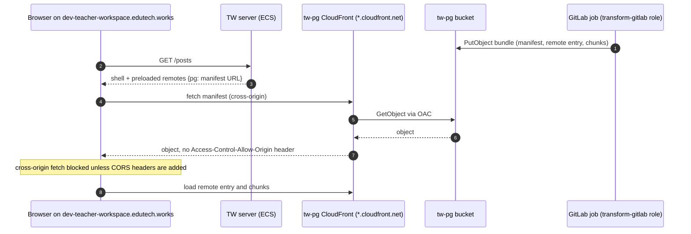

# 06 Infra Static Sites

Infra revision: `main` @ `b345a06`; app revision `5ff58a7`. Phase 1 batch 4 (2026-10-10). Paths are relative to `infra/states/provider.aws/` unless they start with `infra/modules/` or `docs/`. Labels: **Verified**, **Inferred**, **Unknown**, **Conflicts** (see `README.md`).

Short version:

- Two kinds of static hosting relate to TW, both S3 behind CloudFront with Origin Access Control.
- The **marketing site** (dev `dev-tw.edutech.works`, prd `tw.digital.moe.gov.sg`) is reachable only from Singapore and only from government network IP sets. Nothing in either repo builds or uploads its content.
- The **`pg` micro-frontend host** (`svc.tw-pg`, dev only) is where Transform's GitLab role can upload a remote bundle. As configured it has no custom hostname, no WAF and no CORS headers. That makes it a likely, but not yet working, value for `TW_REMOTE_POSTS_MANIFEST_URL` (section 3.3, IQ3).

## 1. Inventory (Verified)

| Site | Env | Hostname | Distribution ID (as hard-coded in the bucket policy) | Bucket | Evidence |
| --- | --- | --- | --- | --- | --- |
| Marketing | dev | `dev-tw.edutech.works` | `EEW3TN7AXGTGR` | `transform-677450898165-ap-southeast-1-dev-teacher-workspace` | `acct.lower/env.dev/svc.teacher-workspace/cloudfront/terragrunt.hcl:24`; `.../s3/terragrunt.hcl:15-17`; `globals.hcl:38-43` |
| Marketing | prd | `tw.digital.moe.gov.sg` | `E24CBJULCPLCVX` | `transform-940920597907-ap-southeast-1-prd-teacher-workspace` | `acct.prd/env.prd/svc.teacher-workspace/cloudfront/terragrunt.hcl:30`; `.../s3/terragrunt.hcl:17` |
| `pg` MFE ("MFE for PG Staff Portal @ Teacher Workspace") | dev | **none** (default `*.cloudfront.net` name, not in code) | `E1C22F5OJM9Q3O` | `transform-677450898165-ap-southeast-1-dev-tw-pg-s3` | `acct.lower/env.dev/svc.tw-pg/cloudfront/terragrunt.hcl:25`; `.../s3/terragrunt.hcl:15-23` |

- The bucket names are derived from `name_prefixes.s3` (`<project>-<account>-<region>-<env>-<svc>`). The `tw-pg` stack also appends its directory name (`s3`). Resolved names above are Verified from the formula.
- No stg static sites exist.

DNS (Verified):

- `dev-tw` is an A alias in the lower `edutech.works` zone to `d29navw8yw3vja.cloudfront.net` (`acct.lower/route53/edutech.works/terragrunt.hcl:31, 35-39`).
- `tw` is an A alias in the mgmt `digital.moe.gov.sg` zone to `d26w5uk6gcdt26.cloudfront.net` (`acct.mgmt/route53/digital.moe.gov.sg/terragrunt.hcl:15, 161-169`).
- No record points at the `tw-pg` distribution.
- The neighbouring record `teacher.digital.moe.gov.sg` (L151-159) points at the SDT production ALB. It is not TW.

## 2. Marketing site (dev and prd)

### 2.1 Configuration (Verified; dev and prd differ only where shown)

| Setting | Value | Evidence (dev `cloudfront/terragrunt.hcl` unless noted) |
| --- | --- | --- |
| Module | `terraform-aws-modules/cloudfront/aws` 6.0.2; bucket via `s3-bucket/aws` 3.15.1 | L7; `s3/terragrunt.hcl:7` |
| Origin | the bucket's regional domain, through OAC `tw-marketing-site-s3-oac` (SigV4, always sign) | L29-45 |
| Default object | `index.html` | L25 |
| Methods | `GET`, `HEAD` only; redirect HTTP to HTTPS; compression on | L47-55 |
| Caching | AWS managed `CachingOptimized` policy | L17-19, L54 |
| Custom error responses (SPA fallback) | none | not set |
| Geo restriction | allowlist `SG` only | L65-70 |
| TLS | the account's us-east-1 certificate (`*.edutech.works` in lower; `*.digital.moe.gov.sg` among the prd certificates), SNI only, minimum `TLSv1.2_2021` | L16, L72-76; `acct.lower/acm/us-east-1/terragrunt.hcl:17`; `acct.prd/acm/us-east-1/terragrunt.hcl:18-33` |
| Access logs | the account's logs bucket, prefix `cloudfront/...-dev-tw/` (prd `...-prd-tw/`) | L59-63; prd L64-68 |
| WAF | dev: hard-coded ARN of the shared `transform-dev` CloudFront ACL; prd: dependency on `env.prd/wafv2/us-east-1` | L57; prd L14-20, L32 |
| Bucket | AES256 at rest; HTTPS-only policy; owner-enforced; public access restricted; read allowed only to CloudFront for the one distribution ID | `s3/terragrunt.hcl:23-61` |

### 2.2 Who can see it (Verified config; IP set contents Unknown)

| Env | WAF default | Allowed | Logging | Evidence |
| --- | --- | --- | --- | --- |
| dev | block | IP set `transform-SEED` only | yes, CloudWatch | `acct.lower/env.dev/wafv2/us-east-1/terragrunt.hcl:37-58` |
| prd | block | IP sets `transform-SSOE` and `transform-SEED` | **no** (`enable_logging` not set; module default `false`) | `acct.prd/env.prd/wafv2/us-east-1/terragrunt.hcl:38-58`; `infra/modules/aws/wafv2/variables.tf:179-183` |

The prd comment calls this the "CloudFront allowlist policy for TW: only requests from approved CIDRs pass" (L38). Together with the Singapore-only geo rule, the public hostname `tw.digital.moe.gov.sg` serves only users on those government networks. Everyone else gets a 403. That is unusual for a marketing site and suggests it is pre-launch or internal (Inferred; IQ32).

Both ACLs are environment-level stacks (`env.<env>/wafv2/us-east-1`, named `transform-<env>`), not TW stacks. Any other distribution in the environment that uses the same ACL gets the same allowlist. Only the prd file's comment ties it to TW.

### 2.3 Where the content comes from (Unknown)

- The TW app repo has no marketing site source and no job that uploads to S3. Its only build output is the container image (app `08-infrastructure-and-operations.md`).
- The bucket policy grants nothing to a CI role, only CloudFront read (`s3/terragrunt.hcl:31-50`). Uploads therefore need a principal whose own IAM policy allows `s3:PutObject` on this bucket, such as an admin role (Inferred).
- No cache invalidation step exists anywhere in the infra repo for these distributions. With `CachingOptimized`, updated files can be served stale until their TTL expires (default 1 day), unless the uploader sets `Cache-Control` or invalidates (Inferred from the managed policy defaults).

Who builds and publishes the marketing site, and from which repo, is IQ33.

### 2.4 Relation to the app hostname (IQ4, IQ11)

The marketing site owns `tw.digital.moe.gov.sg`. The Edupass secret descriptions name `tw.digital.moe.gov.sg` (prd) and `stg-tw.digital.moe.gov.sg` (stg) as the **app** registrations (batch 3).

- If the app launches on `tw.digital.moe.gov.sg`, the marketing distribution must give up that alias, or route app paths elsewhere.
- `ARCHITECTURE.md:48` ("served as a static site from S3 and CloudFront") describes this marketing site, not the app.

IQ4 and IQ11 stay open, sharpened.

## 3. The `pg` micro-frontend host (`svc.tw-pg`, dev)

### 3.1 Configuration (Verified)

| Setting | Value | Evidence (`svc.tw-pg/cloudfront/terragrunt.hcl` unless noted) |
| --- | --- | --- |
| Comment | "MFE for PG Staff Portal @ Teacher Workspace" | L25 |
| Aliases | none, so it is served on the default `*.cloudfront.net` domain. The `*.edutech.works` certificate is attached but unused | L22-24 (no `aliases`), L70-74 |
| Origin | S3 through OAC named `AllowCloudFrontOAC` | L27-43 |
| Methods, caching | `GET`/`HEAD`, `CachingOptimized`, redirect to HTTPS | L45-53 |
| WAF | **none**: the `web_acl_id` line is commented out | L55 |
| Geo restriction | `SG` only | L63-68 |
| Response headers policy (CORS, `Cache-Control`) | none | not set |
| Bucket policy | CloudFront read for `E1C22F5OJM9Q3O`; **`s3:PutObject`, `GetObject`, `DeleteObject` for `arn:aws:iam::<lower>:role/transform-gitlab`** | `svc.tw-pg/s3/terragrunt.hcl:33-73` |
| Bucket CORS rules | none | `s3/terragrunt.hcl` has no `cors_rule` |

So Transform's own GitLab role, not ESTL's, is the intended uploader. No pipeline in this repo uploads to the bucket (`.gitlab/` has only `teacher-workspace` and `tw-ci` projects, Phase 0). The upload job lives elsewhere, Unknown, probably in the PG MFE's own repo (IQ34).

### 3.2 How the TW host would use it

The host registers the remotes it receives from the server (manifest URLs from `TW_REMOTE_*_MANIFEST_URL`) and, on `/posts/*` or `/groups/*`, the Module Federation runtime fetches the manifest and chunks from that URL (app `subsystems/host-shell.md` section 2). The server never fetches the manifest. The browser does.

### 3.3 Can `svc.tw-pg` serve as `TW_REMOTE_POSTS_MANIFEST_URL` today? (Inferred)

| Requirement | Status | Why |
| --- | --- | --- |
| Reachable over HTTPS from teachers' browsers | yes, from Singapore | geo `SG`; no WAF |
| URL passes app validation (http/https with host) | yes | `https://<id>.cloudfront.net/<path>` |
| Cross-origin manifest fetch allowed | **no** | the host page is on `dev-teacher-workspace.edutech.works`, the manifest on `*.cloudfront.net`. A `fetch` needs `Access-Control-Allow-Origin`. Neither a CloudFront response headers policy nor an S3 CORS rule adds it. Script-tag loads of the remote entry and chunks do not need CORS, but a JSON manifest fetch does |
| Fresh after a deploy | **no guarantee** | `CachingOptimized` keeps objects up to 1 day by default. A fixed manifest name needs `Cache-Control: no-cache` on upload or an invalidation, and the GitLab role's CloudFront permissions are not visible here (`shared/gitlab-policy.tftpl`, not read) |
| Stable hostname | no | the default domain changes if the distribution is recreated; no alias or DNS record |
| Same hostname for stg and prd | n/a | no stg or prd `tw-pg` stack exists |

To make it work, the infra changes would be:

1. a response headers policy (or S3 CORS plus forwarding the `Origin` header) that allows the TW origins;
2. a cache policy or upload headers for the manifest;
3. an alias such as `dev-tw-pg.edutech.works` with a DNS record;
4. the matching stacks in stg and prd.

On the app side, the posts remote also needs `TW_REMOTE_POSTS_BACKEND_BASE_URL` and its signing key (batch 1, IQ3).

## 4. Questions raised or sharpened

| IQ | Change | Section |
| --- | --- | --- |
| IQ3 | sharpened: `svc.tw-pg` lacks CORS, cache control and a stable hostname for use as the manifest URL; no stg or prd copy | 3.3 |
| IQ4 | sharpened: the "static site" sentence describes the marketing site | 2.4 |
| IQ11 | sharpened: the marketing site holds `tw.digital.moe.gov.sg`, which the Edupass secret names as the prd app registration | 2.4 |
| IQ32 (new) | marketing site limited to SEED (dev) and SSOE + SEED (prd) networks and Singapore; prd CloudFront WAF has no logging | 2.2 |
| IQ33 (new) | no source, build or upload path for the marketing site in either repo; no invalidation step | 2.3 |
| IQ34 (new) | `svc.tw-pg`: who builds and uploads the PG bundle (Transform GitLab role), no WAF, dev only | 3.1 |
