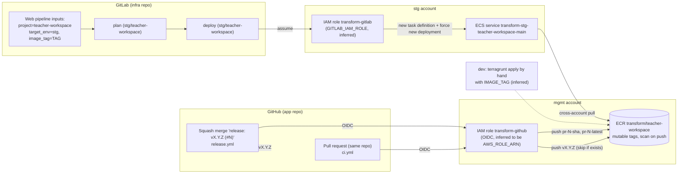

# 07 Infra Delivery: From Commit to Running Task

Infra revision: `main` @ `b345a06`; app revision `5ff58a7`. Phase 1 batch 5 (2026-10-10). Paths are relative to `infra/states/provider.aws/` unless they start with `.gitlab`, `docs/`, `infra/modules/` or `.github/` (app repo). Labels: **Verified**, **Inferred**, **Unknown**, **Conflicts** (see `README.md`).

Short version:

- **Builds happen in GitHub.** GitHub Actions in the app repo build an arm64 image and push it to the mgmt account's ECR, assuming a shared GitHub OIDC role. Every same-repo pull request pushes `pr-<N>-<sha>` and `pr-<N>-latest` tags. A squash-merged release PR pushes `vX.Y.Z`.
- **Deploys happen in GitLab.** A GitLab pipeline in the infra repo deploys only **stg**: a person starts it with an image tag, and it runs a Terragrunt plan and apply of `ecs-services/main`.
- **dev has no deploy pipeline.** Infra docs say `IMAGE_TAG` stacks are planned locally and applied by "the app pipeline", which does not exist for dev (IQ9).
- **The weak points are mutable tags and broad trust:**
  - ECR tags are mutable, with no lifecycle policy.
  - The GitHub role can push to any repository in mgmt ECR.
  - Neither CI role is limited to a branch.

## 1. End-to-end flow

## 2. Build: GitHub Actions in the app repo (Verified)

| Workflow | Trigger | Runs when | Pushes tags | Role | Evidence |
| --- | --- | --- | --- | --- | --- |
| `ci.yml` job `build-and-push-image` | `pull_request` to any branch | after format, lint, Go lint and Go tests pass; **only if the PR branch is in the same repo** (forks cannot get `id-token: write`) | `pr-<N>-<head sha>` and `pr-<N>-latest` (`DOCKER_METADATA_PR_HEAD_SHA` tags the head commit, not the merge commit) | `vars.AWS_ROLE_ARN` via OIDC | `.github/workflows/ci.yml:95-145` |
| `release.yml` | `push` to `main` | head commit title matches `release: vX.Y.Z (#N)`, the version equals root `package.json`, and git tag `vX.Y.Z` does not exist | `vX.Y.Z`; skips the build if that tag is already in ECR | same | `.github/workflows/release.yml:3-111` |
| `release.yml` | same | after the push | creates and pushes git tag `vX.Y.Z` | `contents: write` | `release.yml:113-121` |

Notes:

- Both workflows build `linux/arm64` on `ubuntu-24.04-arm`, matching the task's `ARM64` runtime (batch 1) (`ci.yml:97, 140`; `release.yml:20, 106`).
- The role ARN and region are GitHub repository variables, not in code. That `AWS_ROLE_ARN` is mgmt's `transform-github` is Inferred: it is the only GitHub OIDC role in the infra repo that can push to ECR.
- A merge to `main` without a release title builds **nothing**. Only PR images and release images exist, so a stg deploy uses either a PR tag or a release tag.

## 3. Registry: mgmt ECR (Verified)

| Setting | `transform/teacher-workspace` | `transform/mock-edupass` | Evidence |
| --- | --- | --- | --- |
| Tag mutability | `MUTABLE` | `MUTABLE` | `acct.mgmt/ecr/terragrunt.hcl:517, 549` |
| Pull allowed | lower, stg and prd account roots | same | L518-524, L550-556; module `policy.tf:5-23` |
| Push via repository policy | none (`push = []`); pushes come from mgmt identity policies | same | L524, L556 |
| Encryption | AES256 | AES256 | L526-529, L558-561 |
| Scan on push | yes (module default) | yes | `infra/modules/aws/ecr/main.tf:13-15` |
| Lifecycle policy | **none** (other repos in the file have one, L85, L373) | none | module `main.tf:27-34` |
| Deletion | `prevent_destroy` | same | module `main.tf:17-19` |

Consequences (Inferred):

- **Mutable tags.** `pr-<N>-latest` is meant to move. Nothing stops a later push from overwriting a `vX.Y.Z` tag either: the release workflow only avoids it for itself. The running service resolves the tag when a deployment starts (ECS resolves tags to digests per deployment), so a re-pushed tag reaches tasks at the next deployment or task replacement, not immediately.
- **Unbounded growth.** Two tags per PR push and no lifecycle policy mean images accumulate indefinitely.
- **No mock-edupass build.** The ECR repo exists, but no workflow in the TW repo or pipeline in the infra repo builds `transform/mock-edupass` (IQ12 stays open).

## 4. Deploy: GitLab pipeline in the infra repo

### 4.1 Pipeline (Verified)

| Item | Value | Evidence |
| --- | --- | --- |
| Entry | root `.gitlab-ci.yml` with `spec.inputs`: `project` (choice list includes `teacher-workspace`), `image_tag` (free text), `target_env` (free text) | `.gitlab-ci.yml:1-16` |
| Variables | `IMAGE_TAG` and `TARGET_ENV` from the inputs | L22-24 |
| Job templates | `wog/moe/dxdtransform/dxd-transform/cicd-templates@v2.3.1` `gitlab/bundle.yml` (`.plan`, `.deploy`, `.vars:aws-acct:stg`, `.rules:pipeline`) | L26-30; **inaccessible** |
| Project jobs | `.gitlab/<project>/*-pipeline.yml` | L36 |
| TW jobs | `plan (stg/teacher-workspace)` then `deploy (stg/teacher-workspace)`, both only when `TARGET_ENV == "stg"`; `INFRA_PATH` = the stg `ecs-services/main` stack; deploy also sets `ECS_CLUSTER_NAME=transform-stg-cluster`, `ECS_SERVICE_NAME=transform-stg-teacher-workspace-main` and GitLab environment `stg/teacher-workspace` | `.gitlab/teacher-workspace/trunk-pipeline.yml:1-30` |
| Role | `ROLE_ARN: $GITLAB_IAM_ROLE` (a CI variable; value not in code) | L8, L25 |

What `.plan` and `.deploy` do is Inferred from the variables, because the templates are inaccessible:

- `terragrunt plan` and `apply` in `INFRA_PATH`, with `IMAGE_TAG` exported.
- The deploy job probably then waits for the service to become stable, using the cluster and service names.

If it does wait, that covers the missing `wait_for_steady_state` on `main` (IQ19) for stg. For dev and local applies it does not.

### 4.2 The stg deploy role (Verified)

The stg `transform-gitlab` role (`acct.stg/iam/gitlab/terragrunt.hcl`; identical to lower except `envs` and `s3_buckets`) has:

| Grant | Scope | Evidence |
| --- | --- | --- |
| Trust | GitLab OIDC (`sgts.gitlab-dedicated.com`), any project under `wog/moe/dxdtransform/dxd-transform/*`, **no branch or ref condition** | `acct.lower/iam/gitlab/terragrunt.hcl:49-65` (stg same) |
| `ReadOnlyAccess` | whole account | L32-34 |
| Terraform state read/write and lock table | the account's state bucket and table | `shared/gitlab-policy.tftpl:3-27` |
| `ecs:RegisterTaskDefinition`, `UpdateService`, `RunTask` | `*` | `gitlab-policy.tftpl:43-55` |
| `iam:PassRole`, `iam:PutRolePolicy` | `role/transform-<env>-*` | L66-78 |
| `ec2:*SecurityGroup*`, tagging, autoscaling, `network-firewall:UpdateRuleGroup`, `kms:Decrypt` on `*` | `*` | L56-131 |
| S3 deploy buckets | lower: none; stg: the SDT app bucket only | lower L41-42; stg diff |

That is enough to re-apply `ecs-services/main` when only the task definition and service change, which is what an image deploy does. It is **not** enough to create IAM roles, ALB rules or log groups (Inferred). Changes to those go through an admin, matching the `iam` quirk in `docs/atlantis-quirks.md:15`.

### 4.3 dev (IQ9)

`trunk-pipeline.yml` has no dev job: `target_env=dev` runs nothing (Verified). `docs/atlantis-quirks.md:16` says stacks reading `IMAGE_TAG` cannot be applied by Atlantis ("Plan locally with `export IMAGE_TAG=...` ... the app pipeline injects `IMAGE_TAG` and applies"). In dev there is no app pipeline, so the dev TW and mock-edupass services can only have been applied from someone's machine (Inferred).

The same quirk reaches further: `elasticache/cache` depends on `ecs-services/main`, so evaluating it also needs `IMAGE_TAG` (quirk "Signature 2", `atlantis-quirks.md:113-119`). How dev is meant to be deployed stays IQ9.

## 5. Infra changes vs image deploys

| Change | Path to production-like env | Who | Evidence |
| --- | --- | --- | --- |
| New image to stg | GitLab web pipeline with `image_tag` | anyone allowed to run pipelines in the infra project (GitLab protections Unknown) | 4.1 |
| Task definition change (env vars, secrets, CPU) in stg | MR in the infra repo, plan locally with `IMAGE_TAG`, merge; the next stg pipeline run applies it | MR reviewer plus pipeline runner; `acct.stg` changes need devops review | `atlantis-quirks.md:16`; `CODEOWNERS` (Phase 0) |
| IAM changes (task or exec role policies) | admin applies | infrastructure admins | `atlantis-quirks.md:15` |
| Valkey user group | applied by hand with `LOCAL` | whoever holds `VALKEY_PASSWORD` | batch 3 |
| Secret values | `put-secret-value` by hand, then a deploy | whoever has `GetSecretValue`/`PutSecretValue` | batch 3 |
| ALB, WAF, DNS, cache, secrets containers | Atlantis plan and apply on MR | MR author and reviewer | `ARCHITECTURE.md:245-260` (Phase 0) |

A merged infra MR that changes the stg task definition therefore does nothing until someone runs the stg pipeline. The running service keeps the old task definition in the meantime (Inferred).

## 6. Rollback

| Mechanism | Status | Notes |
| --- | --- | --- |
| Automatic | Verified config | deployment circuit breaker with rollback (batch 1): a deployment whose tasks keep failing returns to the last working task definition |
| Manual | Inferred | re-run the stg pipeline with the previous `image_tag`. There is no record of "the previous tag" except GitLab job history and ECS task definition revisions |
| Release tags | Verified | `vX.Y.Z` git tags and image tags map one to one when created by `release.yml`, but the tags are mutable (section 3) |

## 7. Trust boundaries (Verified config; impact Inferred)

| Role | Who can assume | What it can do to TW | Concern |
| --- | --- | --- | --- |
| mgmt `transform-github` | any workflow run (any branch, any PR from the same repo) in any repo of the `transformteamsg` org, plus listed `String-dxd`/`String-sg` repos including `String-dxd/teacher-workspace` | push any image or tag to **any** mgmt ECR repo (`Resource: "*"`), including `transform/teacher-workspace` | another team's workflow, or any PR branch, can overwrite a TW tag that stg or prd would then deploy (IQ35) |
| same role, `ReadOnlyAccess` | same | read most of the mgmt account, including S3 objects unless a bucket policy denies | mgmt Terraform state is in a mgmt S3 bucket. Whether a bucket policy blocks this role was not checked (IQ35) |
| lower/stg `transform-gitlab` | any pipeline, any branch, of any project under `wog/moe/dxdtransform/dxd-transform/*` | write the account's Terraform state; register task definitions and update any service; pass any `transform-<env>-*` role | deploy rights rest on GitLab-side protections (protected branches, protected environment `stg/teacher-workspace`), which are not visible here (IQ36) |

GitHub trust and the app repo's location (IQ10, sharpened):

- The trust list matches `repo:transformteamsg/*` (and the org-ID form) and `repo:String-dxd/teacher-workspace:*` (`acct.mgmt/iam/github/terragrunt.hcl:53-64`).
- The app's `go.mod` names `github.com/String-sg/teacher-workspace`. **No** trust entry matches a `String-sg/teacher-workspace` repo.
- If immutable subject claims are on for a `String-dxd` repo, the plain `String-dxd/teacher-workspace` form also stops matching (the file's own comment, L49-52).
- If CI pushes succeed today, the repo that runs them must be `transformteamsg/teacher-workspace`.

## 8. Questions raised or sharpened

| IQ | Change | Section |
| --- | --- | --- |
| IQ9 | sharpened: no dev job; Atlantis cannot apply `IMAGE_TAG` stacks, so dev is applied from a laptop | 4.3 |
| IQ10 | sharpened: which org runs CI decides whether OIDC trust matches; `String-sg` would not | 7 |
| IQ12 | unchanged: no build of `transform/mock-edupass` anywhere | 3 |
| IQ19 | sharpened: the stg deploy job probably waits for stability (template inaccessible); local applies do not | 4.1 |
| IQ34 | sharpened: the lower `transform-gitlab` role cannot invalidate CloudFront, so `tw-pg` uploads cannot refresh caches | 4.2 |
| IQ35 (new) | mgmt `transform-github`: any repo in the org and any PR branch can push or overwrite any ECR tag, including TW's; `ReadOnlyAccess` on mgmt | 3, 7 |
| IQ36 (new) | GitLab deploy role trust has no branch condition; which GitLab protections guard the stg deploy | 7 |
| IQ37 (new) | no ECR lifecycle policy for TW repos; PR images accumulate | 3 |
