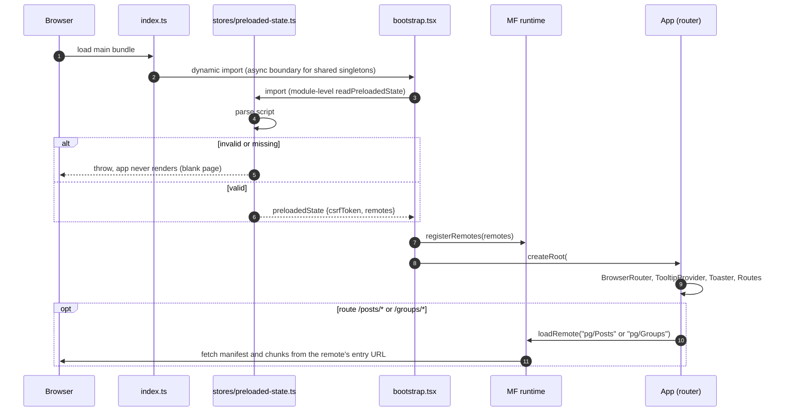
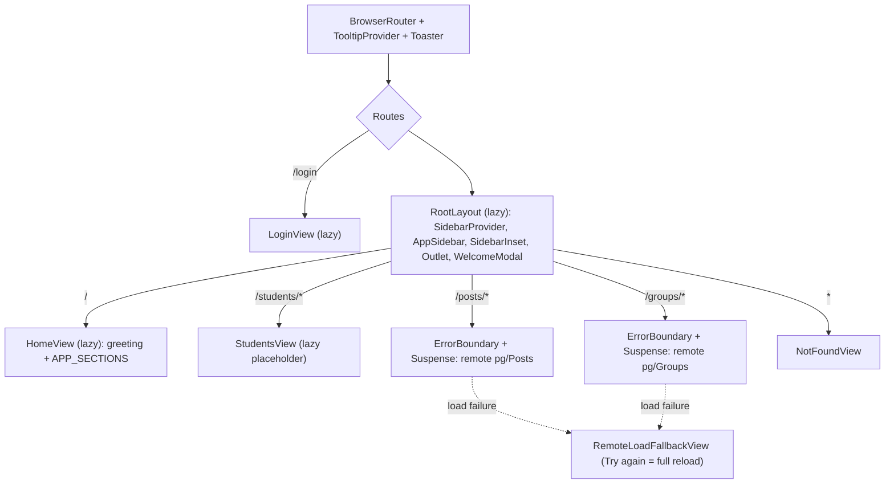

# Subsystem: Host Shell (React Frontend)

Revision: `main` @ `5ff58a7`. Batch 7 (2026-10-09).

Files in scope, read in full:

- `apps/host/src/index.ts`, `bootstrap.tsx`, `App.tsx`
- `stores/preloaded-state.ts`
- `containers/*` (all 6)
- `components/{Sidebar,AppCard,AppSection,WelcomeModal,ErrorBoundary}.tsx`
- `hooks/use-mobile.ts`, `helpers/cn.ts`, `env.d.ts`
- `App.css`, `components.json`, `rsbuild.config.ts`, `index.html`, `tsconfig.json`, `package.json`

`components/ui/*` (9 shadcn-generated files) were listed, not read. The repo says to regenerate them rather than hand-edit (`CONTRIBUTING.md`).

## 1. Purpose and shape

The host is a **Module Federation host** named `teacher_workspace`, built with Rsbuild. It provides:

- the layout: a collapsible sidebar and a first-visit welcome modal
- a static **home page catalogue** of MOE apps, most of them external links
- a login page
- routes that lazy-load two exposed modules from the `pg` remote: `Posts` and `Groups`

The host holds no data. It makes no API calls, and has no state library beyond the read-once preloaded state.

## 2. Boot sequence

| Step | Evidence |
| --- | --- |
| Async boundary via `import('./bootstrap')` | `index.ts:1` |
| Preloaded state read and validated at module load, throws on mismatch | `preloaded-state.ts:24-59` |
| Remotes registered before first render | `bootstrap.tsx:10-11` |
| `#root` required | `bootstrap.tsx:13-14`, `index.html:12` |
| Shared singletons: `react`, `react-dom` `^19.2.7`, `react-router` `^8.2.0`; no static remotes | `rsbuild.config.ts:10-27` |

## 3. Routes and component tree

| Route | Component | Notes | Evidence |
| --- | --- | --- | --- |
| `/login` | `LoginView` | outside `RootLayout` (no sidebar); "Sign in with Edupass" link carrying `return_to`; error toast for `?error=oauth2_callback_failed` | `App.tsx:41`, `LoginView.tsx` |
| `/` | `HomeView` | time-of-day greeting (browser clock) and the app catalogue | `HomeView.tsx:204-227` |
| `/students/*` | `StudentsView` | heading "Student Insight" only; the `si` remote is not wired (Q10) | `StudentsView.tsx` |
| `/posts/*`, `/groups/*` | remote `pg/Posts`, `pg/Groups` | each wrapped in `ErrorBoundary` + `Suspense fallback={null}` | `App.tsx:16-67` |
| `*` | `NotFoundView` | "Page not found", inside the layout | `App.tsx:69`, `NotFoundView.tsx` |

Remote route paths use `/*`, so the remote owns everything below its prefix (for example `/posts/123/edit`) and routes with the shared `react-router` instance (Inferred from the singleton sharing and the splat routes).

## 4. Navigation

Sidebar (`Sidebar.tsx:27-35`), collapsible to icons, closes on mobile after navigation:

| Group          | Item             | Target                                                  |
| -------------- | ---------------- | ------------------------------------------------------- |
| (top)          | Home             | `/`                                                     |
| (top)          | Student Insights | `/students`                                             |
| Communications | Posts            | `/posts` (remote `pg`)                                  |
| Communications | Groups           | `/groups` (remote `pg`)                                 |
| Footer         | Help             | `https://go.gov.sg/teacherworkspace-feedback` (new tab) |

## 5. Home page app catalogue

`APP_SECTIONS` in `HomeView.tsx:24-202` is a **hard-coded list** of 8 sections and 18 cards. Only Student Insights (`/students`, appearing twice: Featured with a "Beta" badge, and under Student Information) is internal. Every other card is an external MOE or government URL, opened in a new tab with `rel="noopener noreferrer"`. `AppCard` picks between external and internal by `href.startsWith('http')` (`AppCard.tsx:85-97`).

| Section                                         | Apps                                       |
| ----------------------------------------------- | ------------------------------------------ |
| Featured                                        | Student Insights                           |
| Frequently Used                                 | School Cockpit, SC Mobile, SLS             |
| Student Information                             | All Ears, Student Insights, Allocate, SDIS |
| Social-Emotional & Mental Wellbeing (SEConnect) | MySEI, Connecto-gram, Termly Check-In      |
| AI Productivity Tools                           | HeyTalia, Appraiser                        |
| Teaching & Learning                             | LangBuddy                                  |
| Admin                                           | Workpal, HR and Payroll portal (HRP)       |
| Professional Development                        | OPAL 2.0, Glow                             |

The catalogue is not personalised, not role-based and not server-driven. Changing it means a frontend release.

## 6. Welcome modal

`WelcomeModal.tsx` opens on first visit unless `localStorage["tw_welcome_modal_seen"] === "true"`, plays a muted looping onboarding video, and sets the flag on close. Being in `RootLayout`, it appears on every layout page, including for signed-out visitors. The flag is per browser, not per user. If storage throws (e.g. disabled), the modal never shows (`WelcomeModal.tsx:16-22`).

## 7. Styling conventions

| Convention | Detail | Evidence |
| --- | --- | --- |
| Tailwind v4 with a **`tw:` class prefix** | every utility is written `tw:flex`, `tw:text-sm`, etc. Likely there so host utilities do not collide with class names in remotes that share the document (rationale Inferred) | `App.css:2`, `components.json:12` |
| Design tokens as CSS variables on `:root` and `.dark` | primary `#0064ff`, neutral greys, sidebar palette; mapped into Tailwind with `@theme inline` | `App.css:7-100` |
| Global base styles | `*` border and outline colours, `body` font and colours: these apply to remote content too (Inferred: same document) | `App.css:102-111` |
| shadcn `base-nova` style on Base UI | components in `components/ui`, `cn()` = `twMerge(clsx(...))` | `components.json`, `helpers/cn.ts` |
| Inter font via `@fontsource/inter` | bundled, not fetched from a CDN | `App.css:1` |
| Dark mode | tokens exist (`.dark`), but nothing in the read code toggles the class | `App.css:5, 38-66` |
| Hard-coded hex still present | `#eaf3ff` badge background (sidebar, welcome modal), `#C8C8C8` featured border; CHANGELOG 0.0.2 moved one hex to a token, others remain | `Sidebar.tsx:65`, `WelcomeModal.tsx:60`, `AppCard.tsx:65` |

## 8. Error handling

| Case | Behaviour | Evidence |
| --- | --- | --- |
| Remote fails to load or throws while rendering | `ErrorBoundary` shows `RemoteLoadFallbackView`; "Try again" reloads the whole page | `App.tsx:45-67`, `ErrorBoundary.tsx` |
| Errors are reported anywhere | **No**: `ErrorBoundary` has no `componentDidCatch`, and there is no client-side error reporting | `ErrorBoundary.tsx:12-26` |
| Error outside a remote route (e.g. in `HomeView` or the layout) | no boundary, so React unmounts the app (blank page) | `App.tsx` (only remote routes are wrapped) |
| Invalid preloaded state | throw at module load, blank page | `preloaded-state.ts:24-59` |
| Lazy chunk loading | `Suspense fallback={null}`, so the area is blank while loading (no skeleton) | `RootLayout.tsx:16-18`, `App.tsx:51, 63` |

## 9. Integration points with the server and remotes

| Concern | Status | Evidence |
| --- | --- | --- |
| Host calls `/api/` | **never** (no `fetch`, XHR or client library in host source, excluding `components/ui`) | search over `apps/host/src` |
| Host uses `csrfToken` | **no**: validated in the preloaded state, then unused | `preloaded-state.ts:5, 44`; search |
| Remotes get the CSRF token or user info from the host | no shared module or prop carries them (only `react`, `react-dom` and `react-router` are shared); a remote could only read the `#preloaded-state` script from the DOM itself | `rsbuild.config.ts:13-26`, `App.tsx:16-32` (no props passed) |
| Host knows whether the user is signed in | no (Q30) | `preloaded-state.ts:4-7` |
| Host links to `/login` | never; only the server's sign-in failure redirects there | search, `auth.go:287-294` |

## 10. Where to change things

| Change | Where |
| --- | --- |
| Add or change a home page app | `APP_SECTIONS` in `HomeView.tsx`, logo in `src/assets/logos/` |
| Add a sidebar item | `navItems` / `communicationsItems` in `Sidebar.tsx:27-35` |
| Mount a new remote module | lazy `loadRemote('<remote>/<Module>')` plus a route wrapped in `ErrorBoundary` + `Suspense` in `App.tsx`; the remote must also be registered server-side (`index.go:25-32`) |
| Wire Student Insights | replace `StudentsView` at `App.tsx:44` with a `loadRemote('si/...')` route |
| Add a sign-in guard | in `RootLayout` or a wrapper route, once the preloaded state carries a signed-in flag (Q30) |
| Report frontend errors | add `componentDidCatch` to `ErrorBoundary` and a top-level boundary in `App.tsx` |
| Theme or tokens | `App.css` variables |

## 11. Tests

There are no frontend tests in `apps/host`, and `CONTRIBUTING.md` says "No conventions documented yet" for TypeScript tests. PR CI has no dedicated build or typecheck job for the host; it is compiled only inside the Docker image build, which runs for same-repo PRs and skips forks (Q12, `ci.yml:95-101`).
