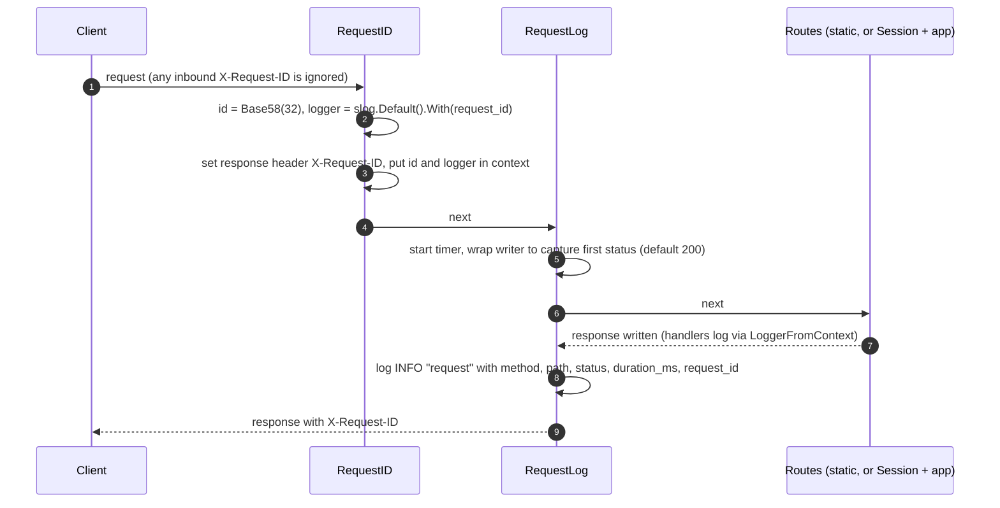

# Subsystem: Request ID, Logging and Observability

Revision: `main` @ `5ff58a7`. Batch 6 (2026-10-09).

Files in scope (read in full): `server/internal/middleware/requestid.go`, `server/internal/middleware/requestlog.go`. Tests: case names of `requestid_test.go` and `requestlog_test.go` reviewed. A search for every log call across all 21 server source files built the log catalog in section 4.

## 1. Summary

Every request gets a fresh random request ID, returned in `X-Request-ID` and attached to a request-scoped `slog` logger. One JSON access-log line per request records method, path, status and duration. That is the whole observability surface: there are **no metrics, no tracing, no health endpoint and no panic-recovery middleware** in the server code.

## 2. Middleware behaviour



| Behaviour | Status | Evidence |
| --- | --- | --- |
| ID generated for every request (`random.Base58(32)`); an inbound `X-Request-ID` is **not** trusted or reused | Verified | `requestid.go:20-31`; test "two requests get different IDs" `requestid_test.go:29` |
| Response carries `X-Request-ID` (set before the handler runs, so error responses carry it too) | Verified | `requestid.go:28`; test `requestid_test.go:14` |
| Request-scoped logger = `slog.Default().With("request_id", id)`; `LoggerFromContext` falls back to `slog.Default()` | Verified | `requestid.go:25, 41-48`; tests `requestid_test.go:65, 110` |
| Handler log lines and the access-log line share the same `request_id` | Verified | test `requestid_test.go:82` |
| `RequestIDFromContext` exists but has **no non-test caller** | Verified | search over `server/` |
| Access log fields: `method`, `path` (no query string), `status` (first `WriteHeader`, else 200), `duration_ms`, plus `request_id`; level INFO; message `"request"` | Verified | `requestlog.go:44-60`; tests `requestlog_test.go:17-183` |
| `requestLogResponseWriter` implements `Unwrap`, so Flush and Hijack (e.g. HMR WebSockets through the dev proxy) still work | Verified | `requestlog.go:33-37`; test `requestlog_test.go:152` |
| The logged status is what the client actually got: when the session save fails, the Session writer suppresses the handler's status and sends 500 through the same chain, so the access log shows 500 | Verified by code reading | `middleware/session.go:169-202`, `requestlog.go:20-26` |
| Ordering requirement (RequestLog after RequestID) is met by `Chain(..., RequestID, RequestLog)` | Verified | `main.go:107-111`, `middleware.go:10-18` (resolves the Inferred note in `02-architecture.md` section 7) |

## 3. Log output format

From `main.go:29-42`: JSON to stdout via `slog.NewJSONHandler`, level from `TW_LOG_LEVEL` (default INFO, applied after config loads), `time` formatted RFC 3339 (seconds precision). An access-log line looks like this (shape derived from the code; values illustrative):

```json
{
  "time": "2026-10-09T17:51:00+08:00",
  "level": "INFO",
  "msg": "request",
  "request_id": "<32 base58 chars>",
  "method": "GET",
  "path": "/posts/123",
  "status": 200,
  "duration_ms": 4
}
```

## 4. Log catalog (every log statement in server code)

| Where | Level | Message | Extra fields |
| --- | --- | --- | --- |
| `main.go:46, 50` | ERROR | `failed to load config`, `invalid config` | `err` (joined validation errors; Valkey URL credentials redacted, `config.go:214-217`) |
| `main.go:62, 78, 87, 93` | ERROR | Valkey port, Valkey client, unsupported provider, handler creation | `err` / `port` / `provider` |
| `main.go:122` | INFO | `listening` | `addr`, `env`, `session_store` |
| `main.go:124, 136` | ERROR | `listen failed`, `shutdown failed` | `err` |
| `requestlog.go:54` | INFO | `request` | see section 2 |
| `middleware/session.go:73` | WARN | `discarding undecodable session` | `err` |
| `middleware/session.go:76, 117, 176` | ERROR | load failure, drop superseded failure, save failure | `err` |
| `handler/index.go:38, 50` | ERROR | no session, template failure | `err` |
| `handler/handler.go:126` | ERROR | `failed to proxy request to dev server` | `err` |
| `handler/proxy.go:69` | ERROR | `failed to sign JWT` | `app`, `err` |
| `handler/proxy.go:107` | ERROR | `failed to proxy request` | `method`, `path` (no query), `remote_backend_url` (no query), `err` |
| `handler/auth.go:43, 95` | ERROR | no session | `provider` |
| `handler/auth.go:110, 124` | WARN | `no pending login in session`, `state mismatch` | which values were present |
| `handler/auth.go:144` | WARN (`access_denied`) or ERROR | `login failed at provider` | `error_code`, `error_description` |
| `handler/auth.go:168-244` | ERROR | client assertion signing, token exchange (with Edupass `error_codes`, `trace_id`, `correlation_id`), missing ID token, verify failure, nonce mismatch, claims, missing email | `provider`, `status`, `err` |
| `handler/auth.go:251` | INFO | `logged in` | `provider` only (no email, test `auth_test.go:652`) |
| `httputil/httputil.go:38-91` | ERROR | write or encode failures, invalid redirect status | `renderer`, `err`, `status` |

Notes:

- **No DEBUG statements exist**, so `TW_LOG_LEVEL=debug` adds nothing today (Verified by the search above).
- **Secrets and PII:** client secrets and client assertions are kept out of logs (tests `auth_test.go:727, 1025`), query strings are kept out of proxy and access logs, and the email is not logged at sign-in. Paths are logged as-is, so identifiers in paths (e.g. `/api/posts/v1/students/<id>`) will appear in access logs.
- The only user-correlated log line is `logged in`, and it carries no user identifier, so a signed-in user's requests cannot be tied to them from logs alone (by design or not, unknown).

## 5. What is not there

| Capability | Status | Evidence / note |
| --- | --- | --- |
| Metrics (Prometheus, OTel) | absent | no imports in server code; OpenTelemetry appears in `go.mod` only as an indirect dependency (of testcontainers, Inferred) |
| Distributed tracing | absent | same |
| Health / readiness endpoint | absent | route table `handler.go:93-105` (Q11) |
| Panic recovery middleware | absent | no `recover()` in server code. `net/http` recovers per-connection panics and writes to the server's `ErrorLog`, which is unset, so it goes to stderr through the standard `log` package as plain text, not JSON, and no access-log line is written for that request (Inferred, stdlib behaviour) |
| Trusting an upstream request ID | absent | inbound `X-Request-ID` ignored, so load balancer IDs cannot be joined to TW logs |
| Request ID to remote backends | absent | `proxy.go:83-90` sets only `Authorization`. Any client-supplied `X-Request-ID` header is passed through unchanged to the backend, so a backend could see the client's value rather than TW's (Verified: `Rewrite` copies inbound headers except `Cookie`) (Q31) |
| Client IP, user agent, response size in access log | absent | `requestlog.go:54-59` |

## 6. Debugging guide

| Symptom | Where to look |
| --- | --- |
| User reports an error page | Ask for the `X-Request-ID` response header (browser devtools, Network tab), then filter logs on `request_id` |
| Sign-in loops back to `/login?error=oauth2_callback_failed` | Logs with `provider=edupass` for the callback request: `state mismatch` / `no pending login` usually mean cookie problems (e.g. `TW_SESSION_SECURE=true` over plain HTTP); `failed to exchange code for token` carries Edupass `trace_id` / `correlation_id` to give the Edupass team |
| `/api/...` returns 502 | `failed to proxy request` with `remote_backend_url` |
| Every request 500s | `failed to load session` or `failed to save session` (Valkey down or auth wrong) |
| Blank page in dev | `failed to execute index template` (dev server on `TW_DEV_SERVER_URL` not running) |

## 7. Where to change things

| Change | Where |
| --- | --- |
| Accept an upstream request ID | `requestid.go:22` (validate format and length before trusting) |
| Forward request ID to backends | `proxy.go` `Rewrite`: `pr.Out.Header.Set("X-Request-ID", id)` using `RequestIDFromContext(pr.In.Context())` |
| More access-log fields | `requestlog.go:54-59` (bytes written needs counting in `Write`) |
| Panic recovery | new middleware placed inside `RequestLog` in `main.go:107-111`, so the 500 is logged |
| Health endpoint | `Handler.Routes` on the outer mux (outside the session, like `/static/`) to avoid creating sessions for probes |
