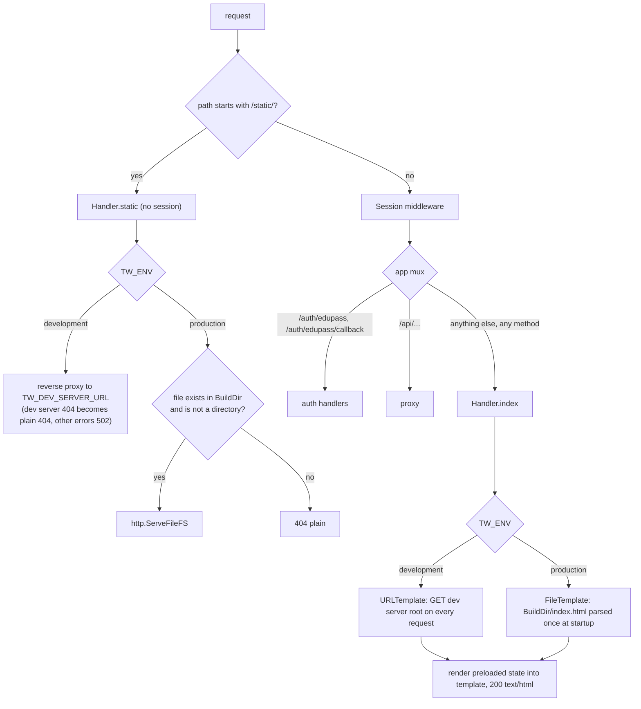
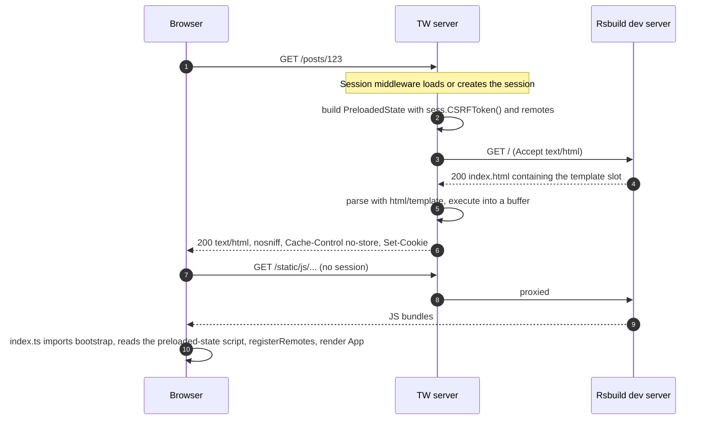

# Subsystem: Page Render, Static Assets and Response Helpers

Revision: `main` @ `5ff58a7`. Batch 4 (2026-10-09).

Files in scope (read in full): `server/internal/handler/index.go`, `server/internal/htmlutil/template.go`, `server/internal/httputil/httputil.go`, `server/internal/httputil/error.go`, `apps/host/src/containers/RootLayout.tsx`, `apps/host/src/containers/RemoteLoadFallbackView.tsx`. Tests: case names of `index_test.go`, `template_test.go`, `httputil_test.go` reviewed; one `index_test.go` body read.

## 1. Purpose

Serve the single-page host shell. For every page URL the server renders `index.html` with a per-request **preloaded state** (a fresh CSRF token and the list of registered remotes) embedded as JSON. Static assets come from the Rsbuild dev server in development and from `TW_BUILD_DIR` in production.

## 2. Routing by environment



| Edge | Status | Evidence |
| --- | --- | --- |
| `/static/` bypasses the session | Verified | `handler.go:100-102` |
| Dev static: reverse proxy, 404 mapped to plain 404, other errors 502 | Verified | `index.go:63-64`, `handler.go:107-130`; test `index_test.go:275` |
| Prod static: `TrimPrefix("/")`, `fs.Stat` on an `os.Root` FS, directories 404, `ServeFileFS` | Verified | `index.go:65-73`, `handler.go:78-82`; tests `index_test.go:294-357` (incl. "symlink outside build directory") |
| Index is the catch-all for every unmatched path and every method (POST to `/foo` gets the HTML page) | Verified | `handler.go:98` (`"/"` pattern with no method), `index.go:24-57` |
| Dev template fetched from the dev server root on every page load, `Accept: text/html`, 10s timeout, bound to the request context | Verified | `template.go:16-82`; tests `template_test.go:16-131` |
| Prod template parsed once; missing or invalid file fails startup | Verified | `template.go:84-103`, `handler.go:71-76` |

Asset URL alignment: Rsbuild uses `assetPrefix: '/static'`, HMR at `/static/rsbuild-hmr`, lazy compilation at `/static/_rspack/lazy/trigger` (`rsbuild.config.ts:37-45`). That keeps every asset and dev-tool request under `/static/`, which is the only path the server proxies to the dev server. HMR uses a WebSocket; `httputil.ReverseProxy` supports upgrades (Inferred, stdlib behaviour).

## 3. Page render sequence (development)



In production steps 3-5 are replaced by executing the template parsed at startup. Any template error returns a 500 plain response, and because output goes to a buffer first, no partial HTML is sent (`index.go:48-55`; test `index_test.go:232`).

## 4. Preloaded state contract

Server side (`index.go:14-22, 25-46`):

```json
{
  "csrfToken": "<86-char base64url masked token, new on every render>",
  "remotes": [
    { "name": "pg", "entry": "<TW_REMOTE_POSTS_MANIFEST_URL>" },
    { "name": "si", "entry": "<TW_REMOTE_STUDENT_INSIGHTS_MANIFEST_URL>" }
  ]
}
```

- A remote is listed only when all three of its settings are set (`IsPostsRegistered`, `IsStudentInsightsRegistered`). The list is computed once when the routes are built, not per request (`index.go:25-32`). With no remotes it is `[]`, never `null` (test "no remotes configured", `index_test.go:165`).
- The template slot is `{{.}}` inside `<script type="application/json" id="preloaded-state">` (`apps/host/index.html:7-9`). `html/template` treats `application/json` script content as a JS context and emits the struct as JSON with HTML-sensitive characters escaped (escaping behaviour Inferred from the standard library; JSON-parseable output Verified by `index_test.go:97-126`).

Client side (`apps/host/src/stores/preloaded-state.ts`): parses that script once at module load, validates the shape (`csrfToken` string, `remotes` array of `{name, entry}` strings), and **throws** if it is missing or invalid, which stops the app from booting. `bootstrap.tsx:11` then calls `registerRemotes(preloadedState.remotes)` before rendering.

Remote names are a cross-repo contract: the server's `pg` and `si` must match the names the host uses in `loadRemote('pg/Posts')` etc. (`App.tsx:16-32`) and the names the remote builds expose.

## 5. Answers from this batch

| Question | Answer | Evidence |
| --- | --- | --- |
| Q9: is sign-in enforced anywhere for pages? | **No.** The server renders the shell for anonymous sessions, and `RootLayout` has no auth guard. The preloaded state carries no user or "signed in" flag, so the SPA cannot tell whether the user is signed in. Users reach `/login` only by navigating there | `index.go:34-56`, `RootLayout.tsx:8-22`, `index.go:14-17` |
| Q10: Student Insights remote vs `/students` | The `si` remote is registered when configured, but no route loads anything from it: `/students/*` renders the local `StudentsView` placeholder. Only `pg/Posts` and `pg/Groups` are loaded | `index.go:30-31`, `App.tsx:13, 44` |
| Remote failure UX | `/posts/*` and `/groups/*` wrap the lazy remote in an `ErrorBoundary`; on failure `RemoteLoadFallbackView` offers "Try again" (full page reload) or "Back to home". This includes the case where the remote is not registered, because `loadRemote` then fails | `App.tsx:45-67`, `RemoteLoadFallbackView.tsx`; unregistered case per `CONTRIBUTING.md` |

## 6. Response helpers (`httputil`)

| Helper | Behaviour | Evidence |
| --- | --- | --- |
| `RenderPlain(w, logger, status)` | `text/plain; charset=UTF-8`, `nosniff`, body = `http.StatusText(status)` | `httputil.go:27-40` |
| `RenderHTML(w, logger, status, body)` | `text/html; charset=UTF-8`, `nosniff` | `httputil.go:42-54` |
| `RenderJSON(w, logger, status, v)` | marshal first; on failure a 500 plain; else `application/json; charset=UTF-8`, `nosniff` | `httputil.go:56-77` |
| `Redirect(w, logger, status, url)` | only 301/302/303/307/308, else logs and 500; `Location` sent exactly as given (not resolved) | `httputil.go:79-97` |
| `ErrorResponse{Message}` | JSON error body shape `{"message": "..."}`, used by the proxy's 404/500 | `error.go`, `proxy.go:54-56, 70-72` |

Write errors are logged, never returned. All helpers are covered by `httputil_test.go`.

## 7. Observations

| # | Observation | Status | Impact |
| --- | --- | --- | --- |
| P1 | No security headers on the page: no `Content-Security-Policy`, `X-Frame-Options` / `frame-ancestors`, `Referrer-Policy` or `Strict-Transport-Security`. Only `nosniff` and `Cache-Control: no-store` | Verified (`httputil.go:45-54`, `middleware/session.go:102`) | Clickjacking and XSS hardening rely on the platform (load balancer or CDN may add them, unknown). Q29 |
| P2 | Prod static assets get no `Cache-Control`, even though Rsbuild filenames are content-hashed, so browsers revalidate rather than cache them as immutable | Verified (`index.go:73`, no header set) | Performance only |
| P3 | Every page render in dev makes an HTTP round trip to the dev server and re-parses the template | Verified | Dev only |
| P4 | Unknown paths (e.g. `/favicon.ico`, `/robots.txt`, typos) get the 200 HTML shell, and each one creates a session if there is no cookie | Verified | Harmless for the SPA; adds to store growth (Q23) and can confuse monitoring |
| P5 | The CSRF token is re-minted on every page render but never checked (Q8) | Verified | See `sessions.md` |

## 8. Where to change things

| Change | Where |
| --- | --- |
| Add a field the SPA needs at boot (e.g. signed-in user) | `PreloadedState` (`index.go:14-17`) and `index()` (`index.go:43-46`), plus `PreloadedState` and `isPreloadedState` in `apps/host/src/stores/preloaded-state.ts` (both sides must change together, or the host throws on boot) |
| Add a remote | config (see `02-architecture.md` section 8), `index.go:25-32`, host routes in `App.tsx` |
| Security or caching headers | `RenderHTML` / `index()` for the page; `static()` for assets; or a middleware in `main.go` `Chain` |
| Server-side redirect of anonymous users to `/login` | `index()` using `sess.IsAuthenticated()` (excluding `/login` itself) |

Breakpoints: `index.go:43` (state built), `index.go:49` (template execute), `index.go:66` (static path resolution), `template.go:58` (dev fetch).
