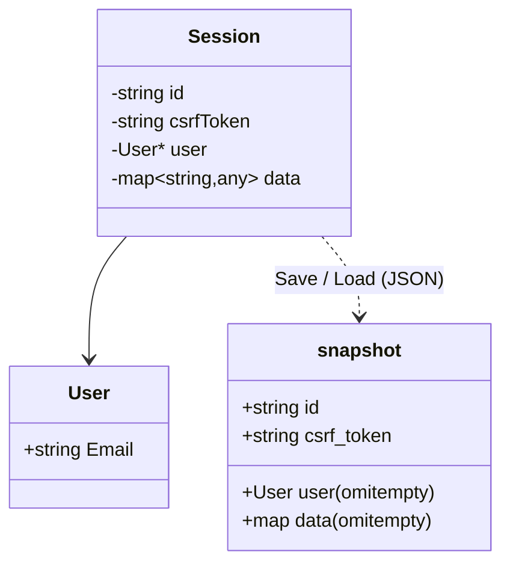
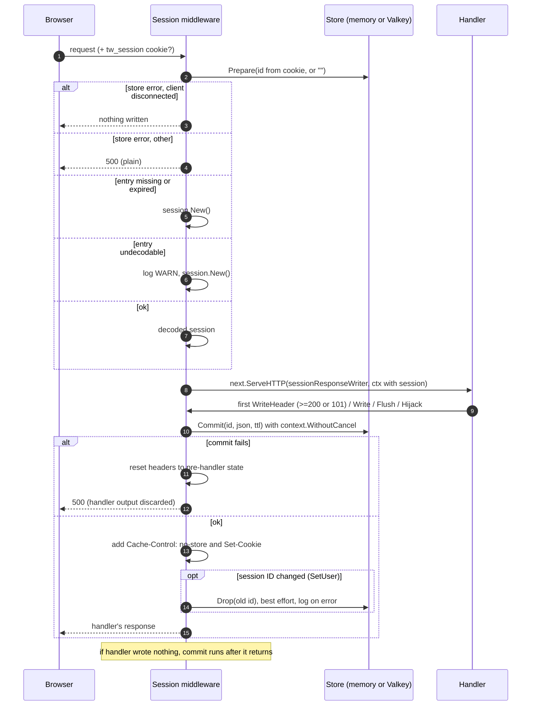
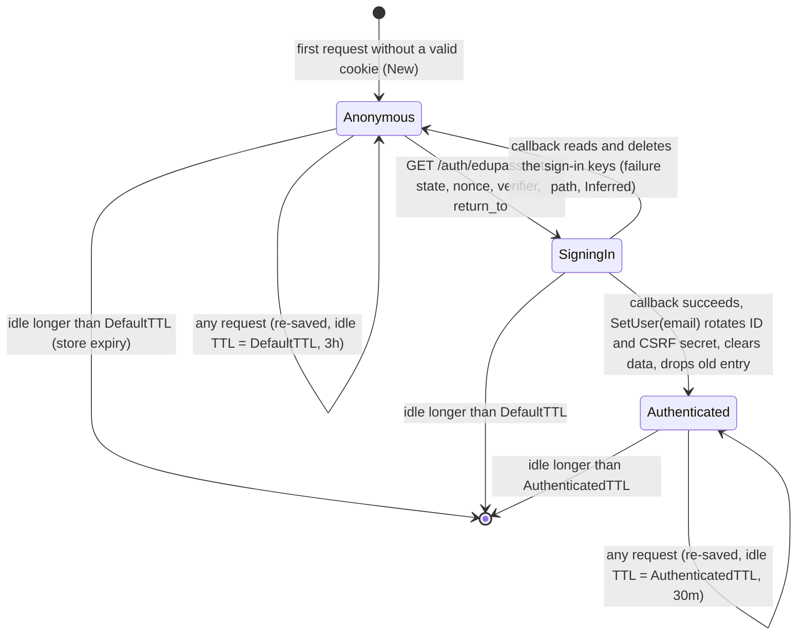

# Subsystem: Sessions and CSRF

Revision: `main` @ `5ff58a7`. Phase 2, batch 2 (2026-10-09).

Files in scope: `server/internal/session/session.go`, `server/internal/session/csrf.go`, `server/internal/middleware/session.go`, `server/internal/session/memstore/memstore.go`, `server/internal/session/valkeystore/valkeystore.go`, `server/pkg/random/random.go`. Tests: case names of all six test files reviewed; bodies not read. Call sites in `handler/auth.go` and `handler/index.go` were located by search only (their logic is batch 3 and 4).

## 1. Purpose

Give every non-static request a server-side session identified by an opaque cookie, persist it in a pluggable store, rotate it on sign-in, and issue CSRF tokens bound to it. The session currently holds very little: a user email once signed in, plus temporary sign-in data.

## 2. Public interface

| Symbol | Contract (from doc comments, Verified against code) | Location |
| --- | --- | --- |
| `session.Store` | `Prepare(ctx, id)` returns the last committed bytes, or `(nil, nil)` for empty, missing or expired id. `Commit(ctx, id, data, ttl)` replaces the entry; errors on empty id or ttl <= 0. `Drop(ctx, id)` removes; no-op for empty/missing. All must be concurrency-safe and fail with the context's error if ctx is already done | `session.go:14-31` |
| `session.New()` | New unauthenticated session with random ID and CSRF secret | `session.go:63-69` |
| `session.Load(ctx, store, id)` | Stored session, or a **new** one when none; error wrapping `ErrUndecodable` if JSON is bad, the stored ID differs from `id`, or the CSRF secret is empty | `session.go:71-102` |
| `session.Save(ctx, store, sess, ttl)` | JSON-encode the snapshot and `Commit` under the current ID | `session.go:104-122` |
| `(*Session).CSRFToken()` / `VerifyCSRFToken(tok)` | Masked token, different on every call; verify accepts any token minted from the current secret, in constant time | `session.go:130-143`, `csrf.go` |
| `(*Session).User()`, `IsAuthenticated()` | User present or not | `session.go:145-158` |
| `Get[T]`, `GetAndDelete[T]`, `Set`, `Delete` | Free-form data map; after a round trip numbers are `float64` and structs are `map[string]any` | `session.go:160-187` |
| `(*Session).SetUser(u)` | Attach user **and** rotate ID, rotate CSRF secret, clear data (anti session fixation) | `session.go:189-199` |
| `middleware.Session(store, opts)` | Per-request load, attach to context, save before first write, set cookie | `middleware/session.go:37-132` |
| `middleware.SessionFromContext(ctx)` | Retrieve the request's session | `middleware/session.go:134-139` |

## 3. Data model

| Fact | Status | Evidence |
| --- | --- | --- |
| Stored value is the JSON `snapshot` (`id`, `csrf_token`, optional `user`, optional `data`) | Verified | `session.go:50-56, 110-116` |
| `User` holds **only `Email`**; no name, roles, groups, school/location or Edupass `sub` | Verified | `session.go:58-61` |
| Session ID and CSRF secret: 32 chars from the base58 alphabet via `crypto/rand` with rejection sampling (about 187 bits each) | Verified | `session.go:33-35, 66-67`, `random.go:18-83` |
| Valkey key = `TW_SESSION_VALKEY_PREFIX` (default `session:`) + ID; `GET`, `SET` with expiry, `DEL` | Verified | `valkeystore.go:45-101` |
| Known data keys: Edupass return-to, state, nonce, PKCE code verifier, set on `GET /auth/edupass` and read-and-deleted on the callback | Verified (call sites only) | `auth.go:52-55, 100-107` |

## 4. Request lifecycle through the Session middleware

Walkthrough:

- **Every request through the session layer writes the store and sets the cookie**, even if nothing changed (`middleware/session.go:88-111, 128-129`). That includes `/` page loads, `/auth/*` and every `/api/` call; only `/static/` is exempt (`handler.go:100-102`).
- **Changes after the first write are lost.** Handlers must mutate the session before writing any bytes or headers (doc comment `middleware/session.go:44-46`; test "does not save changes made after the handler's first write", `session_test.go:531`).
- **Saving ignores client disconnects** (`context.WithoutCancel`, `middleware/session.go:94-96`), so a completed sign-in is persisted even if the browser goes away.
- **Save failure replaces the response with a 500** and discards headers the handler added (e.g. `Content-Length`) (`middleware/session.go:167-188`).

Cookie attributes (`middleware/session.go:103-111`):

| Attribute | Value                                    |
| --------- | ---------------------------------------- |
| Name      | `TW_SESSION_NAME` (default `tw_session`) |
| Value     | session ID                               |
| Path      | `/`                                      |
| Max-Age   | current TTL in seconds                   |
| Secure    | `TW_SESSION_SECURE` (default true)       |
| HttpOnly  | true                                     |
| SameSite  | Lax                                      |
| Domain    | not set (host-only)                      |

## 5. Session lifecycle and TTLs (resolves Q16)

| Rule | Status | Evidence |
| --- | --- | --- |
| Both TTLs are **idle (sliding) timeouts**: every request re-commits with a fresh TTL and re-sends `Max-Age` | Verified | `middleware/session.go:25-31, 88-111`; tests at `session_test.go:348, 383, 435, 1002` |
| TTL choice depends on `IsAuthenticated()` at commit time, so the response that signs in already uses `AuthenticatedTTL` | Verified | `middleware/session.go:89-92`; test `session_test.go:435` |
| **No absolute lifetime**: an active signed-in session never expires on its own | Verified (no such logic exists) | `middleware/session.go`, `session.go` |
| **No logout**: nothing calls `Store.Drop` except ID rotation, and no logout route is registered | Verified | `middleware/session.go:115-119`; route table `handler.go:93-105` |
| Why DefaultTTL (3h) is longer than AuthenticatedTTL (30m) | Unknown (likely a short idle limit for signed-in staff; rationale not in repo) | ask maintainers |
| Failure path of the callback returning the session to Anonymous | Inferred (keys are `GetAndDelete`d before validation) | `auth.go:100-107`; confirm in batch 3 |

## 6. CSRF tokens (resolves Q8, server side)

How tokens work (Verified, `csrf.go`, `session.go:130-143`):

1. Each session has a 32-char secret.
2. `CSRFToken()` XORs the secret with a fresh 32-byte one-time pad and returns base64url(`pad || secret XOR pad`), 86 chars. Each call differs, so the token does not leak the secret through compression side channels (the BREACH mitigation pattern).
3. `VerifyCSRFToken` decodes, checks length, unmasks, and compares in constant time. It rejects empty or malformed tokens.
4. `SetUser` rotates the secret, so all tokens minted before sign-in stop verifying.

Where tokens are used:

| Use | Status | Evidence |
| --- | --- | --- |
| Issued into the page's preloaded state as `csrfToken` on page render | Verified (call site) | `index.go:36-44`, host `preloaded-state.ts` |
| **Verified anywhere in server code** | **Not verified anywhere.** `VerifyCSRFToken` has no non-test caller in `server/` | search across `server/internal/handler/*.go` and middleware (this batch) |

So, at this revision, CSRF protection relies only on `SameSite=Lax` (which blocks cross-site cookies on POST/PUT/DELETE from other sites but not on top-level GET navigations). See Q8 and Q21.

## 7. Stores

| Aspect | memstore | valkeystore |
| --- | --- | --- |
| Intended for | dev and tests (doc comment says production should use a shared store) | multi-instance deployments |
| Expiry | checked on `Prepare`; expired entry deleted when read | Valkey key TTL (`SET ... EX`) |
| Sweeping | **none**: entries never read again stay in memory until restart | handled by Valkey |
| Copies | clones bytes in and out | strings over the wire |
| Concurrency | single `sync.Mutex` | client handles it |
| Prefix | n/a | configurable, default `session:` |
| Evidence | `memstore.go:1-106`; tests `memstore_test.go:86-125, 417` | `valkeystore.go:1-101`; tests use testcontainers (`valkeystore_test.go`) |

## 8. Risks and edge cases found

| # | Finding | Status | Impact |
| --- | --- | --- | --- |
| R1 | **`/api/` proxy does not require an authenticated session and carries no user identity.** `proxy()` routes `/api/{posts,student-insights}/...` to the backend with a fresh HS256 JWT (`iss=tw`, `aud=pg` or `si`, `iat`, `exp`) for any caller, signed in or not; no `sub` or email claim; no `SessionFromContext` call | Verified, `proxy.go:25-78` | High: conflicts with ADR-0001 hop 3 ("authenticates the session... signs a short-lived JWT scoped to that one app"). Possibly in progress for a 0.0.x pre-release. Q21 |
| R2 | CSRF tokens issued but never checked (section 6) | Verified | Medium (SameSite=Lax limits it); matters once R1 is fixed and `/api/` mutates data |
| R3 | Every cookieless request creates and stores a new session for 3h (bots, health probes, first page loads) | Verified by code reading | Store growth; with memstore, unbounded memory growth in long-running processes (no sweeper) |
| R4 | Concurrent requests on one session are last-write-wins over the whole snapshot (load, modify, save; no locking or versioning). A request that loaded the pre-sign-in session can re-save it under the old ID after the callback dropped it, leaving an orphaned anonymous entry until it expires | Verified by code reading | Low today (only sign-in mutates); grows if more state is stored |
| R5 | No absolute session lifetime and no logout | Verified | Policy question for security review (Q22) |
| R6 | `User` stores only email; roles/groups from Edupass (e.g. `0001_TW_ROLE_TEACHER` in mock fixtures) are not kept in the session | Verified | Authorisation by role is not possible from session data today (Q7) |

## 9. Where to change things

| Change | Where |
| --- | --- |
| Store more user attributes (roles, school, name) | `session.User` (`session.go:58-61`) plus `SetUser` caller in `auth.go:249`; existing sessions will decode fine because fields are additive JSON |
| Require sign-in for `/api/` | `proxy()` handler or a middleware in `Handler.Routes` around `/api/` (`handler.go:97`) |
| Enforce CSRF | A middleware on unsafe methods calling `SessionFromContext(...).VerifyCSRFToken(header)`; the host must send `preloadedState.csrfToken` in a header |
| Logout | New route calling `store.Drop` (not reachable from handlers today: `Handler` has no store reference) or a session-level "destroy" flag the middleware honours |
| Absolute timeout | Add a created-at field to `snapshot` and check it in `Load` or the middleware |

Breakpoints: `middleware/session.go:65` (load), `:98` (save), `session.go:194` (rotation), `proxy.go:51` (API routing).

## 10. Tests

Coverage is thorough for the mechanics: middleware load/save/cookie/TTL/rotation/500 paths (`middleware/session_test.go`, 40 subtests), session model and CSRF (`session/session_test.go`, `csrf_test.go`), both stores including concurrency (memstore) and Docker-backed Valkey (`valkeystore_test.go`). Not covered (because not implemented): CSRF enforcement, auth gating of `/api/`, logout, absolute expiry.
