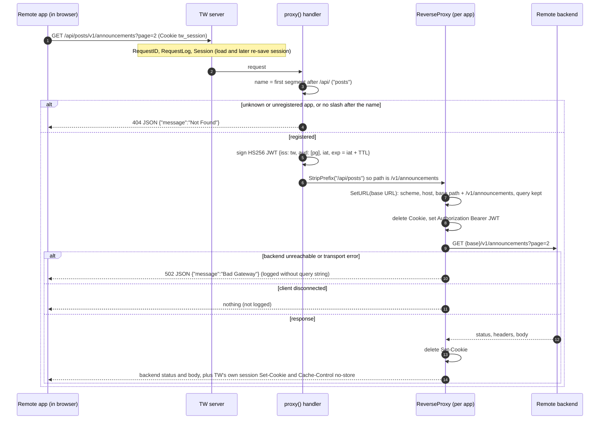

# Workflow: API Proxy to Remote App Backends

Revision: `main` @ `5ff58a7`. Batch 5 (2026-10-09).

Files in scope (read in full): `server/internal/handler/proxy.go`, `server/pkg/require/require.go`. Tests: `server/internal/handler/proxy_test.go` case names reviewed and the JWT test body read (`proxy_test.go:181-266`).

## 1. Purpose

Remote apps (MFEs) run inside the host shell on the TW origin, so their browser requests carry the TW session cookie. They call their own backends through TW at `/api/<app>/...`. TW strips cookies, attaches a short-lived HS256 JWT signed with a per-app shared key, and reverse-proxies to the app's backend. This is hop 3 to 4 of ADR-0001.

## 2. Request flow

| Step | Status | Evidence |
| --- | --- | --- |
| Session layer runs for `/api/` and re-saves the session, but the proxy never reads it | Verified | `handler.go:97, 102`, `proxy.go:48-78` (no `SessionFromContext`); `proxy_test.go` calls `h.proxy()` with no session in context and expects 200 |
| App name from the first path segment; `/api/posts` (no trailing slash) is 404 | Verified | `proxy.go:51-58`; test "missing path after app" `proxy_test.go:144` |
| JWT claims exactly `iss`, `aud`, `iat`, `exp` | Verified | `proxy.go:60-66`; test asserts deep equality of the claim set (`proxy_test.go:254-262`) |
| Prefix stripped, base URL path prepended, escaped segments preserved | Verified | `proxy.go:77, 84`; tests `proxy_test.go:40-111, 292` |
| Cookie removed, `Authorization: Bearer` set (replacing any client-sent value) | Verified | `proxy.go:86-89`; tests `proxy_test.go:308, 326` |
| Backend `Set-Cookie` removed | Verified | `proxy.go:91-94`; test `proxy_test.go:345` |
| 502 JSON on transport error, query string kept out of logs; silent on client cancel | Verified | `proxy.go:95-117`; tests `proxy_test.go:368-465` |

## 3. Path mapping

| Registered app | Browser path prefix | JWT `aud` | Backend base URL setting | MF remote name |
| --- | --- | --- | --- | --- |
| Posts (Parents Gateway) | `/api/posts/` | `pg` | `TW_REMOTE_POSTS_BACKEND_BASE_URL` | `pg` (exposes `Posts`, `Groups`) |
| Student Insights | `/api/student-insights/` | `si` | `TW_REMOTE_STUDENT_INSIGHTS_BACKEND_BASE_URL` | `si` |

Examples, with base URL `https://pg-api.internal/base`:

| Browser request                   | Forwarded to                                        |
| --------------------------------- | --------------------------------------------------- |
| `/api/posts/`                     | `https://pg-api.internal/base/`                     |
| `/api/posts/v1/groups/P5%2F3?x=1` | `https://pg-api.internal/base/v1/groups/P5%2F3?x=1` |
| `/api/posts`                      | 404 at TW                                           |
| `/api/unknown/x`                  | 404 at TW                                           |

The API prefix (`posts`, `student-insights`), the audience (`pg`, `si`) and the remote name (`pg`, `si`) are three different identifiers for the same app, all hard-coded (`proxy.go:28-41`, `index.go:27-31`). Groups API calls presumably also go under `/api/posts/` since the `pg` remote owns both (Inferred).

## 4. Contract for remote backend teams

What a remote backend receives (Verified from code and tests):

| Item | Value |
| --- | --- |
| Method, path suffix, query, body | as sent by the browser, minus the `/api/<app>` prefix |
| `Authorization` | `Bearer <JWT>`, always set by TW |
| `Cookie` | never (removed) |
| JWT header | `alg: HS256`, `typ: JWT` |
| JWT claims | `iss: "tw"`, `aud: ["pg"]` or `["si"]`, `iat`, `exp` = `iat` + `TW_REMOTE_SIGNED_TOKEN_TTL` (default 1 minute) |
| Signing key | the app's `TW_REMOTE_..._BACKEND_SIGNING_KEY` (at least 32 bytes, shared secret) |
| User identity | **none**: no `sub`, email, roles or school |
| Client IP / forwarding headers | not set by TW (`SetXForwarded` is not called). With a `Rewrite` hook, the stdlib also drops inbound `X-Forwarded-*` (Inferred, `net/http/httputil` behaviour) |
| Request ID | TW's own ID is not forwarded (no header set in `Rewrite`); a client-supplied `X-Request-ID` passes through unchanged (Verified in batch 6, `subsystems/observability.md` section 5) |

What a backend should verify (recommendation, mirroring the test at `proxy_test.go:243-250`): signature with the shared key, algorithm restricted to HS256, `iss == "tw"`, `aud` contains its own code, and `exp` not passed (allowing small clock skew).

What the backend can send back: any status, headers and body; TW passes them through except `Set-Cookie` (removed) and hop-by-hop headers. TW adds its own session `Set-Cookie` and `Cache-Control: no-store` to every `/api/` response, overriding any caching header the backend sets (`middleware/session.go:102`).

## 5. Failure and timeout behaviour

| Situation | Result | Evidence |
| --- | --- | --- |
| Unknown app, unregistered app, missing path | 404 JSON | `proxy.go:53-58` |
| JWT signing error | 500 JSON, logged with app name | `proxy.go:67-74` |
| Backend unreachable, connection reset, TLS error | 502 JSON, logged with method, path (no query) and backend URL (no query) | `proxy.go:95-117` |
| Client disconnects | nothing written, nothing logged | `proxy.go:96-100` |
| Backend slow | no per-backend timeout: the proxy uses the default transport, so the server's `WriteTimeout` (30s default) cuts the response | Verified absence (`proxy.go:82-118` sets no `Transport`); cut-off behaviour Inferred from `net/http` |
| Large or slow uploads | the server's `ReadTimeout` (15s default) applies to the request body | Inferred from `net/http` and `config.go:52-54` |
| Session store failure | 500 before the proxy runs (session layer) | `middleware/session.go:65-80` |
| Backend 4xx/5xx | passed through unchanged | Verified (no `ModifyResponse` status handling) |

## 6. Gap against ADR-0001 (Q21)

ADR-0001 hop 3: the host backend "authenticates the session, strips the cookie, and signs a short-lived JWT scoped to that one app".

| ADR element | Implemented? |
| --- | --- |
| Strips the cookie | yes (`proxy.go:86`) |
| Short-lived JWT scoped to one app | yes (`aud`, 1m default TTL) |
| Authenticates the session | **no**: anonymous callers get the same token |
| Carries who the user is | **no**: no user claim, and the test pins the claim set without one |
| CSRF on state-changing calls | **no** (Q8) |

Impact: any client that can reach TW (no cookie needed) can obtain a validly signed call to a registered backend, and backends cannot tell users apart. This is fine for a pre-release shell with no real backends wired, but must be closed before partner backends hold real data. The test at `proxy_test.go:254-262` will need updating when a user claim is added.

## 7. `pkg/require`

Test assertion helpers only (`Equal`, `NotEqual`, `True`, `False`, `NoError`, `HasError`, all `t.Fatalf` on failure), used by e.g. `pkg/dotenv/dotenv_test.go`. It imports `testing` and is not used by the server binary. It sits in `pkg/` (exported) although it is test-only (`require.go:1-63`).

## 8. Where to change things

| Change | Where |
| --- | --- |
| Require sign-in for `/api/` | `proxy()` handler before signing (`proxy.go:59`): `SessionFromContext`, `IsAuthenticated`, return 401 JSON |
| Add user identity to the JWT | claims at `proxy.go:61-66` (switch from `RegisteredClaims` to a custom struct with `sub`/`email`); session `User` needs the data first (`workflows/edupass-sign-in.md` section 10); update `proxy_test.go:254-262` |
| Enforce CSRF on unsafe methods | before signing, using `sess.VerifyCSRFToken(r.Header.Get(...))`; host must send `preloadedState.csrfToken` |
| Forward request ID or client IP | `Rewrite` in `newRemoteBackendProxy` (`proxy.go:83-90`): `pr.SetXForwarded()`, set `X-Request-Id` |
| Per-backend timeout | give the `ReverseProxy` a `Transport` with `ResponseHeaderTimeout` |
| New remote app | config, `proxy.go:28-41`, `index.go:27-31`, host routes (see Q20) |

Breakpoints: `proxy.go:51` (routing), `proxy.go:67` (signing), `proxy.go:86` (outbound headers), `proxy.go:107` (proxy errors).
