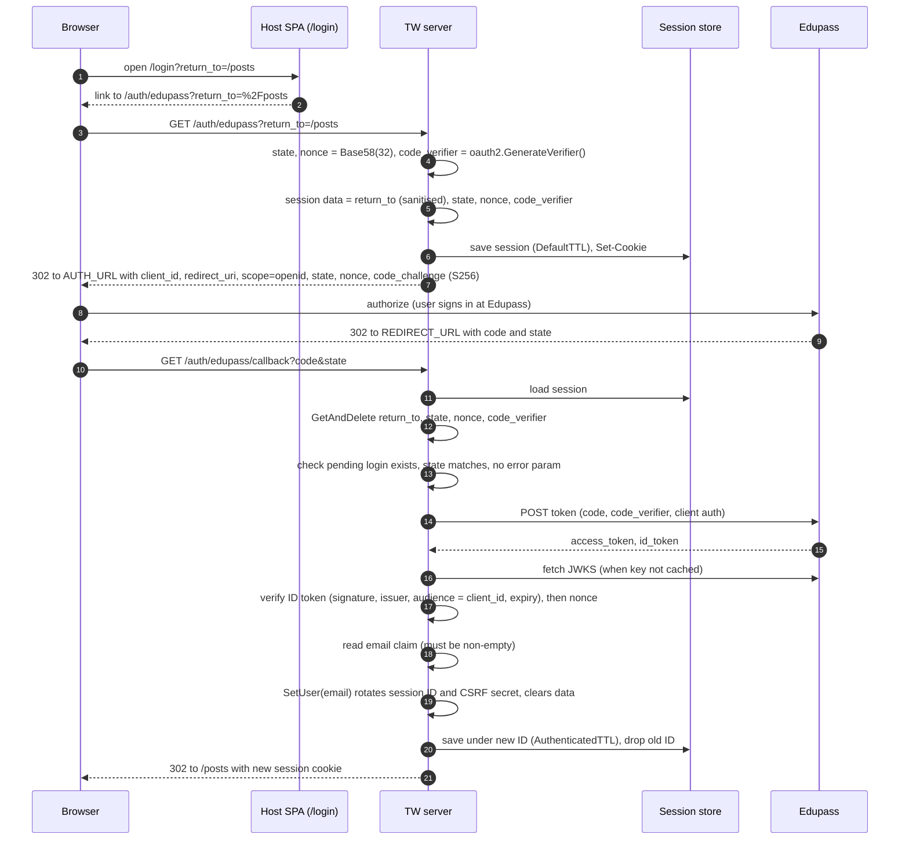
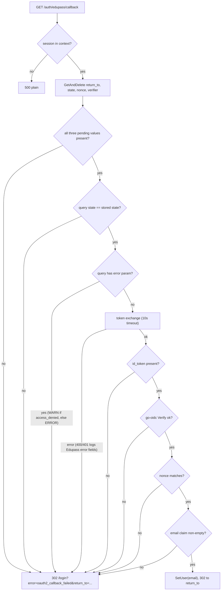

# Workflow: Sign in with Edupass

Revision: `main` @ `5ff58a7`. Phase 2/3, batch 3 (2026-10-09).

Files in scope: `server/internal/handler/auth.go` (read in full), `server/internal/handler/auth_test.go` (case names reviewed, a few bodies sampled), `apps/mock-edupass/src/provider.ts` and `src/config.ts` (read in full), `apps/mock-edupass/test/api.test.ts` (case names reviewed), `apps/host/src/containers/LoginView.tsx` (read in full). Session mechanics are in `../subsystems/sessions.md`.

## 1. Summary

Teacher Workspace (TW) is an OIDC **relying party** of Edupass, MOE's identity provider. It uses the **authorization code flow with PKCE (S256)**, a `state` and a `nonce`, and authenticates itself at the token endpoint with either `client_secret_post` or `private_key_jwt` (PS256 client assertion with an `x5t#S256` certificate thumbprint). After verifying the ID token, it keeps **only the `email` claim** in the session.

There is no sign-out, no token refresh, and the access token and ID token are discarded after sign-in.

## 2. Actors and endpoints

| Actor / endpoint | Role | Evidence |
| --- | --- | --- |
| Host SPA `/login` (`LoginView`) | "Sign in with Edupass" link to `/auth/edupass?return_to=...`; shows an error toast when `?error=oauth2_callback_failed` | `LoginView.tsx:8-35` |
| `GET /auth/edupass` (`Handler.authEdupass`) | Start: create pending login, redirect to Edupass | `auth.go:29-64`, route `handler.go:95` |
| `GET /auth/edupass/callback` (`Handler.authEdupassCallback`) | Finish: validate, exchange code, verify ID token, sign in | `auth.go:73-253`, route `handler.go:96` |
| Edupass authorize endpoint | `TW_EDUPASS_AUTH_URL` (mock: `/authorize`) | `handler.go:49-50`, `provider.ts:124-126` |
| Edupass token endpoint | `TW_EDUPASS_TOKEN_URL`, called server to server with a 10s timeout | `handler.go:41, 51`, `auth.go:149-182` |
| Edupass JWKS | `TW_EDUPASS_JWKS_URL`, fetched by go-oidc's remote key set | `handler.go:56-63` |

## 3. Happy path

| Step | Status | Evidence |
| --- | --- | --- |
| Steps 4-5: random values and session keys | Verified | `auth.go:48-55`, keys `auth.go:22-27` |
| Step 7: auth URL params (`client_id`, `redirect_uri`, `scope=openid`, `state`, `nonce`, S256 challenge) | Verified | `auth.go:57-61`, `handler.go:46-55`; tests `auth_test.go:78-169` |
| Steps 6, 19-20: session save, rotation, cookie | Verified | `middleware/session.go`, see `../subsystems/sessions.md` |
| Step 12: single-use pending login (deleted before validation) | Verified | `auth.go:100-107` |
| Steps 14-15: token request | Verified | `auth.go:149-182`; tests `auth_test.go:430, 881-1297` |
| Step 17: ID token checks: signature, issuer, audience, expiry done by go-oidc `Verify` | Inferred (library behaviour); nonce check Verified | `handler.go:56-63`, `auth.go:222-233` |
| Step 18: only `email` kept | Verified | `auth.go:235-249` |
| Login is logged without the email | Verified | `auth.go:251`; test `auth_test.go:652` |

## 4. Client authentication at the token endpoint

| Method | What TW sends | Evidence |
| --- | --- | --- |
| `client_secret_post` (default) | `client_id` (form body, `AuthStyleInParams`), `client_secret`, `code`, `code_verifier` | `auth.go:177-181`, `handler.go:53` |
| `private_key_jwt` | `client_assertion_type=urn:ietf:params:oauth:client-assertion-type:jwt-bearer`, `client_assertion` = PS256 JWT with `iss` and `sub` set to the client ID, `aud` = token URL, random `jti` (Base62(32)), `iat` = `nbf` = now, `exp` = now + 5 min; header `x5t#S256` = base64url SHA-256 of the certificate | `auth.go:153-176`, thumbprint built in `config.go:415-419`; tests `auth_test.go:925-1297` |

The mock README says real Edupass requires `private_key_jwt`; the mock accepts a client assertion only when it is PS256 and its `x5t#S256` matches the registered certificate (`provider.ts:97-112`).

## 5. Callback validation and failure paths

Every failure redirects to the login page with the sanitised `return_to`, so the user can retry and still land where they wanted (`auth.go:287-294`, `LoginView.tsx:14-16`). Because the pending login is deleted first, a replayed callback always fails (doc comment `auth.go:86-87`).

| Failure branch | Test case present? | Evidence |
| --- | --- | --- |
| No session (500) | yes | `auth_test.go:379, 400` |
| Token endpoint rejects client / code; no ID token; timeout | yes | `auth_test.go:484-547` |
| Logging of failed token responses (fields, no secret, no assertion) | yes | `auth_test.go:727-832, 1025` |
| No pending login, state mismatch, `error` param, ID token verification failure, nonce mismatch, missing email | **no case names cover these** | `auth_test.go` case list; worth adding (Q25) |

## 6. `return_to` safety (`safeReturnTo`)

Accepted only if it is at most 1024 bytes, starts with `/` but not `//` or `/\`, parses as a URL, has no backslash in the decoded path, and has no `.` or `..` path segment; otherwise `/` (`auth.go:255-285`). It is applied when the login starts (`auth.go:52`); the callback trusts the stored value. Tests cover protocol-relative, encoded protocol-relative, backslash variants, encoded and partly encoded dot-dot, control characters, CRLF injection and length (`auth_test.go:1396-1560`).

## 7. Identity data: what Edupass sends vs what TW keeps

| Claim    | Sent (per mock)                                        | Kept by TW              |
| -------- | ------------------------------------------------------ | ----------------------- |
| `sub`    | yes                                                    | no                      |
| `email`  | yes (staff-8 has one but no name)                      | **yes, the only field** |
| `name`   | when present                                           | no                      |
| `groups` | always present, possibly empty (`provider.ts:151-152`) | no                      |

Group naming in the fixtures follows `<location>_<APP>_<ROLE or ATTR>_<NAME>`, for example `0001_TW_ROLE_TEACHER`, `X_TW_ATTR_PG_ADMIN` (location `X` = global), `0001_TWSTG_ROLE_TEACHER` (pre-prod app code) (`provider.ts:14-62`, mock README). The README lists fixtures for a role conflict (staff-4) and unknown-role rejection (staff-7), but **no server code parses groups or rejects any user** at this revision, so any Edupass user with an email can sign in (resolves Q7; see Q26).

## 8. Local development with mock-edupass

- The mock auto-completes login and consent with no UI and defaults to `staff-1` (`app.ts:15-56`).
- To sign in as another fixture, the authorize request needs `&account=staff-N` (`provider.ts:118`). TW never adds it, so in practice append it to the Edupass URL in the browser's address bar after the redirect, before it loads (or copy the 302 `Location` and edit it).
- The mock generates a new signing key each boot (`provider.ts:72-76`); TW's remote key set refetches on an unknown `kid`, so restarting the mock while TW runs should be fine (Inferred, go-oidc behaviour).
- `provider.proxy = true` trusts `X-Forwarded-*` headers so it works behind a load balancer (`provider.ts:159`; test `api.test.ts:75`).
- mock-edupass tests are not run in CI (Q12).

## 9. Observations

| # | Observation | Status |
| --- | --- | --- |
| A1 | Edupass token error bodies carry `error_codes`, `timestamp`, `trace_id`, `correlation_id`, which TW logs for 400/401. That shape matches Microsoft Entra ID error responses, suggesting Edupass is built on Entra | Verified fields (`auth.go:66-71, 191-207`); Entra link Inferred |
| A2 | If Edupass returns an `error` without echoing `state`, TW logs "state mismatch" instead of the provider error, because the state check runs first | Verified order (`auth.go:121-147`) |
| A3 | `email_verified` is not checked | Verified (only `email` decoded, `auth.go:235-247`) |
| A4 | No refresh token use and no stored ID token, so there is no silent re-auth after the 30m idle expiry and no `id_token_hint` for an Edupass logout | Verified (tokens go out of scope after `auth.go:249`) |
| A5 | The `switch` on client auth method has no `default`; an unknown method would leave the token nil. Unreachable because config validation rejects other values | Verified (`auth.go:152-182`, `config.go:421-424`) |
| A6 | Starting a login is a GET that changes session state. Harmless here (it only replaces a pending login), and `state` bound to the session prevents login CSRF on the callback | Verified |

## 10. Where to change things

| Change | Where |
| --- | --- |
| Keep more identity (sub, name, groups) | `claims` struct `auth.go:235-237`, `session.User` (`session.go:58-61`), `SetUser` call `auth.go:249` |
| Role-based access / reject unknown roles | After claims decoding, before `SetUser` (`auth.go:243-249`); use mock staff-4 and staff-7 as fixtures |
| Request more scopes | `Scopes` in `handler.go:54` |
| Change login error UX | `loginFailedURL` (`auth.go:287-294`) and `LoginView.tsx` |

Breakpoints: `auth.go:52` (start), `auth.go:109` (pending login check), `auth.go:183` (token exchange result), `auth.go:222` (ID token verify), `auth.go:249` (sign in).
